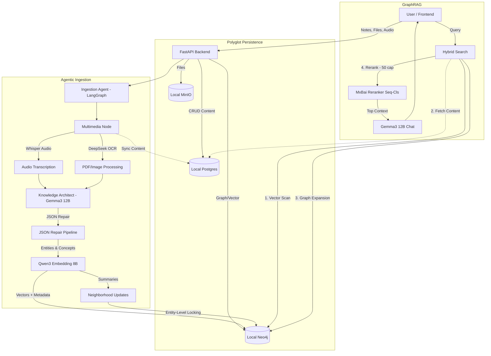

# LiveOS Brain (Core System)

LiveOS Brain is a multimodal, graph-based personal memory system. It ingests notes, audio, images, and PDFs, understands their semantic meaning, and creates a living ontology (knowledge graph) of your life.

> **Project History**: For a detailed log of the architectural evolution and model choices, see [Development Process](./development_process.md).

## System Architecture

The system operates on a **Polyglot Persistence** model ("Mind & Body") supported by three main pillars: **Ingestion**, **Memory**, and **Retrieval**.



---

---

## 🚀 Getting Started

### Option 1: Local Development (Recommended for Development)

The system runs locally using Docker for services and Ollama for models.

#### Prerequisites
*   **Docker Desktop** (or Engine)
*   **Ollama**: Installed and running (`ollama serve`).
*   **Python 3.11+**
*   **Node.js 20+**

#### Steps
1.  **Start Services**:
    ```bash
    docker compose up -d
    ```

2.  **Backend Setup**:
    ```bash
    cd backend
    python -m venv venv
    source venv/bin/activate
    pip install -r requirements.txt

    # Create Database Tables & Storage Bucket
    python scripts/init_local.py

    # Build Custom Model
    ollama create knowledge-architect -f Architect.modelfile

    # Start API Server
    uvicorn app.main:app --reload
    ```

3.  **Frontend Setup**:
    ```bash
    cd frontend
    npm install
    npm run dev
    ```

4.  **Access**:
    *   Frontend: `http://localhost:3000`
    *   Backend API: `http://localhost:8000/docs`
    *   Neo4j Browser: `http://localhost:7474`
    *   MinIO Console: `http://localhost:9001`

---

### Option 2: Production Deployment (All-in-One Docker)

Deploy the entire stack with a single command (requires Ollama running on host).

#### Prerequisites
*   **Docker** & **Docker Compose**
*   **Ollama** installed on host machine with models pulled

#### Steps
1.  **Pull Ollama Models** (on host):
    ```bash
    ollama pull gemma3:12b
    ollama pull qwen3-embedding:8b
    ollama create knowledge-architect -f backend/Architect.modelfile
    ```

2.  **Download Hugging Face Models** (pre-bundled in repo):
    *   **Florence-2-Large** (Vision): [`microsoft/Florence-2-large`](https://huggingface.co/microsoft/Florence-2-large)
    *   **MxBai Reranker** (Context Scoring): [`michaelfeil/mxbai-rerank-large-v2-seq`](https://huggingface.co/michaelfeil/mxbai-rerank-large-v2-seq)
    *   **Whisper V3** (Audio Transcription): [`openai/whisper-large-v3`](https://huggingface.co/openai/whisper-large-v3)
    
    These models will need to be downoaded into the `backend/models/` folder and will be copied into the Docker image during build.

3.  **Deploy Full Stack**:
    ```bash
    docker compose -f docker-compose.prod.yml up -d
    ```

4.  **Access**:
    *   Frontend: `http://localhost:3000`
    *   Backend API: `http://localhost:8000`

5.  **Monitor Logs**:
    ```bash
    docker compose -f docker-compose.prod.yml logs -f backend
    ```

**Note**: The init container automatically creates database tables and MinIO buckets on first run.

---

## ️ Maintenance & Reset

### How to Completely Reset the System
If you want to wipe all data (Notes, Graph, Vectors, Files) and start fresh:

1.  **Stop everything**: `Ctrl+C` in your terminals.
2.  **Run the Reset Script**:
    ```bash
    cd backend
    python scripts/reset_db_and_verify.py
    ```
    *This script will wipe the Neo4j Graph, Postgres Tables, and MinIO Bucket.*

### How to Manage Models
The system uses custom Modelfiles for optimized extraction. To rebuild:
```bash
ollama create knowledge-architect -f backend/Architect.modelfile
```

---

## 1. The Ingestion Pipeline ("The Senses")

When you create a note or upload a file, it enters the **Ingestion Agent** (`app/workflows/agents/ingestion_agent.py`), a LangGraph-based workflow with entity-level locking for data consistency.

1.  **Multimedia Processing**:
    *   **Unified Pipeline**: Detects file links `[📎 Filename](URL)` and processes them.
    *   **Audio**: `.webm`/`.mp3`/`.m4a` are transcribed via **Whisper Large V3** (local). Transcripts sync to Postgres.
    *   **Images**: Described via **Florence-2-Large** (Local Transformer).
    *   **PDFs**: OCR'd via **DeepSeek OCR** (Ollama).
    *   **Historical Dates**: Backdate notes using the **Date Picker** in the toolbar. The system uses `dateparser` for robust parsing of user-selected dates.

2.  **Cognition (Extraction)**:
    *   **Model**: `knowledge-architect` (Custom ModelFile based on `gemma3:12b`).
    *   **Schema**: Strict JSON extraction for `Entities`, `Concepts`, `Tasks`, `Persona`.
    *   **JSON Repair Pipeline**: A robust regex layer fixes common LLM syntax errors (comments, smart quotes, unquoted keys).
    *   **Entity-Level Locking**: Prevents race conditions when multiple notes update the same entity concurrently.

3.  **Embedding & Graph Storage**:
    *   **Embedding**: `qwen3-embedding:8b` generates 4096-dim vectors.
    *   **Graph**: Neo4j stores the ontology with relationships (`MENTIONS`, `CONTRIBUTES_TO`, `PRODUCES_TASK`, `REVEALED_BY`).
    *   **Neighborhood Summaries**: Parallel updates with async locking ensure data integrity.

---

## 2. The Retrieval System ("The Voice")

1.  **Double-Fetch Hybrid RAG**:
    *   **Step 1**: Vector Search in Neo4j finds top 50 distinct Note IDs.
    *   **Step 2**: Full content is fetched from Postgres (Single Source of Truth).
    *   **Step 3**: Graph Context expansion (Entities, Concepts, Tasks, Persona Traits with evidence quotes).
    *   **Step 4**: Soft cap at 50 snippets for reranker performance (3-5s response time).
2.  **Reranking**: `mxbai-rerank-large-v2-seq` (Generative Reranker).
3.  **Synthesis**: **Gemma3 12B** with strict grounding (no advice, only insights).

---

## 3. Technology Stack

*   **Backend**: Python 3.11 (FastAPI, LangGraph, dateparser, instructor, tenacity)
*   **Frontend**: Next.js 14 (React, Tailwind, Framer Motion, ReactMarkdown)
*   **Aesthetics**: High-fidelity cursor effects with subtle glows, glassmorphism, and micro-animations.
*   **Infrastructure** (Docker):
    *   **Postgres**: Authoritative content (Port 5433)
    *   **Neo4j**: Knowledge Graph & Vectors (Port 7474)
    *   **MinIO**: Local S3-compatible storage (Port 9000/9001)
*   **LLM Stack** (Ollama):
    *   **Main LLM**: Gemma3 12B (Extraction, Summarization, Chat)
    *   **Embedding**: Qwen3 Embedding 8B
    *   **Reranking**: MxBai Rerank Large V2 (Seq-Cls)
    *   **Vision**: Florence-2-Large (Transformers)
    *   **Audio**: Whisper Large V3 (Transformers)
    *   **OCR**: DeepSeek OCR (Ollama)

---

## 4. Key Features

*   **Multimodal Ingestion**: Text, Audio, Images, PDFs
*   **GraphRAG**: Semantic search + Knowledge graph traversal
*   **Historical Journaling**: Manual date picker for backdating notes
*   **Entity-Level Locking**: Prevents data corruption during concurrent updates
*   **Parallel Neighborhood Updates**: Faster ingestion with `asyncio.gather`
*   **Soft-Capped Reranking**: 50-snippet limit for consistent 3-5s response times
*   **Markdown Support**: Note previews render markdown in chat
*   **Real-time System Info**: Header displays all active services and databases
