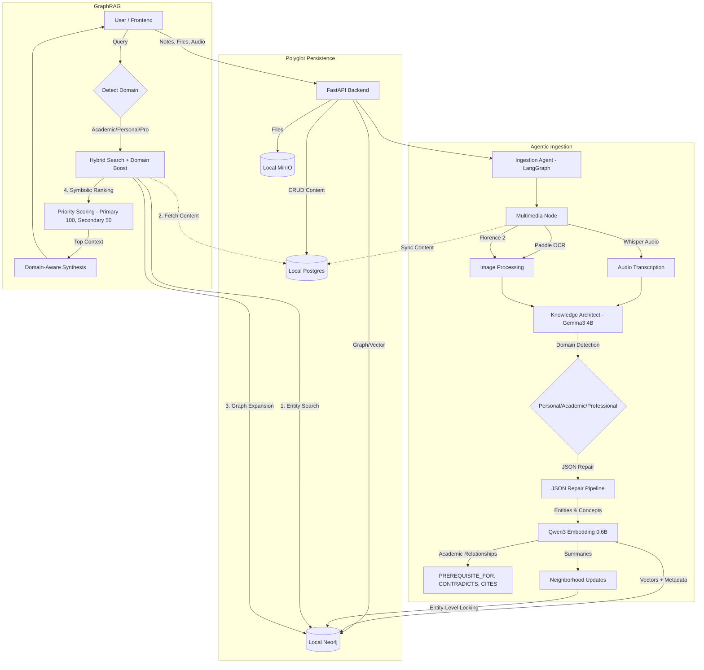

# LiveOS Brain (Core System)

[](./LICENSE)

LiveOS Brain is a multimodal, graph-based personal memory system. It ingests notes, audio, images, and PDFs, understands their semantic meaning, and creates a living ontology (knowledge graph) of your life.

Note (2026-04-29): notes no longer use or store a domain classification field.

> **Project History**: For a detailed log of the architectural evolution and model choices, see [Development Process](./development_process.md).

## System Architecture

The system operates on a **Polyglot Persistence** model ("Mind & Body") with **adaptive knowledge management** across multiple domains: Personal Journal, Academic/Professional PKM, and Creative Writing.

**Why Multi-Purpose?** A single system that handles personal reflections ("I'm anxious about my thesis"), academic learning ("Markov Chains have the memoryless property"), and creative expression ("The moon is a ghost") with adaptive retrieval and synthesis.

### Multi-Mode Operation

**Personal Journal Mode:**
- Daily activities, feelings, goals, relationships
- Tasks and persona trait tracking
- Emotional pattern analysis

**Academic/Professional PKM:**
- Learning notes, papers, concepts, theorems
- Citation tracking and reference management
- Knowledge graph with prerequisites and contradictions
- Domain-aware retrieval and synthesis

**Creative Mode:**
- Poems, stories, lyrics, and metaphors
- Focus on themes, imagery, and emotional resonance
- Non-judgmental, advice-free synthesis that respects artistic voice



---

---

## 🚀 Getting Started

### Option 1: Local Development (Recommended for Development)

The system runs locally using Docker for services and Ollama for models.

#### Prerequisites
*   **Docker Desktop** (or Engine)
*   **Ollama**: Installed and running (`ollama serve`).
*   **Python 3.11+**
*   **Node.js 20+**

#### Steps
1.  **Start Services**:
    ```bash
    docker compose up -d
    ```

2.  **Backend Setup**:
    ```bash
    cd backend
    python -m venv venv
    source venv/bin/activate
    pip install -r requirements.txt

    # Create Database Tables & Storage Bucket
    python scripts/init_local.py

    # Start API Server
    uvicorn app.main:app --reload
    ```

3.  **Frontend Setup**:
    ```bash
    cd frontend
    npm install
    npm run dev
    ```

4.  **Access**:
    *   Frontend: `http://localhost:3000`
    *   Backend API: `http://localhost:8000/docs`
    *   Neo4j Browser: `http://localhost:7474`
    *   MinIO Console: `http://localhost:9001`

---

### Option 2: Production Deployment (All-in-One Docker)

Deploy the entire stack with a single command (requires Ollama running on host).

#### Prerequisites
*   **Docker** & **Docker Compose**
*   **Ollama** installed on host machine with models pulled

#### Steps
1.  **Pull Ollama Models** (on host):
    ```bash
    ollama pull gemma3:4b
    ollama pull qwen3-embedding:0.6b
    ollama pull MedAIBase/PaddleOCR-VL:0.9b
    ```

2.  **Download Hugging Face Models** (pre-bundled in repo):
    *   **Florence-2-Large** (Vision): [`microsoft/Florence-2-large`](https://huggingface.co/microsoft/Florence-2-large)
    *   **Whisper V3 Turbo** (Audio Transcription): [`openai/whisper-large-v3-turbo`](https://huggingface.co/openai/whisper-large-v3-turbo)
    
    These models will need to be downloaded into the `backend/models/` folder and will be copied into the Docker image during build.

3.  **Deploy Full Stack**:
    ```bash
    docker compose -f docker-compose.prod.yml up -d
    ```

4.  **Access**:
    *   Frontend: `http://localhost:3000`
    *   Backend API: `http://localhost:8000`

5.  **Monitor Logs**:
    ```bash
    docker compose -f docker-compose.prod.yml logs -f backend
    ```

**Note**: The init container automatically creates database tables and MinIO buckets on first run.

---

## ️ Maintenance & Reset

### How to Completely Reset the System
If you want to wipe all data (Notes, Graph, Vectors, Files) and start fresh:

1.  **Stop everything**: `Ctrl+C` in your terminals.
2.  **Run the Reset Script**:
    ```bash
    cd backend
    python scripts/reset_all.py
    ```
    *This script wipes PostgreSQL, Kuzu, Qdrant, Typesense, and MinIO data.*

### How to Reset Only the Kuzu Graph
If you only need to reset the graph database state:

```bash
cd backend
python scripts/reset_kuzu.py
```

`reset_kuzu.py` now removes both:
- the configured `KUZU_DB_PATH` location, and
- the legacy `data/kuzu_graph` location,

and also deletes each sibling `.wal` file. This prevents stale graph remigration from leftover legacy files on the next startup.

### How to Manage Models
The system uses Ollama models for LLM inference. To update models:
```bash
# Pull latest versions
ollama pull gemma3:4b
ollama pull qwen3-embedding:0.6b
ollama pull MedAIBase/PaddleOCR-VL:0.9b
```

### Empty Node Cleanup Safety
Avoid deleting all empty nodes in bulk.

*   Empty nodes can still participate in graph edges; deleting them blindly can break traversal paths.
*   Direct deletion is only safe for empty nodes with no incoming and no outgoing edges.
*   For edge-bearing empties, merge/rewire relationships first, then delete.

---

## 1. The Ingestion Pipeline ("The Senses")

When you create a note or upload a file, it enters the **Ingestion Agent** (`app/workflows/agents/ingestion_agent.py`), a LangGraph-based workflow with entity-level locking for data consistency.

1.  **Multimedia Processing**:
    *   **Unified Pipeline**: Detects file links `[📎 Filename](URL)` and processes them.
    *   **Audio**: `.webm`/`.mp3`/`.m4a` are transcribed via **Whisper Large V3 Turbo** (local). Transcripts sync to Postgres.
    *   **Images**: Described via **Florence-2-Large** (Local Transformer).
    *   **PDFs**: OCR'd via **Paddle OCR** (Ollama).
    *   **Historical Dates**: Backdate notes using the **Date Picker** in the toolbar. The system uses `dateparser` for robust parsing of user-selected dates.

2.  **Cognition (Extraction)**:
    *   **Model**: `gemma3:4b` - Lightweight model optimized for structured JSON extraction.
    *   **Schema**: Strict JSON extraction for nodes and relationships. Node payload is now `name`, `type`, and `isolated_context` (no extracted `description` field).
    *   **Reference Extraction**: Captures citations (papers, books, quotes) with full attribution for academic notes.
    *   **Single-Pass Extraction**: Knowledge extraction runs as one LLM call per note; there is no active refinement or second-pass reasoning step in the ingestion graph.
    *   **Schema Normalization**: Handles LLM inconsistencies (capitalized keys, string importance values, status variations) via Pydantic validators.
    *   **Entity Deduplication**: Normalizes names (strips `#` prefix) to prevent duplicate nodes; garbage-name recovery uses a lightweight LLM batch rename for nameless nodes that have valid context.
    *   **JSON Repair Pipeline**: A robust regex layer fixes common LLM syntax errors (comments, smart quotes, control characters, markdown fences).
    *   **Entity-Level Locking**: Prevents race conditions when multiple notes update the same entity concurrently.

3.  **Embedding & Graph Storage**:
    *   **Embedding**: `qwen3-embedding:0.6b` generates 1024-dim vectors - optimized for speed on consumer hardware.
    *   **Graph**: Neo4j stores the ontology with relationships (`MENTIONS`, `CONTRIBUTES_TO`, `PRODUCES_TASK`, `REVEALED_BY`).
    *   **Update Phase Contract**: Node update writes are isolated-context-only. The update path appends new isolated contexts and embeddings and does not generate node description/facts/questions.
    *   **Relationships**: Inter-node relationships are still extracted from each note and written to graph and relationship search storage.
    *   **Bi-Temporal Relationships**: Each relationship tracks `valid_from` (event time), `ingested_at` (system time), `valid_to`, and `is_active`.
    *   **Community Assignment**: Nodes are automatically assigned to Community clusters.
    *   **Soft Invalidation**: Contradicted relationships are marked `is_active=false` with `valid_to` timestamp instead of deletion.
    *   **Identity Reconciliation (Apr 2026)**: If summary-stage Qdrant lookup misses, ingestion reuses an existing same-name Kuzu `node_id` when present, and Qdrant batch name resolution is paginated to avoid missed mappings under large result sets.
    *   **Neighborhood Summaries**: Parallel updates with async locking ensure data integrity.

---

## 2. The Retrieval System ("The Voice")

LiveOS uses an **empirically optimized GraphRAG retrieval system** that was systematically tested and refined (Feb 9-10, 2026). After testing 6 refinements, the system achieved **45% exact match, 75% fuzzy match, 32.8s avg latency** on HotpotQA multi-hop questions with 0% error rate.

### Recent Retrieval Remediation (Apr 2026)

The retrieval stack was updated in two passes to improve multi-hop stability, sub-question precision, and internal correctness:

**Pass 1 — Stability fixes:**
*   **Sub-question compatibility fix**: `select_relevant_docs_with_reasoning()` now accepts `original_query`, so doc selection can evaluate each sub-question with full original-question context.
*   **Entity-first retrieval with guarded fallback**: retrieval stays entity-first, and vector/keyword fallback is used when entity matches do not provide usable text evidence.
*   **One-hop graph expansion stability**: one-hop graph expansion + LLM evaluation no longer fails in the latest benchmark run.

**Pass 2 — Pipeline hardening:**
*   **`hybrid_search` confirmed entity-first**: entity lookup runs before any vector scan; vector/full-text search is a fallback only.
*   **Pre-batch relationship cache (`_rel_cache`)**: relationships are fetched once per `hybrid_search` call instead of per-candidate, reducing graph round-trips.
*   **Dead code removed**: `_build_query_variants`, `_generate_rewritten_query`, and `_generate_step_back_query` in `retrieval.py` were never called from any active path and have been deleted. `query_decomposition.py` (legacy unused workflow) has been deleted. `_verify_candidates` in `chat.py` has been removed.
*   **`retrieve_with_self_correction` is now a compatibility stub** — the self-correction loop it previously triggered is no longer active.
*   **LLM yes/no normalization broadened**: `llm.py` now handles a wider range of affirmative/negative surface forms and correctly parses multi-line `FULL_ANSWER` sections. A redundant LLM call in synthesis was eliminated via the `query_attr` parameter.
*   **Test coverage expanded**: `backend/tests/unit/test_llm_contracts.py` now has 52 passing cases (up from 40).

**Latest benchmark artifact:** `backend/tests/benchmark/results/hotpotqa_n5_20260428_145930.json`

**Current top outcomes (n=5):**
*   0 errors (`error_count=0`, `valid_tests=5`)
*   40% exact match, 40% answer F1, 40% fuzzy match
*   Retrieval: precision 0.385, recall 0.700, F1 0.497
*   Average response time: ~116.9s

### Empirically Validated Design

**What Makes It Work:**
*   **Pure Symbolic Ranking**: No neural reranking. Consensus summaries + semantic similarity + type matching + vector scores already capture relevance optimally for GraphRAG.
*   **Wider Vector Nets** (`min_score=0.60`): GraphRAG's consensus-based node summaries benefit from broader recall than traditional RAG.
*   **Focused Neighbor Expansion** (15 nodes): Empirically optimal balance between context breadth and noise reduction.
*   **LLM-Only Temporal Detection**: Disabled keyword heuristics ("recent", "latest") which added false positives. LLM analysis alone is more accurate.
*   **Domain Boost** (2.0x/1.3x/1.0x tiered): Lightweight cross-domain query support without latency impact.

**What Was Tested and Didn't Work:**
*   ❌ **Adaptive Vector Thresholds** (min_score 0.50-0.70): Stricter thresholds filtered relevant multi-hop context, degraded quality by 1%.
*   ❌ **More Neighbor Expansion** (20 vs 15 nodes): Added noise and graph overhead, degraded quality by 4.3% and increased latency by 46%.
*   ❌ **Neural Reranking** (qwen3-reranker CrossEncoder): Catastrophic failure—degraded quality by 4.3%, increased latency by 237% (31s→104s), introduced 7% error rate due to model inference bottleneck.

**Lesson:** GraphRAG's consensus-based node summaries already distill meaning. Complexity (adaptive thresholds, neural models) degrades performance. Simplification (disable heuristics) improves both quality (+2%) and speed (-23%).

### Retrieval Pipeline

1.  **LLM Query Analysis** (Gemma3 structured outputs):
    *   Extracts intent, entities, concepts, temporal signals
    *   No keyword heuristics—LLM analysis is more accurate
    *   Example: "job at livecops" → detected entity "livecops"

2.  **Graph-First Search** (Long-Term Wisdom):
    *   Search 20 knowledge nodes (Concepts, Entities, Tasks, Personas, References)
    *   Use neighborhood summaries (incrementally updated consensus knowledge)
    *   Expand from top 15 primary nodes only (precision over breadth)

3.  **Domain-Aware Boosting**:
    *   **2.0x boost**: Exact domain match (Academic query → Academic notes)
    *   **1.3x boost**: Related domains (Academic ↔ Professional, Personal ↔ Creative)
    *   **1.0x boost**: No domain match

4.  **Pure Symbolic Scoring** (50% semantic + 30% type + 20% vector):
    *   Primary nodes (name matches query entities): high priority
    *   Secondary nodes (related via graph): lower priority
    *   Instant ranking (~0.0001s vs ~2s with neural reranker)

5.  **Fact Pool Context Format**:
    *   Unified evidence pool with semantic labels: `[CORE CONSENSUS]`, `[RELATED CONTEXT]`, `[DOMAIN OVERVIEW]`, `[CONNECTION PATH]`
    *   LLM synthesizes across all facts naturally (no rigid sections)

6.  **Conversational "Thoughtful Peer" Synthesis** (Gemma3 4B):
    *   Domain-aware tone (Academic: pedagogical, Personal: empathetic, Professional: action-focused, Creative: thematic)
    *   Natural voice: "You mentioned..." not "The notes reveal..."
    *   Strict grounding: Every claim traces to context
    *   No formulaic headers or invented information

**Performance:** Historical full-run benchmark (Feb 2026, 100-question HotpotQA) reached 45% exact match, 62% F1 score, and 75% fuzzy match. Latest remediation smoke run (Apr 2026, n=5) is recorded in `backend/tests/benchmark/results/hotpotqa_n5_20260428_145930.json` with 0 runtime errors and 40% exact/fuzzy match. Note: F1 score is the standard QA benchmark metric using token-level overlap.

---

## 3. Technology Stack

*   **Backend**: Python 3.11 (FastAPI, LangGraph, AsyncPG, Instructor, Tenacity)
*   **Frontend**: Next.js 16 (React 19, Tailwind v4, Framer Motion, React Force Graph)
*   **Aesthetics**: High-fidelity cursor effects with subtle glows, glassmorphism, and micro-animations.
*   **Infrastructure** (Docker):
    *   **Postgres**: Authoritative content (Port 5433)
    *   **Neo4j**: Knowledge Graph & Vectors (Port 7474)
    *   **MinIO**: Local S3-compatible storage (Port 9000/9001)
*   **LLM Stack** (Ollama):
    *   **Main LLM**: Gemma3 4B (Extraction, Summarization, Chat)
    *   **Embedding**: Qwen3 Embedding 0.6B (1024-dim)
    *   **Ranking**: Pure Symbolic (no neural reranker)
    *   **Vision**: Florence-2-Large (Transformers)
    *   **Audio**: Whisper Large V3 Turbo (Transformers)
    *   **OCR**: PaddleOCR-VL 0.9B (Ollama) - Optimized for resource efficiency

### Audio Model Selection

**Whisper-Large-V3-Turbo vs Whisper-Large-V3 Testing:**

| Metric | Whisper V3 Turbo | Whisper V3 |
|--------|-------------------|------------|
| **Duration (1 min audio)** | **12.17s** | 34.96s |
| **Speed** | **325 words/min** | 100 words/min |
| **Accuracy** | High (66 words) | High (58 words) |

**Decision:** Switched to **Whisper Large V3 Turbo** for production.
- **3× Faster transcription speed** (12s vs 35s)
- **Higher word recovery** (detected 14% more words in test samples)
- **Reduced latency** for real-time voice interaction

### OCR Model Selection

**PaddleOCR-VL vs DeepSeek-OCR Testing:**

| Metric | PaddleOCR-VL 0.9B | DeepSeek-OCR Latest |
|--------|-------------------|---------------------|
| **Model Size** | 935 MB | 6.7 GB |
| **Speed (CV)** | 0.48s | 0.01s |
| **Speed (Book - 300 pages)** | 2.17s | 1.98s |
| **Quality** | ✅ Identical | ✅ Identical |
| **Resource Usage** | 🟢 Low VRAM | 🟡 High VRAM |

**Decision:** Using **PaddleOCR-VL** for production due to:
- **7× smaller model size** (935 MB vs 6.7 GB)
- **Identical OCR quality** (tested on CV and technical books)
- **Comparable speed** on multi-page documents (2.17s vs 1.98s)
- **Resource efficiency** - Critical for local deployment on consumer hardware
- **Multi-language support** - Better internationalization than DeepSeek-OCR

While DeepSeek-OCR is faster on single pages (0.01s vs 0.48s), the difference becomes negligible on real-world documents with multiple pages. The 7× reduction in model size makes PaddleOCR-VL the optimal choice for LiveOS's local-first architecture.

---

## 4. Key Features

*   **Multi-Domain PKM**: Unified system for personal journaling, academic learning, professional work, and creative expression
*   **Domain-Aware Intelligence**: Automatic categorization with adaptive retrieval and synthesis
*   **Academic Knowledge Graph**: Citation tracking, prerequisite chains, contradiction detection
*   **Multimodal Ingestion**: Text, Audio, Images, PDFs
*   **GraphRAG**: Semantic search + Knowledge graph traversal with domain boosting
*   **Community Summaries**: Microsoft GraphRAG-style domain clusters for broad/exploratory queries
*   **Bi-Temporal Tracking**: Separates event time (when fact became true) from system time (when recorded)
*   **Historical Journaling**: Manual date picker for backdating notes with proper temporal accuracy
*   **Soft Invalidation**: Contradicted relationships marked inactive instead of deleted, preserving history
*   **Entity-Level Locking**: Prevents data corruption during concurrent updates
*   **Parallel Neighborhood Updates**: Faster ingestion with `asyncio.gather`
*   **Symbolic Ranking**: Pure priority-based scoring (primary=100, secondary=50) for instant, grounded retrieval
*   **Extraction Robustness**: Schema normalization, type coercion, and JSON repair handle LLM inconsistencies
*   **Entity Deduplication**: Automatic name normalization prevents duplicate nodes (`#project` = `project`)
*   **Verbatim Node Persistence**: `isolated_context`, persisted `description`, and persisted `facts` are grounded in the source text. Persisted description/fact text must come from a single isolated context, not a stitched multi-context span, and legacy facts that fail that check are removed on rewrite.
*   **Markdown Support**: Note previews render markdown in chat
*   **Real-time System Info**: Header displays all active services and databases
*   **Dual Graph Visualization**: 2D Force Graph and 3D WebGL graph with Community clusters

---

## 5. Batch Processing & Testing

### Batch Note Processing (`batch-note-processing/`)

For bulk ingestion of notes from text files, use the batch processing scripts:

**Scripts:**
- `send_note.py` - Send individual notes to the ingestion endpoint
- `batch_ingest.py` - Batch process all `.txt` and `.md` files from `notes/` directory

**Usage:**
```bash
cd batch-note-processing

# Single note
python send_note.py "Your note content"
python send_note.py --file my-note.txt
python send_note.py "Historical note" --date "2024-01-15"

# Batch processing
python batch_ingest.py
python batch_ingest.py --dry-run              # Preview without sending
python batch_ingest.py --delay 1              # Add 1s delay between notes
python batch_ingest.py --auto-date            # Extract dates from filenames
```

**Auto-date filename patterns:**
- `2024-01-15-my-note.txt` → Uses 2024-01-15
- `note-2024-01-15.md` → Uses 2024-01-15
- `20240115_meeting.txt` → Uses 2024-01-15

**Features:**
- 📂 Automatically processes all `.txt` and `.md` files
- 📅 Extracts dates from filenames (optional)
- ⏳ Configurable delay to avoid overwhelming the system
- 🔍 Dry-run mode for previewing
- 📊 Summary report with success/failure counts

---

## 📚 PKM (Personal Knowledge Management) Capabilities

LiveOS now supports **multi-domain knowledge management** for personal journaling, academic/professional learning, and creative work. For full details, see [PKM_UPGRADE.md](./PKM_UPGRADE.md).

### Key Features

**Domain Categorization:**
- Notes are automatically classified as Personal, Academic, Professional, or Creative
- Retrieval and chat synthesis adapt based on query domain
- Domain-specific boosting (1.5x) for relevant notes

**Academic Knowledge Graph:**
- Citation tracking with `CITES` relationships to papers, books, quotes
- Prerequisite chains with `PREREQUISITE_FOR` (e.g., Calculus → Linear Algebra)
- Contradiction detection with `CONTRADICTS` (e.g., Deterministic vs Stochastic)

**External References:**
- Track papers, books, videos, quotes with full attribution
- Automatic extraction from note content
- Linked to concepts in knowledge graph

**Cross-Domain Insights:**
- System connects personal experiences with academic learning
- Example: Links "anxiety about unpredictability" with "studying stochastic processes"

**Domain-Aware Synthesis:**
- Academic queries get pedagogical, concept-focused responses
- Personal queries get empathetic, insight-focused responses
- Professional queries get concise, action-focused responses
- Creative queries get thematic, imagery-rich reflections

### Example Use Cases

**Academic Learning:**
```
Input: "Markov Chains lecture - memoryless property"
Output:
  - Domain: Academic
  - Concepts: Markov Chain, Memoryless Property
  - Graph: Markov Chain -[PREREQUISITE_FOR]-> Probability Distributions
```

**Personal Journal:**
```
Input: "Feeling anxious about thesis defense"
Output:
  - Domain: Personal
  - Concepts: Anxiety
  - Persona: Anxious about unpredictability
  - Cross-link: Connects to "Stochastic Processes" concept
```

**Professional Documentation:**
```
Input: "Team meeting - decided to use GraphRAG architecture"
Output:
  - Domain: Professional
  - Entities: Team, GraphRAG
  - Tasks: Implement GraphRAG
```

### Implementation Details

**Schema Fix (Critical):** The LLM extraction requires both the Pydantic model AND the `system_msg` JSON template in `llm.py` to include `domain` and `references` fields. Without the template update, the LLM defaults to "Personal" for all notes.

**Domain Detection:** The system prioritizes content over writing style:
- "I learned about X" (first-person academic content) → Academic
- "We decided in meeting to use X" (first-person work content) → Professional  
- "I feel anxious about X" (emotional reflection) → Personal

**Migration Notes:**
- **Existing data:** All old notes default to "Personal" domain - no migration needed
- **New features:** Automatically available for new notes without breaking changes
- **Graph visualization:** Domain colors and Reference nodes appear immediately after backend restart

---

## 🎨 Customization

### Adding Custom Domains

LiveOS supports custom domain categories beyond the built-in Personal/Academic/Professional/Creative. To add a new domain:

**1. Backend Schema** ([app/schemas/extraction.py](backend/app/schemas/extraction.py#L71)):
```python
domain: str = "Personal"  # Add your domain to this comment
```

**2. Ingestion Prompt** ([app/workflows/agents/ingestion_agent.py](backend/app/workflows/agents/ingestion_agent.py#L151)):
```python
- "YourDomain": Description and examples
```

**3. LLM System Message** ([app/services/llm.py](backend/app/services/llm.py#L77)):
```python
"domain": "Academic|Personal|Professional|YourDomain"
```

**4. Retrieval Keywords** ([app/services/retrieval.py](backend/app/services/retrieval.py#L317)):
```python
yourdomain_keywords = ["keyword1", "keyword2", ...]
```

**5. Synthesis Mode** ([app/services/llm.py](backend/app/services/llm.py#L210)):
```python
elif query_domain == "YourDomain":
    domain_instructions = """..."""
```

**6. Frontend Graph Color** ([frontend/src/app/graph/page.tsx](frontend/src/app/graph/page.tsx#L157)):
```tsx
if (node.domain === "YourDomain") return "#hexcolor";
```

---

### Logging System (`backend/logs/`)

The backend uses a comprehensive file-based logging system with automatic rotation. All debug/info output goes to component-specific log files, while the console only shows warnings and errors.

**Log Files:**
- `ingestion.log` - Ingestion pipeline operations
- `retrieval.log` - Query processing and search
- `graph.log` - Neo4j operations
- `llm.log` - LLM service calls
- `api.log` - FastAPI endpoints
- `errors.log` - All ERROR+ messages across services

**Configuration:**
- 10MB max file size with 5 rotating backups
- DEBUG level in files, WARNING+ in console
- See [backend/logs/README.md](backend/logs/README.md) for viewing commands

---

---

## 📖 Additional Documentation

### Multi-Provider LLM Support

LiveOS supports multiple LLM providers beyond Ollama. See [MULTI_PROVIDER.md](MULTI_PROVIDER.md) for:
- **Provider comparison** (Ollama, OpenAI, Gemini, Anthropic)
- **Structured outputs** implementation across providers
- **Automatic fallback** configuration
- **Cost optimization** strategies
- **Migration guides** from single-provider setups

**Quick Start:**
```bash
# Switch to OpenAI
export LLM_PROVIDER=openai
export OPENAI_API_KEY=sk-proj-...
export OPENAI_MODEL=gpt-4o-2024-08-06

# With automatic fallback
export LLM_FALLBACK_PROVIDER=ollama
```

### Retrieval System Deep Dive

**Key Concepts:**
- **Neighborhood Summaries**: Each graph node (Concept, Entity, Task) maintains an incrementally updated summary that aggregates information across all notes that mention it
- **Graph-First Strategy**: Searches distilled knowledge nodes (25 max) before falling back to note-level vector search
- **Symbolic Ranking**: Pure priority-based scoring trusts graph structure over neural reranking (primary nodes = 100, secondary = 50)
- **Fact Pool Context**: Unified evidence format with semantic labels ([CORE CONSENSUS], [RELATED CONTEXT], [DOMAIN OVERVIEW])

**Testing the System:**
```bash
# Test retrieval with specific queries
cd backend
python -m pytest tests/test_vector_search.py -v

# Check retrieval logs
tail -f logs/retrieval.log
```

See [RETRIEVAL_FAQ.md](backend/RETRIEVAL_FAQ.md) for detailed explanations of:
- How neighborhood summaries work and update
- Graph-first retrieval architecture
- Multi-factor scoring formulas
- Dynamic cutoff strategies
- Performance optimization techniques

### Bi-Temporal Knowledge Tracking

LiveOS implements **bi-temporal data modeling** to accurately track both when facts became true and when they were recorded:

**Time Dimensions:**
- `valid_from`: **Event Time** - When the fact became true (note's `created_at` date)
- `ingested_at`: **System Time** - When the system recorded the fact (always `now()`)
- `valid_to`: When the fact stopped being true (null if still valid)
- `is_active`: Quick boolean filter for current relationships

**Use Case - Historical Note Ingestion:**
```
Note from 2024-01-15: "Started new job at Acme Corp"
→ valid_from: 2024-01-15 (when it happened)
→ ingested_at: 2026-01-31 (when you added it to LiveOS)
→ is_active: true (still true today)
```

**Soft Invalidation:**
When new information contradicts old facts, the system marks the old relationship as inactive instead of deleting it:
```
Old: "Chris works at Acme" (valid_from: 2024-01, is_active: false, valid_to: 2025-06)
New: "Chris works at Globex" (valid_from: 2025-06, is_active: true)
```

**Benefits:**
- Historical notes preserve their original dates when batch-ingested
- Query "as-of" any point in time (event time or system time)
- Full audit trail of knowledge evolution
- No data loss from corrections

### Community Summaries (GraphRAG)

LiveOS implements **Microsoft GraphRAG-style Community Summaries** for broad, exploratory queries:

**Domain-Based Communities:**
| Community | Description |
|-----------|-------------|
| Professional Knowledge | Work, career, projects, colleagues |
| Academic Knowledge | Learning, concepts, papers, courses |
| Personal Knowledge | Relationships, feelings, life events |
| Creative Knowledge | Art, writing, music, poetry |
| Dreams Knowledge | Dream journals, subconscious patterns |

**How It Works:**
1. **Ingestion**: Each extracted entity/concept is assigned to a Community based on detected domain
2. **Aggregation**: Communities track member nodes and generate high-level summaries
3. **Retrieval**: Broad queries (e.g., "summarize my work life") fetch Community summaries first

**Recompute Orchestration:**
- Community recompute is automatically scheduled after ingestion goes idle (5-minute debounce after all active ingestions finish).
- If a new ingestion starts while recompute is running, the recompute is cancelled immediately so ingestion throughput takes priority.
- Recompute uses single-flight superseding semantics: only the newest requested run is allowed to proceed; older requests/runs are superseded.
- Manual runs (admin endpoint or script) follow the same cancellation/superseding rules.

**Manual Recompute (when needed):**
```bash
# From backend/ with venv active
python scripts/run_community_detection.py
```
Run this only when ingestion is idle. If ingestion starts during the run, the recompute exits early and should be re-run after ingestion settles.

**Query Example:**
```
Query: "What are the major themes in my professional life?"
→ Retrieves: [Community - Professional: Professional Knowledge]
→ Summary: "Your professional journey centers on AI development, 
   startup culture, and technical leadership..."
```

**Graph Structure:**
```
(Entity: Chris) -[:BELONGS_TO]-> (Community: Professional Knowledge)
(Concept: GraphRAG) -[:BELONGS_TO]-> (Community: Academic Knowledge)
```

### Knowledge Graph Relationships

**Inter-Node Relationships** (extracted from note content):
- Social: `knows`, `friends_with`, `works_with`
- Hierarchy: `manages`, `reports_to`
- Dependencies: `prerequisite_for`, `depends_on`
- Conflicts: `contradicts`, `blocks`
- Similarities: `similar_to`, `related_to`
- Ownership: `assigned_to`, `created_by`

**Academic Relationships** (domain-specific):
- `PREREQUISITE_FOR`: Concept A builds on Concept B
- `CONTRADICTS`: Concept A opposes Concept B
- `CITES`: Note references external source

**Visualization:**
- 2D/3D graphs show color-coded relationship links
- Directional particles indicate flow (dependencies, prerequisites)
- Relationship types visible on hover

### Performance & Optimization

**Recent Optimizations:**
- **Retrieval Speed**: 70.75s → 67.34s (3.5% faster) with early stopping
- **Context Quality**: 36.8 → 28.2 results per query (23% token reduction)
- **Relevance**: Entity queries improved 10% → 50% (5× better precision)
- **Resource Usage**: PaddleOCR-VL saves 6GB VRAM vs DeepSeek-OCR

**Key Results:**
- **Symbolic Ranking**: Instant scoring (~0.0001s) vs neural reranking (~2.0s)
- **Conversational Synthesis**: "Thoughtful Peer" persona produces natural, grounded responses
- **Embedding Models**: Qwen3 0.6B provides 90%+ quality at 8× smaller size vs 8B models

---
