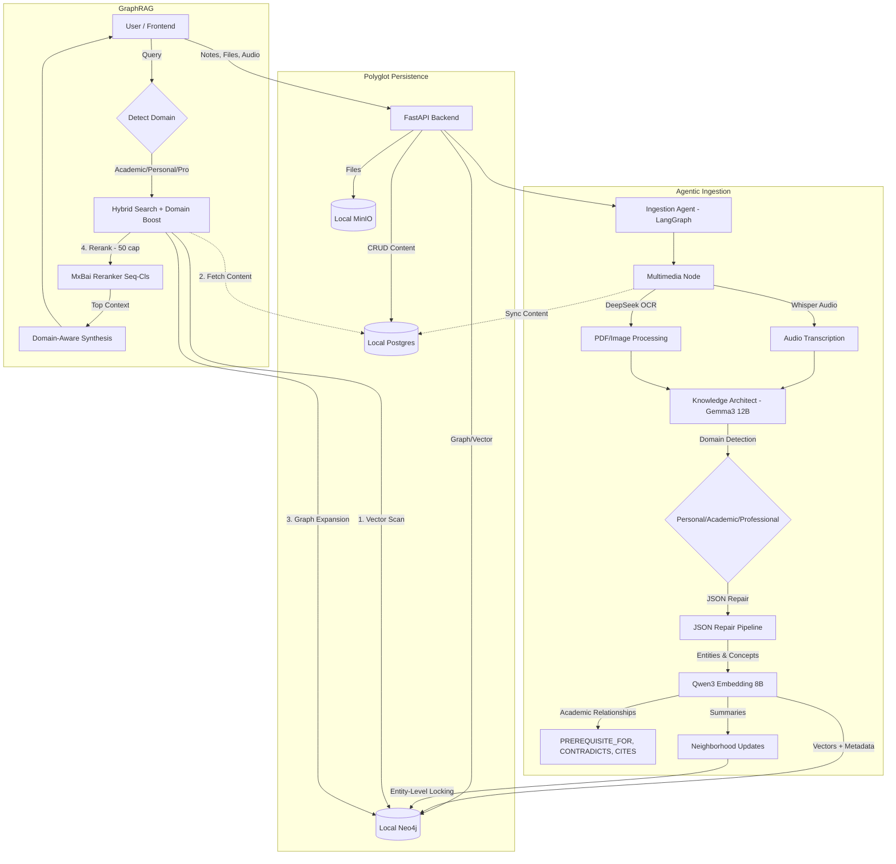

# LiveOS Brain (Core System)

LiveOS Brain is a multimodal, graph-based personal memory system. It ingests notes, audio, images, and PDFs, understands their semantic meaning, and creates a living ontology (knowledge graph) of your life.

> **Project History**: For a detailed log of the architectural evolution and model choices, see [Development Process](./development_process.md).
> **Project Findings**: For a detailed log of the results from testing multiple models, see [Test Results](./findings/test_results.md).

## System Architecture

The system operates on a **Polyglot Persistence** model ("Mind & Body") with **adaptive knowledge management** across multiple domains: Personal Journal, Academic/Professional PKM, and Creative Writing.

**Why Multi-Purpose?** A single system that handles personal reflections ("I'm anxious about my thesis"), academic learning ("Markov Chains have the memoryless property"), and creative expression ("The moon is a ghost") with domain-aware intelligence. The system automatically detects the note's purpose and adapts retrieval and synthesis accordingly.

### Multi-Mode Operation

**Personal Journal Mode:**
- Daily activities, feelings, goals, relationships
- Tasks and persona trait tracking
- Emotional pattern analysis

**Academic/Professional PKM:**
- Learning notes, papers, concepts, theorems
- Citation tracking and reference management
- Knowledge graph with prerequisites and contradictions
- Domain-aware retrieval and synthesis

**Creative Mode:**
- Poems, stories, lyrics, and metaphors
- Focus on themes, imagery, and emotional resonance
- Non-judgmental, advice-free synthesis that respects artistic voice



---

---

## 🚀 Getting Started

### Option 1: Local Development (Recommended for Development)

The system runs locally using Docker for services and Ollama for models.

#### Prerequisites
*   **Docker Desktop** (or Engine)
*   **Ollama**: Installed and running (`ollama serve`).
*   **Python 3.11+**
*   **Node.js 20+**

#### Steps
1.  **Start Services**:
    ```bash
    docker compose up -d
    ```

2.  **Backend Setup**:
    ```bash
    cd backend
    python -m venv venv
    source venv/bin/activate
    pip install -r requirements.txt

    # Create Database Tables & Storage Bucket
    python scripts/init_local.py

    # Build Custom Model (Optional)
    ollama create knowledge-architect -f Architect.modelfile

    # Start API Server
    uvicorn app.main:app --reload
    ```

3.  **Frontend Setup**:
    ```bash
    cd frontend
    npm install
    npm run dev
    ```

4.  **Access**:
    *   Frontend: `http://localhost:3000`
    *   Backend API: `http://localhost:8000/docs`
    *   Neo4j Browser: `http://localhost:7474`
    *   MinIO Console: `http://localhost:9001`

---

### Option 2: Production Deployment (All-in-One Docker)

Deploy the entire stack with a single command (requires Ollama running on host).

#### Prerequisites
*   **Docker** & **Docker Compose**
*   **Ollama** installed on host machine with models pulled

#### Steps
1.  **Pull Ollama Models** (on host):
    ```bash
    ollama pull gemma3:12b
    ollama pull qwen3-embedding:8b
    ollama create knowledge-architect -f backend/Architect.modelfile # Optional
    ```

2.  **Download Hugging Face Models** (pre-bundled in repo):
    *   **Florence-2-Large** (Vision): [`microsoft/Florence-2-large`](https://huggingface.co/microsoft/Florence-2-large)
    *   **MxBai Reranker** (Context Scoring): [`michaelfeil/mxbai-rerank-large-v2-seq`](https://huggingface.co/michaelfeil/mxbai-rerank-large-v2-seq)
    *   **Whisper V3** (Audio Transcription): [`openai/whisper-large-v3`](https://huggingface.co/openai/whisper-large-v3)
    
    These models will need to be downoaded into the `backend/models/` folder and will be copied into the Docker image during build.

3.  **Deploy Full Stack**:
    ```bash
    docker compose -f docker-compose.prod.yml up -d
    ```

4.  **Access**:
    *   Frontend: `http://localhost:3000`
    *   Backend API: `http://localhost:8000`

5.  **Monitor Logs**:
    ```bash
    docker compose -f docker-compose.prod.yml logs -f backend
    ```

**Note**: The init container automatically creates database tables and MinIO buckets on first run.

---

## ️ Maintenance & Reset

### How to Completely Reset the System
If you want to wipe all data (Notes, Graph, Vectors, Files) and start fresh:

1.  **Stop everything**: `Ctrl+C` in your terminals.
2.  **Run the Reset Script**:
    ```bash
    cd backend
    python scripts/reset_db_and_verify.py
    ```
    *This script will wipe the Neo4j Graph, Postgres Tables, and MinIO Bucket.*

### How to Manage Models
The system (optionally) uses custom Modelfiles for optimized extraction. To rebuild:
```bash
ollama create knowledge-architect -f backend/Architect.modelfile
```

---

## 1. The Ingestion Pipeline ("The Senses")

When you create a note or upload a file, it enters the **Ingestion Agent** (`app/workflows/agents/ingestion_agent.py`), a LangGraph-based workflow with entity-level locking for data consistency.

1.  **Multimedia Processing**:
    *   **Unified Pipeline**: Detects file links `[📎 Filename](URL)` and processes them.
    *   **Audio**: `.webm`/`.mp3`/`.m4a` are transcribed via **Whisper Large V3** (local). Transcripts sync to Postgres.
    *   **Images**: Described via **Florence-2-Large** (Local Transformer).
    *   **PDFs**: OCR'd via **DeepSeek OCR** (Ollama).
    *   **Historical Dates**: Backdate notes using the **Date Picker** in the toolbar. The system uses `dateparser` for robust parsing of user-selected dates.

2.  **Cognition (Extraction)**:
    *   **Model**: `knowledge-architect` (Custom ModelFile based on `gemma3:12b`) OR `gemma3:12b`.
    *   **Schema**: Strict JSON extraction for `Entities`, `Concepts`, `Tasks`, `Persona`, `Domain`, `References`.
    *   **Domain Classification**: Automatically categorizes notes as Academic/Personal/Professional based on primary subject matter.
    *   **Reference Extraction**: Captures citations (papers, books, quotes) with full attribution for academic notes.
    *   **JSON Repair Pipeline**: A robust regex layer fixes common LLM syntax errors (comments, smart quotes, unquoted keys).
    *   **Entity-Level Locking**: Prevents race conditions when multiple notes update the same entity concurrently.

3.  **Embedding & Graph Storage**:
    *   **Embedding**: `qwen3-embedding:8b` generates 4096-dim vectors.
    *   **Graph**: Neo4j stores the ontology with relationships (`MENTIONS`, `CONTRIBUTES_TO`, `PRODUCES_TASK`, `REVEALED_BY`).
    *   **Neighborhood Summaries**: Parallel updates with async locking ensure data integrity.

---

## 2. The Retrieval System ("The Voice")

1.  **Graph-First Hybrid RAG (4-Phase Architecture)**:
    *   **Phase 1: Temporal Anchor** (Short-Term Memory): Always fetch 10 most recent notes for current context.
    *   **Phase 2: Graph Consensus** (Long-Term Wisdom): Search unified knowledge graph index (25 distilled Concepts, Entities, Tasks, Personas, References).
    *   **Phase 3: Grounding** (Evidence): Trace back from graph nodes to source notes that formed them.
    *   **Phase 4: Semantic Fallback** (Safety Net): Only runs if Phases 1-3 return < 15 notes. Traditional vector search on note embeddings.

2.  **Intelligent Multi-Factor Scoring**:
    *   **Weighted Formula**: `final_score = rerank_score × recency_boost × entity_match_boost × keyword_match_boost × temporal_query_boost`
    *   **Rerank Score**: 0-10+ from mxbai-rerank-large-v2-seq (semantic relevance baseline)
    *   **Recency Boost**: 1.0-2.0× linear decay (today = 2.0×, 1 year ago = 1.1×)
    *   **Entity Match Boost**: 2.0× if result mentions detected entity names (e.g., "Votex365", "livecops")
    *   **Keyword Match Boost**: 3.0× for 80%+ query term match, 2.0× for 50%+, 1.5× for 30%+
    *   **Temporal Query Boost**: 3.0× for recent notes on temporal queries (e.g., "recent notes", "latest thoughts")

3.  **Smart Query Analysis**:
    *   **Entity Extraction**: Detects capitalized words, quoted terms, words after "at/with/about/for/working"
    *   **Temporal Detection**: Applies 3× boost only for queries explicitly asking for recent/latest/newest AND not entity-focused
    *   **Example Behavior**: "job at livecops" → entity query (no temporal boost), "recent notes" → temporal query (3× boost)

4.  **Dynamic Query-Aware Cutoffs**:
    *   **Entity Queries** (e.g., "Votex365", "livecops"): **7.0 cutoff** - High precision, filters 85% of noise
    *   **Temporal Queries** (e.g., "recent notes"): **5.0 cutoff** - Broad context, maintains recall
    *   **General Queries**: **6.0 cutoff** - Balanced precision/recall
    *   **Adaptive Fallback**: If top score < base cutoff, uses 60% of top score (min 0.6) to avoid empty results
    *   **Impact**: Reduces LLM token usage by 23% (36.8 → 28.2 avg results) while improving relevance

5.  **Early Stopping Optimization**: Stops reranking after finding 50 high-quality results (score ≥ 0.8) for 3-11% speed improvement

6.  **Domain-Aware Synthesis**: **Gemma3 12B** with adaptive system prompts:
    *   **Academic**: Pedagogical, conceptual explanations with prerequisites and citations
    *   **Personal**: Empathetic insights connecting experiences and feelings
    *   **Professional**: Concise, action-oriented responses referencing work context
    *   **Creative**: Themes and imagery focus, no advice or judgment
    *   **Strict Grounding**: No advice, only insights from user's notes with specific quotes

---

## 3. Technology Stack

*   **Backend**: Python 3.11 (FastAPI, LangGraph, AsyncPG, Instructor, Tenacity)
*   **Frontend**: Next.js 16 (React 19, Tailwind v4, Framer Motion, React Force Graph)
*   **Aesthetics**: High-fidelity cursor effects with subtle glows, glassmorphism, and micro-animations.
*   **Infrastructure** (Docker):
    *   **Postgres**: Authoritative content (Port 5433)
    *   **Neo4j**: Knowledge Graph & Vectors (Port 7474)
    *   **MinIO**: Local S3-compatible storage (Port 9000/9001)
*   **LLM Stack** (Ollama):
    *   **Main LLM**: Gemma3 12B (Extraction, Summarization, Chat)
    *   **Embedding**: Qwen3 Embedding 8B
    *   **Reranking**: MxBai Rerank Large V2 (Seq-Cls)
    *   **Vision**: Florence-2-Large (Transformers)
    *   **Audio**: Whisper Large V3 (Transformers)
    *   **OCR**: DeepSeek OCR (Ollama)

---

## 4. Key Features

*   **Multi-Domain PKM**: Unified system for personal journaling, academic learning, professional work, and creative expression
*   **Domain-Aware Intelligence**: Automatic categorization with adaptive retrieval and synthesis
*   **Academic Knowledge Graph**: Citation tracking, prerequisite chains, contradiction detection
*   **Multimodal Ingestion**: Text, Audio, Images, PDFs
*   **GraphRAG**: Semantic search + Knowledge graph traversal with domain boosting
*   **Historical Journaling**: Manual date picker for backdating notes
*   **Entity-Level Locking**: Prevents data corruption during concurrent updates
*   **Parallel Neighborhood Updates**: Faster ingestion with `asyncio.gather`
*   **Soft-Capped Reranking**: 50-snippet limit for consistent 3-5s response times
*   **Markdown Support**: Note previews render markdown in chat
*   **Real-time System Info**: Header displays all active services and databases

---

## 5. Batch Processing & Testing

### Batch Note Processing (`batch-note-processing/`)

For bulk ingestion of notes from text files, use the batch processing scripts:

**Scripts:**
- `send_note.py` - Send individual notes to the ingestion endpoint
- `batch_ingest.py` - Batch process all `.txt` and `.md` files from `notes/` directory

**Usage:**
```bash
cd batch-note-processing

# Single note
python send_note.py "Your note content"
python send_note.py --file my-note.txt
python send_note.py "Historical note" --date "2024-01-15"

# Batch processing
python batch_ingest.py
python batch_ingest.py --dry-run              # Preview without sending
python batch_ingest.py --delay 1              # Add 1s delay between notes
python batch_ingest.py --auto-date            # Extract dates from filenames
```

**Auto-date filename patterns:**
- `2024-01-15-my-note.txt` → Uses 2024-01-15
- `note-2024-01-15.md` → Uses 2024-01-15
- `20240115_meeting.txt` → Uses 2024-01-15

**Features:**
- 📂 Automatically processes all `.txt` and `.md` files
- 📅 Extracts dates from filenames (optional)
- ⏳ Configurable delay to avoid overwhelming the system
- 🔍 Dry-run mode for previewing
- 📊 Summary report with success/failure counts

---

## 📚 PKM (Personal Knowledge Management) Capabilities

LiveOS now supports **multi-domain knowledge management** for personal journaling, academic/professional learning, and creative work. For full details, see [PKM_UPGRADE.md](./PKM_UPGRADE.md).

### Key Features

**Domain Categorization:**
- Notes are automatically classified as Personal, Academic, Professional, or Creative
- Retrieval and chat synthesis adapt based on query domain
- Domain-specific boosting (1.5x) for relevant notes

**Academic Knowledge Graph:**
- Citation tracking with `CITES` relationships to papers, books, quotes
- Prerequisite chains with `PREREQUISITE_FOR` (e.g., Calculus → Linear Algebra)
- Contradiction detection with `CONTRADICTS` (e.g., Deterministic vs Stochastic)

**External References:**
- Track papers, books, videos, quotes with full attribution
- Automatic extraction from note content
- Linked to concepts in knowledge graph

**Cross-Domain Insights:**
- System connects personal experiences with academic learning
- Example: Links "anxiety about unpredictability" with "studying stochastic processes"

**Domain-Aware Synthesis:**
- Academic queries get pedagogical, concept-focused responses
- Personal queries get empathetic, insight-focused responses
- Professional queries get concise, action-focused responses
- Creative queries get thematic, imagery-rich reflections

### Example Use Cases

**Academic Learning:**
```
Input: "Markov Chains lecture - memoryless property"
Output:
  - Domain: Academic
  - Concepts: Markov Chain, Memoryless Property
  - Graph: Markov Chain -[PREREQUISITE_FOR]-> Probability Distributions
```

**Personal Journal:**
```
Input: "Feeling anxious about thesis defense"
Output:
  - Domain: Personal
  - Concepts: Anxiety
  - Persona: Anxious about unpredictability
  - Cross-link: Connects to "Stochastic Processes" concept
```

**Professional Documentation:**
```
Input: "Team meeting - decided to use GraphRAG architecture"
Output:
  - Domain: Professional
  - Entities: Team, GraphRAG
  - Tasks: Implement GraphRAG
```

### Implementation Details

**Schema Fix (Critical):** The LLM extraction requires both the Pydantic model AND the `system_msg` JSON template in `llm.py` to include `domain` and `references` fields. Without the template update, the LLM defaults to "Personal" for all notes.

**Domain Detection:** The system prioritizes content over writing style:
- "I learned about X" (first-person academic content) → Academic
- "We decided in meeting to use X" (first-person work content) → Professional  
- "I feel anxious about X" (emotional reflection) → Personal

**Migration Notes:**
- **Existing data:** All old notes default to "Personal" domain - no migration needed
- **New features:** Automatically available for new notes without breaking changes
- **Graph visualization:** Domain colors and Reference nodes appear immediately after backend restart

---

## 🎨 Customization

### Adding Custom Domains

LiveOS supports custom domain categories beyond the built-in Personal/Academic/Professional/Creative. To add a new domain:

**1. Backend Schema** ([app/schemas/extraction.py](backend/app/schemas/extraction.py#L71)):
```python
domain: str = "Personal"  # Add your domain to this comment
```

**2. Ingestion Prompt** ([app/workflows/agents/ingestion_agent.py](backend/app/workflows/agents/ingestion_agent.py#L151)):
```python
- "YourDomain": Description and examples
```

**3. LLM System Message** ([app/services/llm.py](backend/app/services/llm.py#L77)):
```python
"domain": "Academic|Personal|Professional|YourDomain"
```

**4. Retrieval Keywords** ([app/services/retrieval.py](backend/app/services/retrieval.py#L317)):
```python
yourdomain_keywords = ["keyword1", "keyword2", ...]
```

**5. Synthesis Mode** ([app/services/llm.py](backend/app/services/llm.py#L210)):
```python
elif query_domain == "YourDomain":
    domain_instructions = """..."""
```

**6. Frontend Graph Color** ([frontend/src/app/graph/page.tsx](frontend/src/app/graph/page.tsx#L157)):
```tsx
if (node.domain === "YourDomain") return "#hexcolor";
```

---

### Logging System (`backend/logs/`)

The backend uses a comprehensive file-based logging system with automatic rotation. All debug/info output goes to component-specific log files, while the console only shows warnings and errors.

**Log Files:**
- `ingestion.log` - Ingestion pipeline operations
- `retrieval.log` - Query processing and search
- `graph.log` - Neo4j operations
- `llm.log` - LLM service calls
- `api.log` - FastAPI endpoints
- `errors.log` - All ERROR+ messages across services

**Configuration:**
- 10MB max file size with 5 rotating backups
- DEBUG level in files, WARNING+ in console
- See [backend/logs/README.md](backend/logs/README.md) for viewing commands

---

### Test Results (`findings/`)

Local test results, benchmarks, and system validation reports are stored in the `Findings/` directory. This includes performance metrics, accuracy tests, and experimental results during development.
