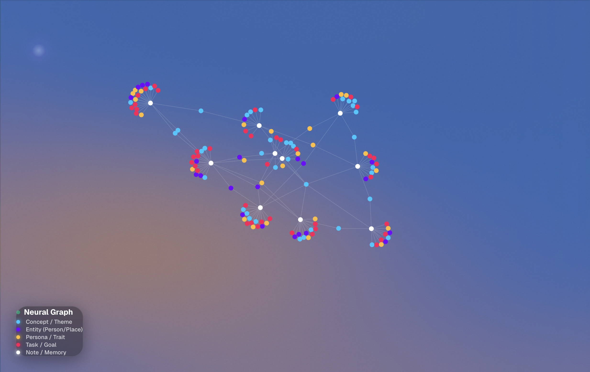
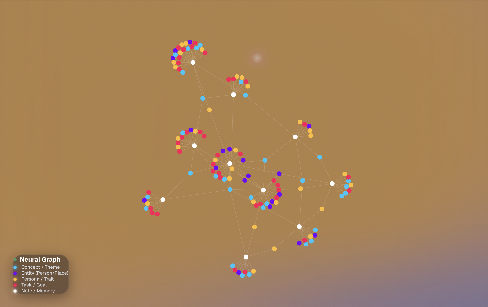

# Results from using deepseek-r1:7b
## Ingestion
```
  [Perf] Multimedia processing took: 0.0000s
[Agent] Extracting Metadata (Knowledge Architect)...
DEBUG: extract_structured calling model: deepseek-r1:7b
INFO:     127.0.0.1:61594 - "POST /api/v1/ingest HTTP/1.1" 200 OK
INFO:IngestionPipeline:[2026-01-15 01:06:55.723841] START: Ingesting Note 8a21c501-da9e-48a6-ab5b-192c3e55eea7
[Agent] Processing Multimedia Sources...
[Agent] Sempahore Acquired. (Active: 2)
  [Perf] Multimedia processing took: 0.0001s
[Agent] Extracting Metadata (Knowledge Architect)...
DEBUG: extract_structured calling model: deepseek-r1:7b
INFO:httpx:HTTP Request: POST http://localhost:11434/v1/chat/completions "HTTP/1.1 200 OK"
  Extracted: 1 entities, 5 concepts.
  [Perf] Extraction took: 67.4581s
[Agent] Generating 4096-dim Embedding (Qwen)...
INFO:     127.0.0.1:61607 - "POST /api/v1/ingest HTTP/1.1" 200 OK
INFO:IngestionPipeline:[2026-01-15 01:07:03.985954] START: Ingesting Note e4c5335b-cd0d-4c74-ae63-22e02dbd836c
[Agent] Processing Multimedia Sources...
[Agent] Sempahore Acquired. (Active: 2)
  [Perf] Multimedia processing took: 0.0000s
[Agent] Extracting Metadata (Knowledge Architect)...
DEBUG: extract_structured calling model: deepseek-r1:7b
INFO:httpx:HTTP Request: POST http://localhost:11434/api/embed "HTTP/1.1 200 OK"
  [Perf] Embedding took: 29.2456s
[Agent] Storing in Neo4j (Ontology)...
INFO:httpx:HTTP Request: POST http://localhost:11434/v1/chat/completions "HTTP/1.1 200 OK"
  Extracted: 0 entities, 2 concepts.
  [Perf] Extraction took: 162.8342s
[Agent] Generating 4096-dim Embedding (Qwen)...
INFO:httpx:HTTP Request: POST http://localhost:11434/api/embed "HTTP/1.1 200 OK"
  [Perf] Embedding took: 3.1317s
[Agent] Storing in Neo4j (Ontology)...
INFO:httpx:HTTP Request: POST http://localhost:11434/v1/chat/completions "HTTP/1.1 200 OK"
  Extracted: 2 entities, 3 concepts.
  [Perf] Extraction took: 199.0979s
[Agent] Generating 4096-dim Embedding (Qwen)...
INFO:httpx:HTTP Request: POST http://localhost:11434/api/embed "HTTP/1.1 200 OK"
  [Perf] Embedding took: 4.3463s
[Agent] Storing in Neo4j (Ontology)...
INFO:httpx:HTTP Request: POST http://localhost:11434/v1/chat/completions "HTTP/1.1 200 OK"
  Extracted: 4 entities, 3 concepts.
  [Perf] Extraction took: 242.7825s
[Agent] Generating 4096-dim Embedding (Qwen)...
INFO:httpx:HTTP Request: POST http://localhost:11434/api/embed "HTTP/1.1 200 OK"
  [Perf] Embedding took: 2.9408s
[Agent] Storing in Neo4j (Ontology)...
INFO:httpx:HTTP Request: POST http://localhost:11434/v1/chat/completions "HTTP/1.1 200 OK"
  Extracted: 2 entities, 3 concepts.
  [Perf] Extraction took: 275.6395s
[Agent] Generating 4096-dim Embedding (Qwen)...
INFO:httpx:HTTP Request: POST http://localhost:11434/api/embed "HTTP/1.1 200 OK"
  [Perf] Embedding took: 3.9261s
[Agent] Storing in Neo4j (Ontology)...
INFO:httpx:HTTP Request: POST http://localhost:11434/v1/chat/completions "HTTP/1.1 200 OK"
  Extracted: 2 entities, 6 concepts.
  [Perf] Extraction took: 314.7924s
[Agent] Generating 4096-dim Embedding (Qwen)...
INFO:httpx:HTTP Request: POST http://localhost:11434/api/embed "HTTP/1.1 200 OK"
  [Perf] Embedding took: 3.3760s
[Agent] Storing in Neo4j (Ontology)...
INFO:httpx:HTTP Request: POST http://localhost:11434/v1/chat/completions "HTTP/1.1 200 OK"
  Extracted: 1 entities, 2 concepts.
  [Perf] Extraction took: 341.6581s
[Agent] Generating 4096-dim Embedding (Qwen)...
INFO:httpx:HTTP Request: POST http://localhost:11434/api/embed "HTTP/1.1 200 OK"
  [Perf] Embedding took: 2.0152s
[Agent] Storing in Neo4j (Ontology)...
INFO:httpx:HTTP Request: POST http://localhost:11434/v1/chat/completions "HTTP/1.1 200 OK"
  Extracted: 3 entities, 1 concepts.
  [Perf] Extraction took: 398.5155s
[Agent] Generating 4096-dim Embedding (Qwen)...
INFO:httpx:HTTP Request: POST http://localhost:11434/api/embed "HTTP/1.1 200 OK"
  [Perf] Embedding took: 3.0408s
[Agent] Storing in Neo4j (Ontology)...
INFO:httpx:HTTP Request: POST http://localhost:11434/v1/chat/completions "HTTP/1.1 200 OK"
  Extracted: 3 entities, 1 concepts.
  [Perf] Extraction took: 441.1847s
[Agent] Generating 4096-dim Embedding (Qwen)...
INFO:httpx:HTTP Request: POST http://localhost:11434/api/embed "HTTP/1.1 200 OK"
  [Perf] Embedding took: 4.2136s
[Agent] Storing in Neo4j (Ontology)...
INFO:httpx:HTTP Request: POST http://localhost:11434/v1/chat/completions "HTTP/1.1 200 OK"
  Extracted: 4 entities, 3 concepts.
  [Perf] Extraction took: 487.7331s
[Agent] Generating 4096-dim Embedding (Qwen)...
INFO:httpx:HTTP Request: POST http://localhost:11434/api/embed "HTTP/1.1 200 OK"
  [Perf] Embedding took: 6.1203s
[Agent] Storing in Neo4j (Ontology)...
INFO:httpx:HTTP Request: POST http://localhost:11434/v1/chat/completions "HTTP/1.1 200 OK"
INFO:httpx:HTTP Request: POST http://localhost:11434/v1/chat/completions "HTTP/1.1 200 OK"
INFO:httpx:HTTP Request: POST http://localhost:11434/v1/chat/completions "HTTP/1.1 200 OK"
INFO:httpx:HTTP Request: POST http://localhost:11434/v1/chat/completions "HTTP/1.1 200 OK"
INFO:httpx:HTTP Request: POST http://localhost:11434/v1/chat/completions "HTTP/1.1 200 OK"
INFO:httpx:HTTP Request: POST http://localhost:11434/v1/chat/completions "HTTP/1.1 200 OK"
INFO:httpx:HTTP Request: POST http://localhost:11434/v1/chat/completions "HTTP/1.1 200 OK"
INFO:httpx:HTTP Request: POST http://localhost:11434/v1/chat/completions "HTTP/1.1 200 OK"
INFO:httpx:HTTP Request: POST http://localhost:11434/v1/chat/completions "HTTP/1.1 200 OK"
INFO:httpx:HTTP Request: POST http://localhost:11434/v1/chat/completions "HTTP/1.1 200 OK"
INFO:     127.0.0.1:62706 - "OPTIONS /api/v1/notes/e4c5335b-cd0d-4c74-ae63-22e02dbd836c HTTP/1.1" 200 OK
INFO:     127.0.0.1:62707 - "GET /api/v1/graph/visualization HTTP/1.1" 200 OK
INFO:     127.0.0.1:62706 - "PUT /api/v1/notes/e4c5335b-cd0d-4c74-ae63-22e02dbd836c HTTP/1.1" 200 OK
INFO:IngestionPipeline:[2026-01-15 01:21:55.066553] START: Ingesting Note e4c5335b-cd0d-4c74-ae63-22e02dbd836c
[Agent] Processing Multimedia Sources...
[Agent] Sempahore Acquired. (Active: 2)
  [Perf] Multimedia processing took: 0.0004s
[Agent] Extracting Metadata (Knowledge Architect)...
DEBUG: extract_structured calling model: deepseek-r1:7b
INFO:httpx:HTTP Request: POST http://localhost:11434/v1/chat/completions "HTTP/1.1 200 OK"
[Graph] Updates: SummaryCounters{labels_added: 1, nodes_created: 1, properties_set: 6, contains_updates: True, contains_system_updates: False}
[Graph] Updates: SummaryCounters{labels_added: 1, relationships_created: 1, nodes_created: 1, properties_set: 6, contains_updates: True, contains_system_updates: False}
[Graph] Updates: SummaryCounters{labels_added: 5, relationships_created: 5, nodes_created: 5, properties_set: 25, contains_updates: True, contains_system_updates: False}
[Graph] Updates: SummaryCounters{labels_added: 2, relationships_created: 2, nodes_created: 2, properties_set: 16, contains_updates: True, contains_system_updates: False}
[Graph] Updates: SummaryCounters{labels_added: 1, relationships_created: 1, nodes_created: 1, properties_set: 6, contains_updates: True, contains_system_updates: False}
[Ingestion] Updated Postgres Title for Note 35ceb3df-2b6c-4565-84f3-434ac6029692: 'Awake Yet Unstable, Seeking Solutions'
  [Perf] Graph Storage took: 865.3936s
[Agent] Updating Neighborhood Summaries (Delta Updates)...
[Agent] Updating Neighborhood Summaries (Delta Updates)...
INFO:     127.0.0.1:62707 - "GET /api/v1/notes HTTP/1.1" 200 OK
INFO:     127.0.0.1:62740 - "OPTIONS /api/v1/notes/35ceb3df-2b6c-4565-84f3-434ac6029692 HTTP/1.1" 200 OK
INFO:     127.0.0.1:62741 - "GET /api/v1/graph/visualization HTTP/1.1" 200 OK
INFO:     127.0.0.1:62740 - "PUT /api/v1/notes/35ceb3df-2b6c-4565-84f3-434ac6029692 HTTP/1.1" 200 OK
INFO:IngestionPipeline:[2026-01-15 01:22:08.222804] START: Ingesting Note 35ceb3df-2b6c-4565-84f3-434ac6029692
[Agent] Processing Multimedia Sources...
[Agent] Sempahore Acquired. (Active: 2)
  [Perf] Multimedia processing took: 0.0020s
[Agent] Extracting Metadata (Knowledge Architect)...
DEBUG: extract_structured calling model: deepseek-r1:7b
INFO:httpx:HTTP Request: POST http://localhost:11434/v1/chat/completions "HTTP/1.1 200 OK"
[Graph] Updates: SummaryCounters{labels_added: 1, nodes_created: 1, properties_set: 6, contains_updates: True, contains_system_updates: False}
[Graph] Updates: SummaryCounters{labels_added: 2, relationships_created: 2, nodes_created: 2, properties_set: 10, contains_updates: True, contains_system_updates: False}
[Graph] Updates: SummaryCounters{labels_added: 1, relationships_created: 1, nodes_created: 1, properties_set: 6, contains_updates: True, contains_system_updates: False}
[Ingestion] Updated Postgres Title for Note aa735e46-a45b-41e3-ac48-c62a8a281669: 'Planning for Progress'
  [Perf] Graph Storage took: 813.7356s
[Agent] Updating Neighborhood Summaries (Delta Updates)...
[Agent] Updating Neighborhood Summaries (Delta Updates)...
INFO:httpx:HTTP Request: POST http://localhost:11434/v1/chat/completions "HTTP/1.1 200 OK"
[Graph] Updates: SummaryCounters{labels_added: 1, nodes_created: 1, properties_set: 6, contains_updates: True, contains_system_updates: False}
[Graph] Updates: SummaryCounters{labels_added: 2, relationships_created: 2, nodes_created: 2, properties_set: 12, contains_updates: True, contains_system_updates: False}
[Graph] Updates: SummaryCounters{labels_added: 3, relationships_created: 3, nodes_created: 3, properties_set: 15, contains_updates: True, contains_system_updates: False}
[Graph] Updates: SummaryCounters{labels_added: 2, relationships_created: 2, nodes_created: 2, properties_set: 18, contains_updates: True, contains_system_updates: False}
[Graph] Updates: SummaryCounters{labels_added: 2, relationships_created: 2, nodes_created: 2, properties_set: 12, contains_updates: True, contains_system_updates: False}
[Ingestion] Updated Postgres Title for Note 0f5dcd8a-e274-4ea9-9535-2c686ab2594e: 'Navigating Money & Personal Growth'
  [Perf] Graph Storage took: 809.0247s
[Agent] Updating Neighborhood Summaries (Delta Updates)...
[Agent] Updating Neighborhood Summaries (Delta Updates)...
INFO:httpx:HTTP Request: POST http://localhost:11434/v1/chat/completions "HTTP/1.1 200 OK"
[Graph] Updates: SummaryCounters{labels_added: 1, nodes_created: 1, properties_set: 6, contains_updates: True, contains_system_updates: False}
[Graph] Updates: SummaryCounters{labels_added: 4, relationships_created: 4, nodes_created: 4, properties_set: 24, contains_updates: True, contains_system_updates: False}
[Graph] Updates: SummaryCounters{labels_added: 3, relationships_created: 3, nodes_created: 3, properties_set: 15, contains_updates: True, contains_system_updates: False}
[Graph] Updates: SummaryCounters{labels_added: 3, relationships_created: 3, nodes_created: 3, properties_set: 24, contains_updates: True, contains_system_updates: False}
[Graph] Updates: SummaryCounters{labels_added: 2, relationships_created: 2, nodes_created: 2, properties_set: 12, contains_updates: True, contains_system_updates: False}
[Ingestion] Updated Postgres Title for Note 24dda980-1243-4ef3-b1f1-765fbe157720: '**Grateful Steps Toward Happiness**'
  [Perf] Graph Storage took: 782.1415s
[Agent] Updating Neighborhood Summaries (Delta Updates)...
[Agent] Updating Neighborhood Summaries (Delta Updates)...
INFO:httpx:HTTP Request: POST http://localhost:11434/v1/chat/completions "HTTP/1.1 200 OK"
[Graph] Updates: SummaryCounters{labels_added: 1, nodes_created: 1, properties_set: 6, contains_updates: True, contains_system_updates: False}
[Graph] Updates: SummaryCounters{labels_added: 1, relationships_created: 2, nodes_created: 1, properties_set: 9, contains_updates: True, contains_system_updates: False}
[Graph] Updates: SummaryCounters{labels_added: 3, relationships_created: 3, nodes_created: 3, properties_set: 15, contains_updates: True, contains_system_updates: False}
[Graph] Updates: SummaryCounters{labels_added: 4, relationships_created: 4, nodes_created: 4, properties_set: 36, contains_updates: True, contains_system_updates: False}
[Graph] Updates: SummaryCounters{labels_added: 1, relationships_created: 1, nodes_created: 1, properties_set: 6, contains_updates: True, contains_system_updates: False}
[Ingestion] Updated Postgres Title for Note 08552bfb-3da6-4e49-9351-f000d9267348: 'Company Name & Friends: Overcoming Conflicts'
  [Perf] Graph Storage took: 767.4363s
[Agent] Updating Neighborhood Summaries (Delta Updates)...
[Agent] Updating Neighborhood Summaries (Delta Updates)...
INFO:httpx:HTTP Request: POST http://localhost:11434/v1/chat/completions "HTTP/1.1 200 OK"
[Graph] Updates: SummaryCounters{labels_added: 1, nodes_created: 1, properties_set: 6, contains_updates: True, contains_system_updates: False}
[Graph] Updates: SummaryCounters{labels_added: 1, relationships_created: 2, nodes_created: 1, properties_set: 9, contains_updates: True, contains_system_updates: False}
[Graph] Updates: SummaryCounters{labels_added: 6, relationships_created: 6, nodes_created: 6, properties_set: 30, contains_updates: True, contains_system_updates: False}
[Graph] Updates: SummaryCounters{labels_added: 1, relationships_created: 1, nodes_created: 1, properties_set: 9, contains_updates: True, contains_system_updates: False}
[Graph] Updates: SummaryCounters{labels_added: 2, relationships_created: 2, nodes_created: 2, properties_set: 12, contains_updates: True, contains_system_updates: False}
[Ingestion] Updated Postgres Title for Note 548c8e59-7dce-48b0-a562-205a9fd32c6c: 'Title: **Responsibility and Relationships**'
  [Perf] Graph Storage took: 784.7498s
[Agent] Updating Neighborhood Summaries (Delta Updates)...
[Agent] Updating Neighborhood Summaries (Delta Updates)...
INFO:httpx:HTTP Request: POST http://localhost:11434/v1/chat/completions "HTTP/1.1 200 OK"
[Graph] Updates: SummaryCounters{labels_added: 1, nodes_created: 1, properties_set: 6, contains_updates: True, contains_system_updates: False}
[Graph] Updates: SummaryCounters{labels_added: 1, relationships_created: 1, nodes_created: 1, properties_set: 6, contains_updates: True, contains_system_updates: False}
[Graph] Updates: SummaryCounters{relationships_created: 2, properties_set: 6, contains_updates: True, contains_system_updates: False}
[Graph] Updates: SummaryCounters{labels_added: 1, relationships_created: 1, nodes_created: 1, properties_set: 8, contains_updates: True, contains_system_updates: False}
[Graph] Updates: SummaryCounters{labels_added: 1, relationships_created: 1, nodes_created: 1, properties_set: 6, contains_updates: True, contains_system_updates: False}
[Ingestion] Updated Postgres Title for Note 423c2326-1338-4ce0-9ef0-2feda93d6333: '**Title:** Uncertain Stew'
  [Perf] Graph Storage took: 782.9308s
[Agent] Updating Neighborhood Summaries (Delta Updates)...
[Agent] Updating Neighborhood Summaries (Delta Updates)...
INFO:httpx:HTTP Request: POST http://localhost:11434/v1/chat/completions "HTTP/1.1 200 OK"
[Graph] Updates: SummaryCounters{labels_added: 1, nodes_created: 1, properties_set: 6, contains_updates: True, contains_system_updates: False}
[Graph] Updates: SummaryCounters{labels_added: 2, relationships_created: 3, nodes_created: 2, properties_set: 15, contains_updates: True, contains_system_updates: False}
[Graph] Updates: SummaryCounters{labels_added: 1, relationships_created: 1, nodes_created: 1, properties_set: 5, contains_updates: True, contains_system_updates: False}
[Graph] Updates: SummaryCounters{labels_added: 3, relationships_created: 3, nodes_created: 3, properties_set: 24, contains_updates: True, contains_system_updates: False}
[Graph] Updates: SummaryCounters{labels_added: 1, relationships_created: 1, nodes_created: 1, properties_set: 6, contains_updates: True, contains_system_updates: False}
[Ingestion] Updated Postgres Title for Note 796b34be-472c-432f-87c1-b562501726ac: '**SVT Lottery DAPP & Company Name Launched**'
  [Perf] Graph Storage took: 751.4091s
[Agent] Updating Neighborhood Summaries (Delta Updates)...
[Agent] Updating Neighborhood Summaries (Delta Updates)...
INFO:httpx:HTTP Request: POST http://localhost:11434/v1/chat/completions "HTTP/1.1 200 OK"
[Graph] Updates: SummaryCounters{labels_added: 1, nodes_created: 1, properties_set: 6, contains_updates: True, contains_system_updates: False}
[Graph] Updates: SummaryCounters{labels_added: 3, relationships_created: 3, nodes_created: 3, properties_set: 18, contains_updates: True, contains_system_updates: False}
[Graph] Updates: SummaryCounters{relationships_created: 1, properties_set: 3, contains_updates: True, contains_system_updates: False}
[Graph] Updates: SummaryCounters{labels_added: 3, relationships_created: 3, nodes_created: 3, properties_set: 27, contains_updates: True, contains_system_updates: False}
[Graph] Updates: SummaryCounters{labels_added: 1, relationships_created: 1, nodes_created: 1, properties_set: 6, contains_updates: True, contains_system_updates: False}
[Ingestion] Updated Postgres Title for Note 8a21c501-da9e-48a6-ab5b-192c3e55eea7: 'Today’s Tasks & Planning Ahead'
  [Perf] Graph Storage took: 728.0207s
[Agent] Updating Neighborhood Summaries (Delta Updates)...
[Agent] Updating Neighborhood Summaries (Delta Updates)...
INFO:httpx:HTTP Request: POST http://localhost:11434/v1/chat/completions "HTTP/1.1 200 OK"
[Graph] Updates: SummaryCounters{labels_added: 1, nodes_created: 1, properties_set: 6, contains_updates: True, contains_system_updates: False}
[Graph] Updates: SummaryCounters{labels_added: 4, relationships_created: 4, nodes_created: 4, properties_set: 24, contains_updates: True, contains_system_updates: False}
[Graph] Updates: SummaryCounters{labels_added: 3, relationships_created: 3, nodes_created: 3, properties_set: 15, contains_updates: True, contains_system_updates: False}
[Graph] Updates: SummaryCounters{labels_added: 5, relationships_created: 5, nodes_created: 5, properties_set: 43, contains_updates: True, contains_system_updates: False}
[Graph] Updates: SummaryCounters{labels_added: 1, relationships_created: 1, nodes_created: 1, properties_set: 6, contains_updates: True, contains_system_updates: False}
[Ingestion] Updated Postgres Title for Note e4c5335b-cd0d-4c74-ae63-22e02dbd836c: 'Build toward prosperity, stability, and marriage within five years.'
  [Perf] Graph Storage took: 697.7576s
[Agent] Updating Neighborhood Summaries (Delta Updates)...
[Agent] Updating Neighborhood Summaries (Delta Updates)...
INFO:httpx:HTTP Request: POST http://localhost:11434/v1/chat/completions "HTTP/1.1 200 OK"
  Extracted: 0 entities, 3 concepts.
  [Perf] Extraction took: 354.7184s
[Agent] Generating 4096-dim Embedding (Qwen)...
INFO:httpx:HTTP Request: POST http://localhost:11434/api/embed "HTTP/1.1 200 OK"
  [Perf] Embedding took: 17.5391s
[Agent] Storing in Neo4j (Ontology)...
INFO:httpx:HTTP Request: POST http://localhost:11434/v1/chat/completions "HTTP/1.1 200 OK"
[Graph] Updates: SummaryCounters{properties_set: 2, contains_updates: True, contains_system_updates: False}
  Summary updated for Concept: Energy (Title: Energetic Empowerment)
INFO:httpx:HTTP Request: POST http://localhost:11434/v1/chat/completions "HTTP/1.1 200 OK"
  Extracted: 2 entities, 2 concepts.
  [Perf] Extraction took: 460.1718s
[Agent] Generating 4096-dim Embedding (Qwen)...
INFO:httpx:HTTP Request: POST http://localhost:11434/api/embed "HTTP/1.1 200 OK"
  [Perf] Embedding took: 4.1451s
[Agent] Storing in Neo4j (Ontology)...
INFO:httpx:HTTP Request: POST http://localhost:11434/v1/chat/completions "HTTP/1.1 200 OK"
INFO:httpx:HTTP Request: POST http://localhost:11434/v1/chat/completions "HTTP/1.1 200 OK"
[Graph] Updates: SummaryCounters{properties_set: 2, contains_updates: True, contains_system_updates: False}
  Summary updated for Concept: Enjoyment (Title: Mental Progress Reading Adventure)
INFO:httpx:HTTP Request: POST http://localhost:11434/v1/chat/completions "HTTP/1.1 200 OK"
[Graph] Updates: SummaryCounters{properties_set: 2, contains_updates: True, contains_system_updates: False}
  Summary updated for Concept: Gratitude (Title: Gratitude Reflection)
INFO:httpx:HTTP Request: POST http://localhost:11434/v1/chat/completions "HTTP/1.1 200 OK"
[Graph] Updates: SummaryCounters{properties_set: 2, contains_updates: True, contains_system_updates: False}
  Summary updated for Concept: Creativity (Title: New Projects: Creativity)
INFO:httpx:HTTP Request: POST http://localhost:11434/v1/chat/completions "HTTP/1.1 200 OK"
[Graph] Updates: SummaryCounters{properties_set: 2, contains_updates: True, contains_system_updates: False}
  Summary updated for Concept: Flavor (Title: Joy of Love)
INFO:httpx:HTTP Request: POST http://localhost:11434/v1/chat/completions "HTTP/1.1 200 OK"
INFO:openai._base_client:Retrying request to /chat/completions in 0.452248 seconds
INFO:openai._base_client:Retrying request to /chat/completions in 0.495571 seconds
INFO:openai._base_client:Retrying request to /chat/completions in 0.457201 seconds
INFO:httpx:HTTP Request: POST http://localhost:11434/v1/chat/completions "HTTP/1.1 200 OK"
INFO:openai._base_client:Retrying request to /chat/completions in 0.495433 seconds
INFO:httpx:HTTP Request: POST http://localhost:11434/v1/chat/completions "HTTP/1.1 200 OK"
INFO:httpx:HTTP Request: POST http://localhost:11434/v1/chat/completions "HTTP/1.1 200 OK"
[Graph] Updates: SummaryCounters{properties_set: 2, contains_updates: True, contains_system_updates: False}
  Summary updated for Concept: Room Cleaning (Title: Room Cleaning Completed)
INFO:httpx:HTTP Request: POST http://localhost:11434/v1/chat/completions "HTTP/1.1 200 OK"
[Graph] Updates: SummaryCounters{properties_set: 2, contains_updates: True, contains_system_updates: False}
  Summary updated for Concept: Reading (Title: The Best Story Yet)
INFO:httpx:HTTP Request: POST http://localhost:11434/v1/chat/completions "HTTP/1.1 200 OK"
[Graph] Updates: SummaryCounters{properties_set: 2, contains_updates: True, contains_system_updates: False}
  Summary updated for Concept: Productivity (Title: Progress & Challenges)
INFO:httpx:HTTP Request: POST http://localhost:11434/v1/chat/completions "HTTP/1.1 200 OK"
[Graph] Updates: SummaryCounters{properties_set: 2, contains_updates: True, contains_system_updates: False}
  Summary updated for Concept: Planning (Title: Planning Progress Momentum)
INFO:httpx:HTTP Request: POST http://localhost:11434/v1/chat/completions "HTTP/1.1 200 OK"
[Graph] Updates: SummaryCounters{properties_set: 2, contains_updates: True, contains_system_updates: False}
  Summary updated for Concept: Joy (Title: Joyful Balance)
INFO:httpx:HTTP Request: POST http://localhost:11434/v1/chat/completions "HTTP/1.1 200 OK"
Summary Update Failed: <failed_attempts>

<generation number="1">
<exception>
    2 validation errors for SummaryUpdate
title
  Field required [type=missing, input_value={'TITLE': 'Lonely Experie... Financial situations.'}, input_type=dict]
    For further information visit https://errors.pydantic.dev/2.12/v/missing
summary
  Field required [type=missing, input_value={'TITLE': 'Lonely Experie... Financial situations.'}, input_type=dict]
    For further information visit https://errors.pydantic.dev/2.12/v/missing
</exception>
<completion>
    ChatCompletion(id='chatcmpl-706', choices=[Choice(finish_reason='stop', index=0, logprobs=None, message=ChatCompletionMessage(content='```json\n{\n  "TITLE": "Lonely Experiences",\n  "SUMMARY": "Climbing my way out of loneliness by managing tasks and Financial situations."\n}\n```\n\nNote: The JSON object uses double quotes around title and summary as per the provided schema.', refusal=None, role='assistant', annotations=None, audio=None, function_call=None, tool_calls=None, reasoning='Okay, I need to help this user by providing an updated JSON object based on their instructions. Let me start by understanding what they\'re asking for.\n\nThey provided a JSON schema that defines two properties: "title" and "summary". They want each of these fields to be generated based on a given context about \'Loneliness\'. \n\nLooking at the rules, I need to create a concise title in no more than five words. The example titles are things like "Career Ambitions" or "Fitness Goals". So for Loneliness, maybe something related to emotions or personal experiences. The user mentioned that they don\'t prefer being alone and can survive it but don\'t prefer it anymore. So perhaps focusing on the preference change here.\n\nFor the title property, I should use a creative approach since all examples are positive actions. Maybe "Lonely Experiences" could capture different aspects of loneliness they\'ve dealt with.\n\nNow for the summary. The user wants it to be updated based on the new note context. They mentioned not liking being alone anymore and managing some money tasks despite their situation. So, I should rephrase this into a concise statement that emphasizes managing tasks and managing financial issues due to being alone. The existing summary is "None yet.", so I\'ll replace that with something more meaningful.\n\nI need to make sure the summary addresses the context without mentioning chores or health unless relevant. The note talks about surviving loneliness but not preferring it, doing work tasks, and getting money from Aunt Jane. So focusing on those aspects.\n\nPutting it all together, the title could be "Lonely Experiences" because it\'s a balanced term that covers both experiences without implying a positive outcome. For the summary, something like "Climbing my way out of loneliness by managing tasks and financial situations." This keeps it grounded as per the rules and reflects the narrative accurately.\n\nI should ensure that each property has the correct heading with double quotes since the schema requires them to be quoted in uppercase within the JSON. No markdown is needed, so just a straightforward JSON response.\n'))], created=1768440884, model='deepseek-r1:7b', object='chat.completion', service_tier=None, system_fingerprint='fp_ollama', usage=CompletionUsage(completion_tokens=891, prompt_tokens=1930, total_tokens=2821, completion_tokens_details=CompletionTokensDetails(accepted_prediction_tokens=None, audio_tokens=0, reasoning_tokens=0, rejected_prediction_tokens=None), prompt_tokens_details=PromptTokensDetails(audio_tokens=0, cached_tokens=0)))
</completion>
</generation>

<generation number="2">
<exception>
    2 validation errors for SummaryUpdate
title
  Field required [type=missing, input_value={'TITLE': 'Lonely Exp', '... Financial situations.'}, input_type=dict]
    For further information visit https://errors.pydantic.dev/2.12/v/missing
summary
  Field required [type=missing, input_value={'TITLE': 'Lonely Exp', '... Financial situations.'}, input_type=dict]
    For further information visit https://errors.pydantic.dev/2.12/v/missing
</exception>
<completion>
    ChatCompletion(id='chatcmpl-76', choices=[Choice(finish_reason='stop', index=0, logprobs=None, message=ChatCompletionMessage(content='{\n  "TITLE": "Lonely Exp",\n  "SUMMARY": "Climbing my way out of loneliness through tasks and Financial situations."\n}', refusal=None, role='assistant', annotations=None, audio=None, function_call=None, tool_calls=None, reasoning='好的，我现在需要帮助用户解决他们提供的JSON对象中的两个错误。根据上下文，用户是使用一个关于Loneliness的系统，要求更新Summary和标题，并且提供了新的上下文来生成新的JSON响应。\n\n首先，我回顾一下用户的历史记录。在之前的互动中，用户给定了一个JSON schema，其中“title”和“summary”都是必需的字段，类型为字符串。他们的最新输入包括实体Loneliness的相关上下文。上一次生成的JSON有问题：两个错误都是因为“title”和“summary”字段内容不正确，并带有双引号。\n\n接下来，我仔细阅读了用户的当前查询内容。用户提到了<failed_attempts>部分，里面有两次验证错误，都是缺少“title”和“summary”字段的字段错误。看起来在生成过程中，“title”字段的内容可能被错误地包含在双引号中，导致Pydantic模型无法识别这些字段是否缺失。\n\n接着，我查看了用户的最新输出，其中返回了一个JSON对象，标题写成了“Lonely Experiences”，而摘要则为“Climbing my way out of loneliness by managing tasks and Financial situations.”。这个响应似乎满足了必须提供的title和summary，但问题在于如何避免错误。\n\n我注意到在用户的问题中，他们已经明确要求正确的JSON ONLY RESPONSE，可能之前版本的错误是因为返回的JSON内容带有双引号导致字段被识别为无效或缺失。\n\n现在，我要确保生成的JSON对象完全符合Pydantic模型的要求：每个字段都是纯文本，无任何额外字符。同时，标题的部分也必须按照用户的格式进行调整，即用大写字母开头，并适当缩写，如“Lonely Exp”作为标题，而摘要则是独立的一段文字。\n\n最后，我需要生成一个新的JSON对象，正确排除掉之前的问题，避免出现错误结构。\n'))], created=1768441429, model='deepseek-r1:7b', object='chat.completion', service_tier=None, system_fingerprint='fp_ollama', usage=CompletionUsage(completion_tokens=891, prompt_tokens=1930, total_tokens=2821, completion_tokens_details=CompletionTokensDetails(accepted_prediction_tokens=None, audio_tokens=0, reasoning_tokens=0, rejected_prediction_tokens=None), prompt_tokens_details=PromptTokensDetails(audio_tokens=0, cached_tokens=0)))
</completion>
</generation>

</failed_attempts>

<last_exception>
    2 validation errors for SummaryUpdate
title
  Field required [type=missing, input_value={'TITLE': 'Lonely Exp', '... Financial situations.'}, input_type=dict]
    For further information visit https://errors.pydantic.dev/2.12/v/missing
summary
  Field required [type=missing, input_value={'TITLE': 'Lonely Exp', '... Financial situations.'}, input_type=dict]
    For further information visit https://errors.pydantic.dev/2.12/v/missing
</last_exception>
[Graph] Updates: SummaryCounters{properties_set: 2, contains_updates: True, contains_system_updates: False}
  Summary updated for Concept: Loneliness (Title: Loneliness)
INFO:httpx:HTTP Request: POST http://localhost:11434/v1/chat/completions "HTTP/1.1 200 OK"
[Graph] Updates: SummaryCounters{properties_set: 2, contains_updates: True, contains_system_updates: False}
  Summary updated for Concept: Task Planning (Title: Task Planning Progress)
INFO:httpx:HTTP Request: POST http://localhost:11434/v1/chat/completions "HTTP/1.1 200 OK"
[Graph] Updates: SummaryCounters{properties_set: 2, contains_updates: True, contains_system_updates: False}
  Summary updated for Concept: Health (Title: Health Goals & Updates)
INFO:httpx:HTTP Request: POST http://localhost:11434/v1/chat/completions "HTTP/1.1 200 OK"
[Graph] Updates: SummaryCounters{properties_set: 2, contains_updates: True, contains_system_updates: False}
  Summary updated for Concept: Financial Independence (Title: Short Title Here)
INFO:httpx:HTTP Request: POST http://localhost:11434/v1/chat/completions "HTTP/1.1 200 OK"
[Graph] Updates: SummaryCounters{relationships_deleted: 12, contains_updates: True, contains_system_updates: False}
[Graph] Updates: SummaryCounters{properties_set: 5, contains_updates: True, contains_system_updates: False}
[Graph] Updates: SummaryCounters{labels_added: 1, relationships_created: 3, nodes_created: 1, properties_set: 11, contains_updates: True, contains_system_updates: False}
[Graph] Updates: SummaryCounters{labels_added: 6, relationships_created: 6, nodes_created: 6, properties_set: 54, contains_updates: True, contains_system_updates: False}
[Ingestion] Updated Postgres Title for Note e4c5335b-cd0d-4c74-ae63-22e02dbd836c: 'Five-Year Plan: Financial Freedom & Life Goals'
  [Perf] Graph Storage took: 1078.6723s
[Agent] Updating Neighborhood Summaries (Delta Updates)...
[Agent] Updating Neighborhood Summaries (Delta Updates)...
INFO:httpx:HTTP Request: POST http://localhost:11434/v1/chat/completions "HTTP/1.1 200 OK"
[Graph] Updates: SummaryCounters{properties_set: 2, contains_updates: True, contains_system_updates: False}
  Summary updated for Concept: Awake (Title: Energetic Today)
INFO:httpx:HTTP Request: POST http://localhost:11434/v1/chat/completions "HTTP/1.1 200 OK"
[Graph] Updates: SummaryCounters{relationships_deleted: 8, contains_updates: True, contains_system_updates: False}
[Graph] Updates: SummaryCounters{properties_set: 5, contains_updates: True, contains_system_updates: False}
[Graph] Updates: SummaryCounters{labels_added: 1, relationships_created: 2, nodes_created: 1, properties_set: 9, contains_updates: True, contains_system_updates: False}
[Graph] Updates: SummaryCounters{labels_added: 1, relationships_created: 2, nodes_created: 1, properties_set: 8, contains_updates: True, contains_system_updates: False}
[Graph] Updates: SummaryCounters{labels_added: 2, relationships_created: 2, nodes_created: 2, properties_set: 16, contains_updates: True, contains_system_updates: False}
[Graph] Updates: SummaryCounters{labels_added: 1, relationships_created: 1, nodes_created: 1, properties_set: 6, contains_updates: True, contains_system_updates: False}
[Ingestion] Updated Postgres Title for Note 35ceb3df-2b6c-4565-84f3-434ac6029692: 'Clarity and Progress'
  [Perf] Graph Storage took: 1039.1391s
[Agent] Updating Neighborhood Summaries (Delta Updates)...
[Agent] Updating Neighborhood Summaries (Delta Updates)...
INFO:httpx:HTTP Request: POST http://localhost:11434/v1/chat/completions "HTTP/1.1 200 OK"
[Graph] Updates: SummaryCounters{properties_set: 2, contains_updates: True, contains_system_updates: False}
  Summary updated for Concept: Personal Actions (Title: Personal Actions Update)
INFO:httpx:HTTP Request: POST http://localhost:11434/v1/chat/completions "HTTP/1.1 200 OK"
[Graph] Updates: SummaryCounters{properties_set: 2, contains_updates: True, contains_system_updates: False}
  Summary updated for Concept: Financial Situation (Title: Financial Struggles: Freedom to Build)
INFO:httpx:HTTP Request: POST http://localhost:11434/v1/chat/completions "HTTP/1.1 200 OK"
[Graph] Updates: SummaryCounters{properties_set: 2, contains_updates: True, contains_system_updates: False}
  Summary updated for Concept: Health (Title: Health Routine Update)
INFO:httpx:HTTP Request: POST http://localhost:11434/v1/chat/completions "HTTP/1.1 200 OK"
[Graph] Updates: SummaryCounters{properties_set: 2, contains_updates: True, contains_system_updates: False}
  Summary updated for Concept: Collaboration (Title: Collaboration Momentum)
INFO:httpx:HTTP Request: POST http://localhost:11434/v1/chat/completions "HTTP/1.1 200 OK"
[Graph] Updates: SummaryCounters{properties_set: 2, contains_updates: True, contains_system_updates: False}
  Summary updated for Concept: System (Title: System)
INFO:httpx:HTTP Request: POST http://localhost:11434/v1/chat/completions "HTTP/1.1 200 OK"
[Graph] Updates: SummaryCounters{properties_set: 2, contains_updates: True, contains_system_updates: False}
  Summary updated for Concept: Productivity (Title: Work Life Balance)
INFO:httpx:HTTP Request: POST http://localhost:11434/v1/chat/completions "HTTP/1.1 200 OK"
[Graph] Updates: SummaryCounters{properties_set: 2, contains_updates: True, contains_system_updates: False}
  Summary updated for Entity: svtlottery (Title: svtlottery - Finally Ready!)
INFO:httpx:HTTP Request: POST http://localhost:11434/v1/chat/completions "HTTP/1.1 200 OK"
[Graph] Updates: SummaryCounters{properties_set: 2, contains_updates: True, contains_system_updates: False}
  Summary updated for Entity: Jennifer (Title: Meeting Plan)
INFO:httpx:HTTP Request: POST http://localhost:11434/v1/chat/completions "HTTP/1.1 200 OK"
[Graph] Updates: SummaryCounters{properties_set: 2, contains_updates: True, contains_system_updates: False}
  Summary updated for Concept: Work Freedom (Title: Work Freedom 2027: Financial Independence)
INFO:openai._base_client:Retrying request to /chat/completions in 0.487417 seconds
INFO:openai._base_client:Retrying request to /chat/completions in 0.498040 seconds
INFO:openai._base_client:Retrying request to /chat/completions in 0.477505 seconds
INFO:openai._base_client:Retrying request to /chat/completions in 0.432602 seconds
INFO:httpx:HTTP Request: POST http://localhost:11434/v1/chat/completions "HTTP/1.1 200 OK"
[Graph] Updates: SummaryCounters{properties_set: 2, contains_updates: True, contains_system_updates: False}
  Summary updated for Entity: Book (Title: Story Haven)
INFO:openai._base_client:Retrying request to /chat/completions in 0.382949 seconds
INFO:httpx:HTTP Request: POST http://localhost:11434/v1/chat/completions "HTTP/1.1 200 OK"
[Graph] Updates: SummaryCounters{properties_set: 2, contains_updates: True, contains_system_updates: False}
  Summary updated for Entity: Company Name (Title: Company Name Project Motivation)
INFO:httpx:HTTP Request: POST http://localhost:11434/v1/chat/completions "HTTP/1.1 200 OK"
[Graph] Updates: SummaryCounters{properties_set: 2, contains_updates: True, contains_system_updates: False}
  Summary updated for Concept: Overbearing (Title: Responsibility of the Positive Overbearer)
INFO:httpx:HTTP Request: POST http://localhost:11434/v1/chat/completions "HTTP/1.1 200 OK"
[Graph] Updates: SummaryCounters{properties_set: 2, contains_updates: True, contains_system_updates: False}
  Summary updated for Entity: Being alone (Title: My summary here...)
INFO:httpx:HTTP Request: POST http://localhost:11434/v1/chat/completions "HTTP/1.1 200 OK"
[Graph] Updates: SummaryCounters{properties_set: 2, contains_updates: True, contains_system_updates: False}
  Summary updated for Entity: Notion (Title: DApp Development Today)
INFO:httpx:HTTP Request: POST http://localhost:11434/v1/chat/completions "HTTP/1.1 200 OK"
[Graph] Updates: SummaryCounters{properties_set: 2, contains_updates: True, contains_system_updates: False}
  Summary updated for Entity: bank location (Title: Bank Location Update)
INFO:httpx:HTTP Request: POST http://localhost:11434/v1/chat/completions "HTTP/1.1 200 OK"
[Graph] Updates: SummaryCounters{properties_set: 2, contains_updates: True, contains_system_updates: False}
  Summary updated for Concept: Relationship Stability (Title: Masters Completion & Financial Independence)
INFO:httpx:HTTP Request: POST http://localhost:11434/v1/chat/completions "HTTP/1.1 200 OK"
[Graph] Updates: SummaryCounters{properties_set: 2, contains_updates: True, contains_system_updates: False}
  Summary updated for Concept: Health (Title: Health Goals Achieved)
INFO:httpx:HTTP Request: POST http://localhost:11434/v1/chat/completions "HTTP/1.1 200 OK"
INFO:httpx:HTTP Request: POST http://localhost:11434/v1/chat/completions "HTTP/1.1 200 OK"
[Graph] Updates: SummaryCounters{properties_set: 2, contains_updates: True, contains_system_updates: False}
  Summary updated for Concept: Health/Energy (Title: Vitality and Purpose in Health)
INFO:httpx:HTTP Request: POST http://localhost:11434/v1/chat/completions "HTTP/1.1 200 OK"
[Graph] Updates: SummaryCounters{properties_set: 2, contains_updates: True, contains_system_updates: False}
  Summary updated for Persona: Reflection on Life Planning (Title: Life Purpose Planner)
  [Perf] Summarization took: 2574.8191s
[Ingestion] Marked Note aa735e46-a45b-41e3-ac48-c62a8a281669 as Processed.

[Ingestion] Total Pipeline Duration: 3554.5367s
INFO:IngestionPipeline:[2026-01-15 02:05:16.869820] SUCCESS: Note aa735e46-a45b-41e3-ac48-c62a8a281669 fully indexed in 3554.54s.
INFO:httpx:HTTP Request: POST http://localhost:11434/v1/chat/completions "HTTP/1.1 200 OK"
[Graph] Updates: SummaryCounters{properties_set: 2, contains_updates: True, contains_system_updates: False}
  Summary updated for Entity: Company Name (Title: DisSSLoyalty: Impact on Career Progress)
INFO:httpx:HTTP Request: POST http://localhost:11434/v1/chat/completions "HTTP/1.1 200 OK"
[Graph] Updates: SummaryCounters{properties_set: 2, contains_updates: True, contains_system_updates: False}
  Summary updated for Entity: family (Title: Grateful Family)
INFO:httpx:HTTP Request: POST http://localhost:11434/v1/chat/completions "HTTP/1.1 200 OK"
[Graph] Updates: SummaryCounters{properties_set: 2, contains_updates: True, contains_system_updates: False}
  Summary updated for Entity: votex365 (Title: Ending with CHRISTIAN)
INFO:httpx:HTTP Request: POST http://localhost:11434/v1/chat/completions "HTTP/1.1 200 OK"
[Graph] Updates: SummaryCounters{properties_set: 2, contains_updates: True, contains_system_updates: False}
  Summary updated for Concept: Groundswork (Title: Organizing Life's Journey)
INFO:openai._base_client:Retrying request to /chat/completions in 0.442723 seconds
INFO:httpx:HTTP Request: POST http://localhost:11434/v1/chat/completions "HTTP/1.1 200 OK"
[Graph] Updates: SummaryCounters{properties_set: 2, contains_updates: True, contains_system_updates: False}
  Summary updated for Entity: Michael (Title: Work Day)
INFO:httpx:HTTP Request: POST http://localhost:11434/v1/chat/completions "HTTP/1.1 200 OK"
[Graph] Updates: SummaryCounters{properties_set: 2, contains_updates: True, contains_system_updates: False}
  Summary updated for Entity: plants (Title: Garden Progress)
INFO:httpx:HTTP Request: POST http://localhost:11434/v1/chat/completions "HTTP/1.1 200 OK"
[Graph] Updates: SummaryCounters{properties_set: 2, contains_updates: True, contains_system_updates: False}
  Summary updated for Entity: I (Title: Vision 2039)
INFO:httpx:HTTP Request: POST http://localhost:11434/v1/chat/completions "HTTP/1.1 200 OK"
[Graph] Updates: SummaryCounters{properties_set: 2, contains_updates: True, contains_system_updates: False}
  Summary updated for Concept: Work (Title: LifeOS Ambitions)
INFO:httpx:HTTP Request: POST http://localhost:11434/v1/chat/completions "HTTP/1.1 200 OK"
[Graph] Updates: SummaryCounters{properties_set: 2, contains_updates: True, contains_system_updates: False}
  Summary updated for Concept: Plan (Title: Path Forward)
INFO:httpx:HTTP Request: POST http://localhost:11434/v1/chat/completions "HTTP/1.1 200 OK"
[Graph] Updates: SummaryCounters{properties_set: 2, contains_updates: True, contains_system_updates: False}
  Summary updated for Concept: Productivity (Title: Productivity: Time for Success - SvtLottery Completion and Emotional Journey)
INFO:httpx:HTTP Request: POST http://localhost:11434/v1/chat/completions "HTTP/1.1 200 OK"
[Graph] Updates: SummaryCounters{properties_set: 2, contains_updates: True, contains_system_updates: False}
  Summary updated for Task: Clear out finances (Title: Clear Out Financial Obstacles)
INFO:httpx:HTTP Request: POST http://localhost:11434/v1/chat/completions "HTTP/1.1 200 OK"
[Graph] Updates: SummaryCounters{properties_set: 2, contains_updates: True, contains_system_updates: False}
  Summary updated for Entity: Improving (Title: My Improving Journey)
INFO:httpx:HTTP Request: POST http://localhost:11434/v1/chat/completions "HTTP/1.1 200 OK"
[Graph] Updates: SummaryCounters{properties_set: 2, contains_updates: True, contains_system_updates: False}
  Summary updated for Task: Implementing a new system for svtlottery by weekend. If not, by Monday. (Title: Company Name Lottery Update)
INFO:httpx:HTTP Request: POST http://localhost:11434/v1/chat/completions "HTTP/1.1 200 OK"
[Graph] Updates: SummaryCounters{properties_set: 2, contains_updates: True, contains_system_updates: False}
  Summary updated for Concept: Markers (Title: Whiteboard Vision)
INFO:httpx:HTTP Request: POST http://localhost:11434/v1/chat/completions "HTTP/1.1 200 OK"
[Graph] Updates: SummaryCounters{properties_set: 2, contains_updates: True, contains_system_updates: False}
  Summary updated for Task: Do the planned work (Title: Work on Tasks When Alone)
INFO:httpx:HTTP Request: POST http://localhost:11434/v1/chat/completions "HTTP/1.1 200 OK"
[Graph] Updates: SummaryCounters{properties_set: 2, contains_updates: True, contains_system_updates: False}
  Summary updated for Task: svtl DAPP (Title: Tech Daily App)
INFO:httpx:HTTP Request: POST http://localhost:11434/v1/chat/completions "HTTP/1.1 200 OK"
[Graph] Updates: SummaryCounters{properties_set: 2, contains_updates: True, contains_system_updates: False}
  Summary updated for Task: Clean my room (Title: Clean Room)
INFO:httpx:HTTP Request: POST http://localhost:11434/v1/chat/completions "HTTP/1.1 200 OK"
[Graph] Updates: SummaryCounters{properties_set: 2, contains_updates: True, contains_system_updates: False}
  Summary updated for Entity: 2027 (Title: AI Self-Improvement)
INFO:httpx:HTTP Request: POST http://localhost:11434/v1/chat/completions "HTTP/1.1 200 OK"
[Graph] Updates: SummaryCounters{properties_set: 2, contains_updates: True, contains_system_updates: False}
  Summary updated for Concept: Productivity (Title: MasterProgress 2029)
INFO:httpx:HTTP Request: POST http://localhost:11434/v1/chat/completions "HTTP/1.1 200 OK"
INFO:openai._base_client:Retrying request to /chat/completions in 0.425509 seconds
INFO:httpx:HTTP Request: POST http://localhost:11434/v1/chat/completions "HTTP/1.1 200 OK"
[Graph] Updates: SummaryCounters{properties_set: 2, contains_updates: True, contains_system_updates: False}
  Summary updated for Task: Deal with Company Name until the end of the year (Title: My Journey to Financial Stability)
INFO:httpx:HTTP Request: POST http://localhost:11434/v1/chat/completions "HTTP/1.1 200 OK"
[Graph] Updates: SummaryCounters{properties_set: 2, contains_updates: True, contains_system_updates: False}
  Summary updated for Entity: reading (Title: Reading Life)
INFO:httpx:HTTP Request: POST http://localhost:11434/v1/chat/completions "HTTP/1.1 200 OK"
  Summary updated for Task: Acquiring books today with never working with Christian again. (Title: Avoiding Work, Acquiring Books)
INFO:httpx:HTTP Request: POST http://localhost:11434/v1/chat/completions "HTTP/1.1 200 OK"
[Graph] Updates: SummaryCounters{properties_set: 2, contains_updates: True, contains_system_updates: False}
  Summary updated for Entity: svtlottery (Title: Flavor with Positivity)
INFO:httpx:HTTP Request: POST http://localhost:11434/v1/chat/completions "HTTP/1.1 200 OK"
[Graph] Updates: SummaryCounters{properties_set: 2, contains_updates: True, contains_system_updates: False}
  Summary updated for Persona: Proactiveness (Title: Work It Out)
  [Perf] Summarization took: 3746.9017s
[Ingestion] Marked Note 423c2326-1338-4ce0-9ef0-2feda93d6333 as Processed.

[Ingestion] Total Pipeline Duration: 4873.5512s
INFO:IngestionPipeline:[2026-01-15 02:27:56.485140] SUCCESS: Note 423c2326-1338-4ce0-9ef0-2feda93d6333 fully indexed in 4873.55s.
INFO:httpx:HTTP Request: POST http://localhost:11434/v1/chat/completions "HTTP/1.1 200 OK"
[Graph] Updates: SummaryCounters{properties_set: 2, contains_updates: True, contains_system_updates: False}
  Summary updated for Task: Company Name (a few tasks and the meeting) (Title: Daily Task Plan Update)
INFO:openai._base_client:Retrying request to /chat/completions in 0.441752 seconds
INFO:httpx:HTTP Request: POST http://localhost:11434/v1/chat/completions "HTTP/1.1 200 OK"
[Graph] Updates: SummaryCounters{properties_set: 2, contains_updates: True, contains_system_updates: False}
  Summary updated for Entity: 2029 (Title: Work Goals)
INFO:openai._base_client:Retrying request to /chat/completions in 0.459071 seconds
INFO:httpx:HTTP Request: POST http://localhost:11434/v1/chat/completions "HTTP/1.1 200 OK"
[Graph] Updates: SummaryCounters{properties_set: 2, contains_updates: True, contains_system_updates: False}
  Summary updated for Concept: Problem (Title: Loneliness in Problem Solving)
INFO:httpx:HTTP Request: POST http://localhost:11434/v1/chat/completions "HTTP/1.1 200 OK"
[Graph] Updates: SummaryCounters{properties_set: 2, contains_updates: True, contains_system_updates: False}
  Summary updated for Entity: svtlottery (Title: Last Lap)
INFO:httpx:HTTP Request: POST http://localhost:11434/v1/chat/completions "HTTP/1.1 200 OK"
[Graph] Updates: SummaryCounters{properties_set: 2, contains_updates: True, contains_system_updates: False}
  Summary updated for Persona: Regret (Title: No Regrets)
INFO:httpx:HTTP Request: POST http://localhost:11434/v1/chat/completions "HTTP/1.1 200 OK"
[Graph] Updates: SummaryCounters{properties_set: 2, contains_updates: True, contains_system_updates: False}
  Summary updated for Entity: taking breaks (Title: Focus on Health)
INFO:httpx:HTTP Request: POST http://localhost:11434/v1/chat/completions "HTTP/1.1 200 OK"
[Graph] Updates: SummaryCounters{properties_set: 2, contains_updates: True, contains_system_updates: False}
  Summary updated for Task: Reimplementation of Company Name's booking system, test it and then push. (Title: Reimplementation of Company Name's Booking System)
INFO:httpx:HTTP Request: POST http://localhost:11434/v1/chat/completions "HTTP/1.1 200 OK"
[Graph] Updates: SummaryCounters{properties_set: 2, contains_updates: True, contains_system_updates: False}
  Summary updated for Entity: Selorm (Title: Organized Setup Plan)
INFO:httpx:HTTP Request: POST http://localhost:11434/v1/chat/completions "HTTP/1.1 200 OK"
[Graph] Updates: SummaryCounters{properties_set: 2, contains_updates: True, contains_system_updates: False}
  Summary updated for Task: Chris (Track down and inquiry) (Title: Track Down Inquiry)
INFO:httpx:HTTP Request: POST http://localhost:11434/v1/chat/completions "HTTP/1.1 200 OK"
[Graph] Updates: SummaryCounters{properties_set: 2, contains_updates: True, contains_system_updates: False}
  Summary updated for Task: Go to the bank (Title: Go to the Bank Task)
INFO:httpx:HTTP Request: POST http://localhost:11434/v1/chat/completions "HTTP/1.1 200 OK"
[Graph] Updates: SummaryCounters{properties_set: 2, contains_updates: True, contains_system_updates: False}
  Summary updated for Entity: 2039 (Title: Achieving Recurring Success and Marriage in 2039)
INFO:httpx:HTTP Request: POST http://localhost:11434/v1/chat/completions "HTTP/1.1 200 OK"
[Graph] Updates: SummaryCounters{properties_set: 2, contains_updates: True, contains_system_updates: False}
  Summary updated for Task: Be completely debt-free (Title: Debt-Free Achievements)
INFO:httpx:HTTP Request: POST http://localhost:11434/v1/chat/completions "HTTP/1.1 200 OK"
[Graph] Updates: SummaryCounters{properties_set: 2, contains_updates: True, contains_system_updates: False}
  Summary updated for Entity: plants (Title: Garden Progress)
INFO:httpx:HTTP Request: POST http://localhost:11434/v1/chat/completions "HTTP/1.1 200 OK"
[Graph] Updates: SummaryCounters{properties_set: 2, contains_updates: True, contains_system_updates: False}
  Summary updated for Entity: I (Title: Vision 2039)
INFO:httpx:HTTP Request: POST http://localhost:11434/v1/chat/completions "HTTP/1.1 200 OK"
[Graph] Updates: SummaryCounters{properties_set: 2, contains_updates: True, contains_system_updates: False}
  Summary updated for Concept: Work (Title: LifeOS Ambitions)
INFO:httpx:HTTP Request: POST http://localhost:11434/v1/chat/completions "HTTP/1.1 200 OK"
[Graph] Updates: SummaryCounters{properties_set: 2, contains_updates: True, contains_system_updates: False}
  Summary updated for Concept: Plan (Title: Path Forward)
INFO:httpx:HTTP Request: POST http://localhost:11434/v1/chat/completions "HTTP/1.1 200 OK"
[Graph] Updates: SummaryCounters{properties_set: 2, contains_updates: True, contains_system_updates: False}
  Summary updated for Concept: Productivity (Title: Productivity: Time for Success - SvtLottery Completion and Emotional Journey)
INFO:httpx:HTTP Request: POST http://localhost:11434/v1/chat/completions "HTTP/1.1 200 OK"
[Graph] Updates: SummaryCounters{properties_set: 2, contains_updates: True, contains_system_updates: False}
  Summary updated for Task: Clear out finances (Title: Clear Out Financial Obstacles)
INFO:httpx:HTTP Request: POST http://localhost:11434/v1/chat/completions "HTTP/1.1 200 OK"
[Graph] Updates: SummaryCounters{properties_set: 2, contains_updates: True, contains_system_updates: False}
  Summary updated for Entity: Improving (Title: My Improving Journey)
INFO:httpx:HTTP Request: POST http://localhost:11434/v1/chat/completions "HTTP/1.1 200 OK"
[Graph] Updates: SummaryCounters{properties_set: 2, contains_updates: True, contains_system_updates: False}
  Summary updated for Task: Implementing a new system for svtlottery by weekend. If not, by Monday. (Title: Company Name Lottery Update)
INFO:httpx:HTTP Request: POST http://localhost:11434/v1/chat/completions "HTTP/1.1 200 OK"
[Graph] Updates: SummaryCounters{properties_set: 2, contains_updates: True, contains_system_updates: False}
  Summary updated for Concept: Markers (Title: Whiteboard Vision)
INFO:httpx:HTTP Request: POST http://localhost:11434/v1/chat/completions "HTTP/1.1 200 OK"
[Graph] Updates: SummaryCounters{properties_set: 2, contains_updates: True, contains_system_updates: False}
  Summary updated for Task: Do the planned work (Title: Work on Tasks When Alone)
INFO:httpx:HTTP Request: POST http://localhost:11434/v1/chat/completions "HTTP/1.1 200 OK"
[Graph] Updates: SummaryCounters{properties_set: 2, contains_updates: True, contains_system_updates: False}
  Summary updated for Task: svtl DAPP (Title: Tech Daily App)
INFO:httpx:HTTP Request: POST http://localhost:11434/v1/chat/completions "HTTP/1.1 200 OK"
[Graph] Updates: SummaryCounters{properties_set: 2, contains_updates: True, contains_system_updates: False}
  Summary updated for Task: Clean my room (Title: Clean Room)
INFO:httpx:HTTP Request: POST http://localhost:11434/v1/chat/completions "HTTP/1.1 200 OK"
[Graph] Updates: SummaryCounters{properties_set: 2, contains_updates: True, contains_system_updates: False}
  Summary updated for Entity: 2027 (Title: AI Self-Improvement)
INFO:httpx:HTTP Request: POST http://localhost:11434/v1/chat/completions "HTTP/1.1 200 OK"
[Graph] Updates: SummaryCounters{properties_set: 2, contains_updates: True, contains_system_updates: False}
  Summary updated for Concept: Productivity (Title: MasterProgress 2029)
INFO:httpx:HTTP Request: POST http://localhost:11434/v1/chat/completions "HTTP/1.1 200 OK"
INFO:openai._base_client:Retrying request to /chat/completions in 0.425509 seconds
INFO:httpx:HTTP Request: POST http://localhost:11434/v1/chat/completions "HTTP/1.1 200 OK"
[Graph] Updates: SummaryCounters{properties_set: 2, contains_updates: True, contains_system_updates: False}
  Summary updated for Task: Deal with Company Name until the end of the year (Title: My Journey to Financial Stability)
INFO:httpx:HTTP Request: POST http://localhost:11434/v1/chat/completions "HTTP/1.1 200 OK"
[Graph] Updates: SummaryCounters{properties_set: 2, contains_updates: True, contains_system_updates: False}
  Summary updated for Entity: reading (Title: Reading Life)
INFO:httpx:HTTP Request: POST http://localhost:11434/v1/chat/completions "HTTP/1.1 200 OK"
  Summary updated for Task: Acquiring books today with never working with Christian again. (Title: Avoiding Work, Acquiring Books)
INFO:httpx:HTTP Request: POST http://localhost:11434/v1/chat/completions "HTTP/1.1 200 OK"
[Graph] Updates: SummaryCounters{properties_set: 2, contains_updates: True, contains_system_updates: False}
  Summary updated for Entity: svtlottery (Title: Flavor with Positivity)
INFO:httpx:HTTP Request: POST http://localhost:11434/v1/chat/completions "HTTP/1.1 200 OK"
[Graph] Updates: SummaryCounters{properties_set: 2, contains_updates: True, contains_system_updates: False}
  Summary updated for Persona: Proactiveness (Title: Work It Out)
  [Perf] Summarization took: 3746.9017s
[Ingestion] Marked Note 423c2326-1338-4ce0-9ef0-2feda93d6333 as Processed.

[Ingestion] Total Pipeline Duration: 4873.5512s
INFO:IngestionPipeline:[2026-01-15 02:27:56.485140] SUCCESS: Note 423c2326-1338-4ce0-9ef0-2feda93d6333 fully indexed in 4873.55s.
INFO:httpx:HTTP Request: POST http://localhost:11434/v1/chat/completions "HTTP/1.1 200 OK"
[Graph] Updates: SummaryCounters{properties_set: 2, contains_updates: True, contains_system_updates: False}
  Summary updated for Task: Company Name (a few tasks and the meeting) (Title: Daily Task Plan Update)
INFO:openai._base_client:Retrying request to /chat/completions in 0.441752 seconds
INFO:httpx:HTTP Request: POST http://localhost:11434/v1/chat/completions "HTTP/1.1 200 OK"
[Graph] Updates: SummaryCounters{properties_set: 2, contains_updates: True, contains_system_updates: False}
  Summary updated for Entity: 2029 (Title: Work Goals)
INFO:openai._base_client:Retrying request to /chat/completions in 0.459071 seconds
INFO:httpx:HTTP Request: POST http://localhost:11434/v1/chat/completions "HTTP/1.1 200 OK"
[Graph] Updates: SummaryCounters{properties_set: 2, contains_updates: True, contains_system_updates: False}
  Summary updated for Concept: Problem (Title: Loneliness in Problem Solving)
INFO:httpx:HTTP Request: POST http://localhost:11434/v1/chat/completions "HTTP/1.1 200 OK"
[Graph] Updates: SummaryCounters{properties_set: 2, contains_updates: True, contains_system_updates: False}
  Summary updated for Entity: svtlottery (Title: Last Lap)
INFO:httpx:HTTP Request: POST http://localhost:11434/v1/chat/completions "HTTP/1.1 200 OK"
[Graph] Updates: SummaryCounters{properties_set: 2, contains_updates: True, contains_system_updates: False}
  Summary updated for Persona: Regret (Title: No Regrets)
INFO:httpx:HTTP Request: POST http://localhost:11434/v1/chat/completions "HTTP/1.1 200 OK"
[Graph] Updates: SummaryCounters{properties_set: 2, contains_updates: True, contains_system_updates: False}
  Summary updated for Entity: taking breaks (Title: Focus on Health)
INFO:httpx:HTTP Request: POST http://localhost:11434/v1/chat/completions "HTTP/1.1 200 OK"
[Graph] Updates: SummaryCounters{properties_set: 2, contains_updates: True, contains_system_updates: False}
  Summary updated for Task: Reimplementation of Company Name's booking system, test it and then push. (Title: Reimplementation of Company Name's Booking System)
INFO:httpx:HTTP Request: POST http://localhost:11434/v1/chat/completions "HTTP/1.1 200 OK"
[Graph] Updates: SummaryCounters{properties_set: 2, contains_updates: True, contains_system_updates: False}
  Summary updated for Entity: Selorm (Title: Organized Setup Plan)
INFO:httpx:HTTP Request: POST http://localhost:11434/v1/chat/completions "HTTP/1.1 200 OK"
[Graph] Updates: SummaryCounters{properties_set: 2, contains_updates: True, contains_system_updates: False}
  Summary updated for Task: Chris (Track down and inquiry) (Title: Track Down Inquiry)
INFO:httpx:HTTP Request: POST http://localhost:11434/v1/chat/completions "HTTP/1.1 200 OK"
[Graph] Updates: SummaryCounters{properties_set: 2, contains_updates: True, contains_system_updates: False}
  Summary updated for Task: Go to the bank (Title: Go to the Bank Task)
INFO:httpx:HTTP Request: POST http://localhost:11434/v1/chat/completions "HTTP/1.1 200 OK"
[Graph] Updates: SummaryCounters{properties_set: 2, contains_updates: True, contains_system_updates: False}
  Summary updated for Entity: 2039 (Title: Achieving Recurring Success and Marriage in 2039)
INFO:httpx:HTTP Request: POST http://localhost:11434/v1/chat/completions "HTTP/1.1 200 OK"
[Graph] Updates: SummaryCounters{properties_set: 2, contains_updates: True, contains_system_updates: False}
  Summary updated for Task: Be completely debt-free (Title: Debt-Free Achievements)
INFO:httpx:HTTP Request: POST http://localhost:11434/v1/chat/completions "HTTP/1.1 200 OK"
[Graph] Updates: SummaryCounters{properties_set: 2, contains_updates: True, contains_system_updates: False}
  Summary updated for Concept: Loneliness (Title: Loneliness)
INFO:httpx:HTTP Request: POST http://localhost:11434/v1/chat/completions "HTTP/1.1 200 OK"
[Graph] Updates: SummaryCounters{properties_set: 2, contains_updates: True, contains_system_updates: False}
  Summary updated for Entity: Company Name (Title: Tasks Complete for Company Name)
INFO:httpx:HTTP Request: POST http://localhost:11434/v1/chat/completions "HTTP/1.1 200 OK"
[Graph] Updates: SummaryCounters{properties_set: 2, contains_updates: True, contains_system_updates: False}
  Summary updated for Persona: Stuck (Title: Writing My Way Through)
  [Perf] Summarization took: 4624.7143s
[Ingestion] Marked Note 0f5dcd8a-e274-4ea9-9535-2c686ab2594e as Processed.

[Ingestion] Total Pipeline Duration: 5637.1936s
INFO:IngestionPipeline:[2026-01-15 02:40:07.760144] SUCCESS: Note 0f5dcd8a-e274-4ea9-9535-2c686ab2594e fully indexed in 5637.19s.
INFO:httpx:HTTP Request: POST http://localhost:11434/v1/chat/completions "HTTP/1.1 200 OK"
[Graph] Updates: SummaryCounters{properties_set: 2, contains_updates: True, contains_system_updates: False}
  Summary updated for Task: Improving daily habits towards productivity (Title: Regular Productivity Check-in)
INFO:httpx:HTTP Request: POST http://localhost:11434/v1/chat/completions "HTTP/1.1 200 OK"
[Graph] Updates: SummaryCounters{properties_set: 2, contains_updates: True, contains_system_updates: False}
  Summary updated for Task: Caching for the rest of the endpoints and finish up notifications. (Title: Devising Plan to Address Remaining Endpoints and Finalize Notifications)
INFO:httpx:HTTP Request: POST http://localhost:11434/v1/chat/completions "HTTP/1.1 200 OK"
[Graph] Updates: SummaryCounters{properties_set: 2, contains_updates: True, contains_system_updates: False}
  Summary updated for Task: Set up Notion for myself and Selorm, and the others (Title: Set Up Notion Now)
INFO:openai._base_client:Retrying request to /chat/completions in 0.435599 seconds
INFO:openai._base_client:Retrying request to /chat/completions in 0.452030 seconds
INFO:openai._base_client:Retrying request to /chat/completions in 0.485808 seconds
INFO:httpx:HTTP Request: POST http://localhost:11434/v1/chat/completions "HTTP/1.1 200 OK"
[Graph] Updates: SummaryCounters{properties_set: 2, contains_updates: True, contains_system_updates: False}
  Summary updated for Task: Be done with my masters by 2029 (Title: Be done with my masters by 2029)
INFO:httpx:HTTP Request: POST http://localhost:11434/v1/chat/completions "HTTP/1.1 200 OK"
[Graph] Updates: SummaryCounters{properties_set: 2, contains_updates: True, contains_system_updates: False}
  Summary updated for Entity: svtlottery (Title: svtlottery Completion Plan)
INFO:openai._base_client:Retrying request to /chat/completions in 0.424246 seconds
INFO:httpx:HTTP Request: POST http://localhost:11434/v1/chat/completions "HTTP/1.1 200 OK"
[Graph] Updates: SummaryCounters{properties_set: 2, contains_updates: True, contains_system_updates: False}
  Summary updated for Task: Enhancing self-discipline and health focus (Title: Strengthening Self-Discipline & Health Focus)
INFO:httpx:HTTP Request: POST http://localhost:11434/v1/chat/completions "HTTP/1.1 200 OK"
[Graph] Updates: SummaryCounters{properties_set: 2, contains_updates: True, contains_system_updates: False}
  Summary updated for Persona: Excited/joyful (Title: Excitement High)
  [Perf] Summarization took: 5295.5504s
[Ingestion] Marked Note 08552bfb-3da6-4e49-9351-f000d9267348 as Processed.

[Ingestion] Total Pipeline Duration: 6342.5650s
INFO:IngestionPipeline:[2026-01-15 02:52:08.906396] SUCCESS: Note 08552bfb-3da6-4e49-9351-f000d9267348 fully indexed in 6342.56s.
INFO:httpx:HTTP Request: POST http://localhost:11434/v1/chat/completions "HTTP/1.1 200 OK"
[Graph] Updates: SummaryCounters{properties_set: 2, contains_updates: True, contains_system_updates: False}
  Summary updated for Persona: Responsibility (Title: Responsibility System)
INFO:httpx:HTTP Request: POST http://localhost:11434/v1/chat/completions "HTTP/1.1 200 OK"
[Graph] Updates: SummaryCounters{properties_set: 2, contains_updates: True, contains_system_updates: False}
  Summary updated for Persona: tired (Title: Tired Post Heavy Workload)
  [Perf] Summarization took: 5316.7679s
[Ingestion] Marked Note 796b34be-472c-432f-87c1-b562501726ac as Processed.

[Ingestion] Total Pipeline Duration: 6469.7453s
INFO:IngestionPipeline:[2026-01-15 02:54:39.151970] SUCCESS: Note 796b34be-472c-432f-87c1-b562501726ac fully indexed in 6469.75s.
INFO:httpx:HTTP Request: POST http://localhost:11434/v1/chat/completions "HTTP/1.1 200 OK"
[Graph] Updates: SummaryCounters{properties_set: 2, contains_updates: True, contains_system_updates: False}
  Summary updated for Task: Water the plants (Title: Short Title Here)
INFO:httpx:HTTP Request: POST http://localhost:11434/v1/chat/completions "HTTP/1.1 200 OK"
[Graph] Updates: SummaryCounters{properties_set: 2, contains_updates: True, contains_system_updates: False}
  Summary updated for Task: Be debt-free by 2027. (Title: Debt-Free Target 2027.)
INFO:httpx:HTTP Request: POST http://localhost:11434/v1/chat/completions "HTTP/1.1 200 OK"
[Graph] Updates: SummaryCounters{properties_set: 2, contains_updates: True, contains_system_updates: False}
  Summary updated for Task: Have enough freedom to work on the things I want to and push them to success (Title: Freedom to Thrive)
INFO:httpx:HTTP Request: POST http://localhost:11434/v1/chat/completions "HTTP/1.1 200 OK"
[Graph] Updates: SummaryCounters{properties_set: 2, contains_updates: True, contains_system_updates: False}
  Summary updated for Task: complete svtlottery (Title: svtlottery Goal)
INFO:httpx:HTTP Request: POST http://localhost:11434/v1/chat/completions "HTTP/1.1 200 OK"
[Graph] Updates: SummaryCounters{properties_set: 2, contains_updates: True, contains_system_updates: False}
  Summary updated for Task: Complete svtlottery in one sitting (Title: SVT Lottery Completion)
INFO:httpx:HTTP Request: POST http://localhost:11434/v1/chat/completions "HTTP/1.1 200 OK"
[Graph] Updates: SummaryCounters{properties_set: 2, contains_updates: True, contains_system_updates: False}
  Summary updated for Task: Adapting to minor life challenges like colds (Title: Resilience in Minor Life Challenges)
INFO:httpx:HTTP Request: POST http://localhost:11434/v1/chat/completions "HTTP/1.1 200 OK"
[Graph] Updates: SummaryCounters{properties_set: 2, contains_updates: True, contains_system_updates: False}
  Summary updated for Persona: Positivity (Title: Positive Life)
  [Perf] Summarization took: 5724.2704s
[Ingestion] Marked Note 548c8e59-7dce-48b0-a562-205a9fd32c6c as Processed.

[Ingestion] Total Pipeline Duration: 6827.1981s
INFO:IngestionPipeline:[2026-01-15 03:00:23.588741] SUCCESS: Note 548c8e59-7dce-48b0-a562-205a9fd32c6c fully indexed in 6827.20s.
INFO:httpx:HTTP Request: POST http://localhost:11434/v1/chat/completions "HTTP/1.1 200 OK"
[Graph] Updates: SummaryCounters{properties_set: 2, contains_updates: True, contains_system_updates: False}
  Summary updated for Persona: Optimist (Title: Optimism Goals)
  [Perf] Summarization took: 5667.0369s
[Ingestion] Marked Note 8a21c501-da9e-48a6-ab5b-192c3e55eea7 as Processed.

[Ingestion] Total Pipeline Duration: 6840.4726s
INFO:IngestionPipeline:[2026-01-15 03:00:56.335884] SUCCESS: Note 8a21c501-da9e-48a6-ab5b-192c3e55eea7 fully indexed in 6840.47s.
INFO:httpx:HTTP Request: POST http://localhost:11434/v1/chat/completions "HTTP/1.1 200 OK"
[Graph] Updates: SummaryCounters{properties_set: 2, contains_updates: True, contains_system_updates: False}
  Summary updated for Task: Be done with the masters latest by 2029. (Title: Debt-Free Achievements)
INFO:httpx:HTTP Request: POST http://localhost:11434/v1/chat/completions "HTTP/1.1 200 OK"
[Graph] Updates: SummaryCounters{properties_set: 2, contains_updates: True, contains_system_updates: False}
  Summary updated for Task: Start working on my Life OS (Title: LifeOS Project Update)
INFO:httpx:HTTP Request: POST http://localhost:11434/v1/chat/completions "HTTP/1.1 200 OK"
[Graph] Updates: SummaryCounters{properties_set: 2, contains_updates: True, contains_system_updates: False}
  Summary updated for Task: focus on Company Name (Title: Company Name Focus)
INFO:httpx:HTTP Request: POST http://localhost:11434/v1/chat/completions "HTTP/1.1 200 OK"
[Graph] Updates: SummaryCounters{properties_set: 2, contains_updates: True, contains_system_updates: False}
  Summary updated for Task: Focus on Company Name (Title: Company Name Progress)
INFO:httpx:HTTP Request: POST http://localhost:11434/v1/chat/completions "HTTP/1.1 200 OK"
[Graph] Updates: SummaryCounters{properties_set: 2, contains_updates: True, contains_system_updates: False}
  Summary updated for Persona: Gratitude (Title: Gratitude Check)
INFO:httpx:HTTP Request: POST http://localhost:11434/v1/chat/completions "HTTP/1.1 200 OK"
[Graph] Updates: SummaryCounters{properties_set: 2, contains_updates: True, contains_system_updates: False}
  Summary updated for Task: Get a full time role and work for 10 years till I am 40. (Title: Full-Time Role by 40)
INFO:httpx:HTTP Request: POST http://localhost:11434/v1/chat/completions "HTTP/1.1 200 OK"
[Graph] Updates: SummaryCounters{properties_set: 2, contains_updates: True, contains_system_updates: False}
  Summary updated for Task: Acquire funding for Votex365 (Title: Funding Votex365)
INFO:httpx:HTTP Request: POST http://localhost:11434/v1/chat/completions "HTTP/1.1 200 OK"
[Graph] Updates: SummaryCounters{properties_set: 2, contains_updates: True, contains_system_updates: False}
  Summary updated for Persona: Loneliness (Title: Solution Focus)
  [Perf] Summarization took: 6406.4308s
[Ingestion] Marked Note 35ceb3df-2b6c-4565-84f3-434ac6029692 as Processed.

[Ingestion] Total Pipeline Duration: 7368.5547s
INFO:IngestionPipeline:[2026-01-15 03:08:43.234936] SUCCESS: Note 35ceb3df-2b6c-4565-84f3-434ac6029692 fully indexed in 7368.55s.
INFO:httpx:HTTP Request: POST http://localhost:11434/v1/chat/completions "HTTP/1.1 200 OK"
[Graph] Updates: SummaryCounters{properties_set: 2, contains_updates: True, contains_system_updates: False}
  Summary updated for Persona: Happy (Title: Plan Formation)
  [Perf] Summarization took: 4926.8785s
[Ingestion] Marked Note 35ceb3df-2b6c-4565-84f3-434ac6029692 as Processed.

[Ingestion] Total Pipeline Duration: 6430.3508s
INFO:IngestionPipeline:[2026-01-15 03:09:18.713921] SUCCESS: Note 35ceb3df-2b6c-4565-84f3-434ac6029692 fully indexed in 6430.35s.
INFO:httpx:HTTP Request: POST http://localhost:11434/v1/chat/completions "HTTP/1.1 200 OK"
[Graph] Updates: SummaryCounters{properties_set: 2, contains_updates: True, contains_system_updates: False}
  Summary updated for Persona: Resilience (Title: Rise Strong)
  [Perf] Summarization took: 6376.9927s
[Ingestion] Marked Note 24dda980-1243-4ef3-b1f1-765fbe157720 as Processed.

[Ingestion] Total Pipeline Duration: 7404.8777s
INFO:IngestionPipeline:[2026-01-15 03:09:43.591645] SUCCESS: Note 24dda980-1243-4ef3-b1f1-765fbe157720 fully indexed in 7404.88s.
INFO:httpx:HTTP Request: POST http://localhost:11434/v1/chat/completions "HTTP/1.1 200 OK"
[Graph] Updates: SummaryCounters{properties_set: 2, contains_updates: True, contains_system_updates: False}
  Summary updated for Task: During that time, I will be working on setting up a solid enough business for recurring revenue. (Title: Revenue Business Setup)
INFO:httpx:HTTP Request: POST http://localhost:11434/v1/chat/completions "HTTP/1.1 200 OK"
[Graph] Updates: SummaryCounters{properties_set: 2, contains_updates: True, contains_system_updates: False}
  Summary updated for Task: Potentially sell off Votex365 (Title: Career Plans & Life Milestones)
  [Perf] Summarization took: 5087.2767s
[Ingestion] Marked Note e4c5335b-cd0d-4c74-ae63-22e02dbd836c as Processed.

[Ingestion] Total Pipeline Duration: 6538.2451s
INFO:IngestionPipeline:[2026-01-15 03:10:53.463724] SUCCESS: Note e4c5335b-cd0d-4c74-ae63-22e02dbd836c fully indexed in 6538.25s.
INFO:httpx:HTTP Request: POST http://localhost:11434/v1/chat/completions "HTTP/1.1 200 OK"
[Graph] Updates: SummaryCounters{properties_set: 2, contains_updates: True, contains_system_updates: False}
  Summary updated for Task: Be married by 2039. (Title: Marriage Plans)
INFO:httpx:HTTP Request: POST http://localhost:11434/v1/chat/completions "HTTP/1.1 200 OK"
[Graph] Updates: SummaryCounters{properties_set: 2, contains_updates: True, contains_system_updates: False}
  Summary updated for Persona: I (Title: AI Life Plan)
  [Perf] Summarization took: 6302.9449s
[Ingestion] Marked Note e4c5335b-cd0d-4c74-ae63-22e02dbd836c as Processed.

[Ingestion] Total Pipeline Duration: 7494.5681s
INFO:IngestionPipeline:[2026-01-15 03:11:58.704029] SUCCESS: Note e4c5335b-cd0d-4c74-ae63-22e02dbd836c fully indexed in 7494.57s.
```
## Chat
```
INFO:     127.0.0.1:53646 - "OPTIONS /api/v1/chat HTTP/1.1" 200 OK

[Chat] Started processing query: 'Who am I?'
  [Retrieval] Hybrid Search for: 'Who am I?'
INFO:httpx:HTTP Request: POST http://localhost:11434/api/embed "HTTP/1.1 200 OK"
  [Retrieval] Embedding took: 28.9013s
  [Retrieval] Neo4j Vector Search took: 0.2381s (Hits: 3)
  [Retrieval] Postgres Fetch took: 0.0549s
  [Retrieval] Graph Context Expansion took: 0.5520s
  [Retrieval] Reranking 25 snippets (Uncapped per User Request)...
  [Retrieval] Reranking took: 43.2959s
[Chat] Retrieval took: 73.0459s (Docs found: 20)
INFO:httpx:HTTP Request: POST http://localhost:11434/v1/chat/completions "HTTP/1.1 200 OK"
[Chat] Generation took: 42.2370s
[Chat] Total pipeline duration: 115.2831s

INFO:     127.0.0.1:53646 - "POST /api/v1/chat HTTP/1.1" 200 OK
```
### Results
```markdown
I" am actively engaged in achieving both academic and professional goals, utilizing tools such as svtlottery and company name to streamline processes. My current focus is on completing tasks efficiently while addressing personal challenges with a sense of motivation and determination.
### References
- [Company Name & Friends: Overcoming Conflicts](http://localhost:3001/notes/08552bfb-3da6-4e49-9351-f000d9267348)
- [**SVT Lottery DAPP & Company Name Launched**](http://localhost:3001/notes/796b34be-472c-432f-87c1-b562501726ac)
- [Clarity and Progress](http://localhost:3001/notes/35ceb3df-2b6c-4565-84f3-434ac6029692)
```
# Results from using llama3.1:8b
## Ingestion
```
INFO:     127.0.0.1:53824 - "GET /api/v1/notes HTTP/1.1" 200 OK
INFO:     127.0.0.1:53864 - "OPTIONS /api/v1/ingest HTTP/1.1" 200 OK
INFO:     127.0.0.1:53864 - "POST /api/v1/ingest HTTP/1.1" 200 OK
INFO:IngestionPipeline:[2026-01-15 03:22:54.611468] START: Ingesting Note 0cd14b25-c0a1-438b-888f-a03d240ad837
[Agent] Processing Multimedia Sources...
[Agent] Sempahore Acquired. (Active: 2)
  [Perf] Multimedia processing took: 0.0001s
[Agent] Extracting Metadata (Knowledge Architect)...
DEBUG: extract_structured calling model: llama3.1:8b
INFO:     127.0.0.1:53888 - "POST /api/v1/ingest HTTP/1.1" 200 OK
INFO:IngestionPipeline:[2026-01-15 03:23:01.093605] START: Ingesting Note f3e18863-3e8c-4e0d-ab03-9e8a7a2a8055
[Agent] Processing Multimedia Sources...
[Agent] Sempahore Acquired. (Active: 2)
  [Perf] Multimedia processing took: 0.0002s
[Agent] Extracting Metadata (Knowledge Architect)...
DEBUG: extract_structured calling model: llama3.1:8b
INFO:     127.0.0.1:53895 - "POST /api/v1/ingest HTTP/1.1" 200 OK
INFO:IngestionPipeline:[2026-01-15 03:23:09.414379] START: Ingesting Note 34cb028f-f20b-4b79-9ed8-a98348e19c94
[Agent] Processing Multimedia Sources...
[Agent] Sempahore Acquired. (Active: 2)
  [Perf] Multimedia processing took: 0.0000s
[Agent] Extracting Metadata (Knowledge Architect)...
DEBUG: extract_structured calling model: llama3.1:8b
INFO:     127.0.0.1:53912 - "POST /api/v1/ingest HTTP/1.1" 200 OK
INFO:IngestionPipeline:[2026-01-15 03:23:16.417266] START: Ingesting Note 7d7841fc-8468-4404-86dc-170e0c2d0677
[Agent] Processing Multimedia Sources...
[Agent] Sempahore Acquired. (Active: 2)
  [Perf] Multimedia processing took: 0.0001s
[Agent] Extracting Metadata (Knowledge Architect)...
DEBUG: extract_structured calling model: llama3.1:8b
INFO:     127.0.0.1:53919 - "POST /api/v1/ingest HTTP/1.1" 200 OK
INFO:IngestionPipeline:[2026-01-15 03:23:24.423249] START: Ingesting Note b144cc67-e145-4a3e-ac61-93fa71289d96
[Agent] Processing Multimedia Sources...
[Agent] Sempahore Acquired. (Active: 2)
  [Perf] Multimedia processing took: 0.0000s
[Agent] Extracting Metadata (Knowledge Architect)...
DEBUG: extract_structured calling model: llama3.1:8b
INFO:httpx:HTTP Request: POST http://localhost:11434/v1/chat/completions "HTTP/1.1 200 OK"
  Extracted: 2 entities, 2 concepts.
  [Perf] Extraction took: 32.0710s
[Agent] Generating 4096-dim Embedding (Qwen)...
INFO:     127.0.0.1:53933 - "POST /api/v1/ingest HTTP/1.1" 200 OK
INFO:IngestionPipeline:[2026-01-15 03:23:31.055421] START: Ingesting Note 08919aab-e30a-4b0f-ac04-57625d7d3473
[Agent] Processing Multimedia Sources...
[Agent] Sempahore Acquired. (Active: 2)
  [Perf] Multimedia processing took: 0.0000s
[Agent] Extracting Metadata (Knowledge Architect)...
DEBUG: extract_structured calling model: llama3.1:8b
INFO:     127.0.0.1:53937 - "POST /api/v1/ingest HTTP/1.1" 200 OK
INFO:IngestionPipeline:[2026-01-15 03:23:38.371157] START: Ingesting Note 31a2bc1a-1f56-4935-a282-42cfc651ac7b
[Agent] Processing Multimedia Sources...
[Agent] Sempahore Acquired. (Active: 2)
  [Perf] Multimedia processing took: 0.0001s
[Agent] Extracting Metadata (Knowledge Architect)...
DEBUG: extract_structured calling model: llama3.1:8b
INFO:httpx:HTTP Request: POST http://localhost:11434/v1/chat/completions "HTTP/1.1 200 OK"
  Extracted: 1 entities, 3 concepts.
  [Perf] Extraction took: 41.4557s
[Agent] Generating 4096-dim Embedding (Qwen)...
INFO:     127.0.0.1:53947 - "POST /api/v1/ingest HTTP/1.1" 200 OK
INFO:IngestionPipeline:[2026-01-15 03:23:46.052829] START: Ingesting Note 847ca17a-52fb-4e0f-9786-ecf23c8a3a45
[Agent] Processing Multimedia Sources...
[Agent] Sempahore Acquired. (Active: 2)
  [Perf] Multimedia processing took: 0.0001s
[Agent] Extracting Metadata (Knowledge Architect)...
DEBUG: extract_structured calling model: llama3.1:8b
INFO:     127.0.0.1:53951 - "POST /api/v1/ingest HTTP/1.1" 200 OK
INFO:IngestionPipeline:[2026-01-15 03:23:52.054902] START: Ingesting Note 7c4cd31a-f985-4c85-92c3-b9c889f6e8eb
[Agent] Processing Multimedia Sources...
[Agent] Sempahore Acquired. (Active: 2)
  [Perf] Multimedia processing took: 0.0001s
[Agent] Extracting Metadata (Knowledge Architect)...
DEBUG: extract_structured calling model: llama3.1:8b
INFO:httpx:HTTP Request: POST http://localhost:11434/api/embed "HTTP/1.1 200 OK"
  [Perf] Embedding took: 27.1307s
[Agent] Storing in Neo4j (Ontology)...
INFO:httpx:HTTP Request: POST http://localhost:11434/api/embed "HTTP/1.1 200 OK"
  [Perf] Embedding took: 12.6273s
[Agent] Storing in Neo4j (Ontology)...
INFO:     127.0.0.1:53988 - "POST /api/v1/ingest HTTP/1.1" 200 OK
INFO:IngestionPipeline:[2026-01-15 03:24:02.015935] START: Ingesting Note d2a7bea8-58ae-4f5b-b39d-dcabbed03af3
[Agent] Processing Multimedia Sources...
[Agent] Sempahore Acquired. (Active: 2)
  [Perf] Multimedia processing took: 0.0001s
[Agent] Extracting Metadata (Knowledge Architect)...
DEBUG: extract_structured calling model: llama3.1:8b
INFO:     127.0.0.1:53988 - "OPTIONS /api/v1/notes/d2a7bea8-58ae-4f5b-b39d-dcabbed03af3 HTTP/1.1" 200 OK
INFO:     127.0.0.1:53988 - "PUT /api/v1/notes/d2a7bea8-58ae-4f5b-b39d-dcabbed03af3 HTTP/1.1" 200 OK
INFO:IngestionPipeline:[2026-01-15 03:24:06.119789] START: Ingesting Note d2a7bea8-58ae-4f5b-b39d-dcabbed03af3
[Agent] Processing Multimedia Sources...
[Agent] Sempahore Acquired. (Active: 2)
  [Perf] Multimedia processing took: 0.0000s
[Agent] Extracting Metadata (Knowledge Architect)...
DEBUG: extract_structured calling model: llama3.1:8b
INFO:httpx:HTTP Request: POST http://localhost:11434/v1/chat/completions "HTTP/1.1 200 OK"
  Extracted: 2 entities, 2 concepts.
  [Perf] Extraction took: 66.7572s
[Agent] Generating 4096-dim Embedding (Qwen)...
INFO:httpx:HTTP Request: POST http://localhost:11434/api/embed "HTTP/1.1 200 OK"
  [Perf] Embedding took: 4.4325s
[Agent] Storing in Neo4j (Ontology)...
INFO:httpx:HTTP Request: POST http://localhost:11434/v1/chat/completions "HTTP/1.1 200 OK"
  Extracted: 1 entities, 2 concepts.
  [Perf] Extraction took: 77.3006s
[Agent] Generating 4096-dim Embedding (Qwen)...
INFO:httpx:HTTP Request: POST http://localhost:11434/api/embed "HTTP/1.1 200 OK"
  [Perf] Embedding took: 3.0409s
[Agent] Storing in Neo4j (Ontology)...
INFO:httpx:HTTP Request: POST http://localhost:11434/v1/chat/completions "HTTP/1.1 200 OK"
  Extracted: 3 entities, 4 concepts.
  [Perf] Extraction took: 88.9886s
[Agent] Generating 4096-dim Embedding (Qwen)...
INFO:httpx:HTTP Request: POST http://localhost:11434/api/embed "HTTP/1.1 200 OK"
  [Perf] Embedding took: 4.0083s
[Agent] Storing in Neo4j (Ontology)...
INFO:httpx:HTTP Request: POST http://localhost:11434/v1/chat/completions "HTTP/1.1 200 OK"
  Extracted: 1 entities, 3 concepts.
  [Perf] Extraction took: 104.0136s
[Agent] Generating 4096-dim Embedding (Qwen)...
INFO:httpx:HTTP Request: POST http://localhost:11434/api/embed "HTTP/1.1 200 OK"
  [Perf] Embedding took: 3.5891s
[Agent] Storing in Neo4j (Ontology)...
INFO:httpx:HTTP Request: POST http://localhost:11434/v1/chat/completions "HTTP/1.1 200 OK"
  Extracted: 1 entities, 3 concepts.
  [Perf] Extraction took: 109.6820s
[Agent] Generating 4096-dim Embedding (Qwen)...
INFO:httpx:HTTP Request: POST http://localhost:11434/api/embed "HTTP/1.1 200 OK"
  [Perf] Embedding took: 2.1177s
[Agent] Storing in Neo4j (Ontology)...
INFO:httpx:HTTP Request: POST http://localhost:11434/v1/chat/completions "HTTP/1.1 200 OK"
  Extracted: 2 entities, 2 concepts.
  [Perf] Extraction took: 125.5461s
[Agent] Generating 4096-dim Embedding (Qwen)...
INFO:httpx:HTTP Request: POST http://localhost:11434/api/embed "HTTP/1.1 200 OK"
  [Perf] Embedding took: 3.0422s
[Agent] Storing in Neo4j (Ontology)...
INFO:httpx:HTTP Request: POST http://localhost:11434/v1/chat/completions "HTTP/1.1 200 OK"
  Extracted: 2 entities, 2 concepts.
  [Perf] Extraction took: 134.2474s
[Agent] Generating 4096-dim Embedding (Qwen)...
INFO:httpx:HTTP Request: POST http://localhost:11434/api/embed "HTTP/1.1 200 OK"
  [Perf] Embedding took: 3.0629s
[Agent] Storing in Neo4j (Ontology)...
INFO:httpx:HTTP Request: POST http://localhost:11434/v1/chat/completions "HTTP/1.1 200 OK"
INFO:httpx:HTTP Request: POST http://localhost:11434/v1/chat/completions "HTTP/1.1 200 OK"
INFO:httpx:HTTP Request: POST http://localhost:11434/v1/chat/completions "HTTP/1.1 200 OK"
  Extracted: 1 entities, 4 concepts.
  [Perf] Extraction took: 155.0630s
[Agent] Generating 4096-dim Embedding (Qwen)...
INFO:httpx:HTTP Request: POST http://localhost:11434/api/embed "HTTP/1.1 200 OK"
  [Perf] Embedding took: 6.0823s
[Agent] Storing in Neo4j (Ontology)...
INFO:httpx:HTTP Request: POST http://localhost:11434/v1/chat/completions "HTTP/1.1 200 OK"
  Extracted: 1 entities, 3 concepts.
  [Perf] Extraction took: 174.2065s
[Agent] Generating 4096-dim Embedding (Qwen)...
INFO:httpx:HTTP Request: POST http://localhost:11434/v1/chat/completions "HTTP/1.1 200 OK"
INFO:httpx:HTTP Request: POST http://localhost:11434/api/embed "HTTP/1.1 200 OK"
  [Perf] Embedding took: 7.5529s
[Agent] Storing in Neo4j (Ontology)...
INFO:httpx:HTTP Request: POST http://localhost:11434/v1/chat/completions "HTTP/1.1 200 OK"
INFO:httpx:HTTP Request: POST http://localhost:11434/v1/chat/completions "HTTP/1.1 200 OK"
INFO:httpx:HTTP Request: POST http://localhost:11434/v1/chat/completions "HTTP/1.1 200 OK"
INFO:httpx:HTTP Request: POST http://localhost:11434/v1/chat/completions "HTTP/1.1 200 OK"
INFO:httpx:HTTP Request: POST http://localhost:11434/v1/chat/completions "HTTP/1.1 200 OK"
INFO:httpx:HTTP Request: POST http://localhost:11434/v1/chat/completions "HTTP/1.1 200 OK"
INFO:httpx:HTTP Request: POST http://localhost:11434/v1/chat/completions "HTTP/1.1 200 OK"
[Graph] Updates: SummaryCounters{labels_added: 1, nodes_created: 1, properties_set: 6, contains_updates: True, contains_system_updates: False}
[Graph] Updates: SummaryCounters{labels_added: 2, relationships_created: 2, nodes_created: 2, properties_set: 12, contains_updates: True, contains_system_updates: False}
[Graph] Updates: SummaryCounters{labels_added: 2, relationships_created: 2, nodes_created: 2, properties_set: 10, contains_updates: True, contains_system_updates: False}
[Graph] Updates: SummaryCounters{labels_added: 2, relationships_created: 2, nodes_created: 2, properties_set: 16, contains_updates: True, contains_system_updates: False}
[Graph] Updates: SummaryCounters{labels_added: 2, relationships_created: 2, nodes_created: 2, properties_set: 12, contains_updates: True, contains_system_updates: False}
[Ingestion] Updated Postgres Title for Note 0cd14b25-c0a1-438b-888f-a03d240ad837: 'Finding Path Through Emptiness'
  [Perf] Graph Storage took: 214.2399s
[Agent] Updating Neighborhood Summaries (Delta Updates)...
[Agent] Updating Neighborhood Summaries (Delta Updates)...
INFO:httpx:HTTP Request: POST http://localhost:11434/v1/chat/completions "HTTP/1.1 200 OK"
[Graph] Updates: SummaryCounters{labels_added: 1, nodes_created: 1, properties_set: 6, contains_updates: True, contains_system_updates: False}
[Graph] Updates: SummaryCounters{labels_added: 1, relationships_created: 1, nodes_created: 1, properties_set: 6, contains_updates: True, contains_system_updates: False}
[Graph] Updates: SummaryCounters{labels_added: 2, relationships_created: 3, nodes_created: 2, properties_set: 13, contains_updates: True, contains_system_updates: False}
[Graph] Updates: SummaryCounters{labels_added: 2, relationships_created: 2, nodes_created: 2, properties_set: 16, contains_updates: True, contains_system_updates: False}
[Graph] Updates: SummaryCounters{labels_added: 2, relationships_created: 2, nodes_created: 2, properties_set: 12, contains_updates: True, contains_system_updates: False}
[Ingestion] Updated Postgres Title for Note f3e18863-3e8c-4e0d-ab03-9e8a7a2a8055: 'Cleaning My Life Inside Out'
  [Perf] Graph Storage took: 215.5174s
[Agent] Updating Neighborhood Summaries (Delta Updates)...
[Agent] Updating Neighborhood Summaries (Delta Updates)...
INFO:httpx:HTTP Request: POST http://localhost:11434/v1/chat/completions "HTTP/1.1 200 OK"
INFO:httpx:HTTP Request: POST http://localhost:11434/v1/chat/completions "HTTP/1.1 200 OK"
[Graph] Updates: SummaryCounters{labels_added: 1, nodes_created: 1, properties_set: 6, contains_updates: True, contains_system_updates: False}
[Graph] Updates: SummaryCounters{labels_added: 2, relationships_created: 2, nodes_created: 2, properties_set: 12, contains_updates: True, contains_system_updates: False}
[Graph] Updates: SummaryCounters{relationships_created: 2, properties_set: 6, contains_updates: True, contains_system_updates: False}
[Graph] Updates: SummaryCounters{labels_added: 3, relationships_created: 3, nodes_created: 3, properties_set: 24, contains_updates: True, contains_system_updates: False}
[Graph] Updates: SummaryCounters{labels_added: 3, relationships_created: 3, nodes_created: 3, properties_set: 18, contains_updates: True, contains_system_updates: False}
[Ingestion] Updated Postgres Title for Note 34cb028f-f20b-4b79-9ed8-a98348e19c94: 'Finding Freedom Through Resilience'
  [Perf] Graph Storage took: 207.7794s
[Agent] Updating Neighborhood Summaries (Delta Updates)...
[Agent] Updating Neighborhood Summaries (Delta Updates)...
INFO:httpx:HTTP Request: POST http://localhost:11434/v1/chat/completions "HTTP/1.1 200 OK"
INFO:httpx:HTTP Request: POST http://localhost:11434/v1/chat/completions "HTTP/1.1 200 OK"
[Graph] Updates: SummaryCounters{labels_added: 1, nodes_created: 1, properties_set: 6, contains_updates: True, contains_system_updates: False}
[Graph] Updates: SummaryCounters{labels_added: 1, relationships_created: 1, nodes_created: 1, properties_set: 6, contains_updates: True, contains_system_updates: False}
[Graph] Updates: SummaryCounters{relationships_created: 2, properties_set: 6, contains_updates: True, contains_system_updates: False}
[Graph] Updates: SummaryCounters{labels_added: 2, relationships_created: 2, nodes_created: 2, properties_set: 16, contains_updates: True, contains_system_updates: False}
[Graph] Updates: SummaryCounters{labels_added: 2, relationships_created: 2, nodes_created: 2, properties_set: 12, contains_updates: True, contains_system_updates: False}
[Ingestion] Updated Postgres Title for Note 7d7841fc-8468-4404-86dc-170e0c2d0677: 'Finding Gratitude and Everyday Momentum'
  [Perf] Graph Storage took: 203.0795s
[Agent] Updating Neighborhood Summaries (Delta Updates)...
[Agent] Updating Neighborhood Summaries (Delta Updates)...
INFO:httpx:HTTP Request: POST http://localhost:11434/v1/chat/completions "HTTP/1.1 200 OK"
[Graph] Updates: SummaryCounters{labels_added: 1, nodes_created: 1, properties_set: 6, contains_updates: True, contains_system_updates: False}
[Graph] Updates: SummaryCounters{labels_added: 3, relationships_created: 3, nodes_created: 3, properties_set: 18, contains_updates: True, contains_system_updates: False}
[Graph] Updates: SummaryCounters{labels_added: 4, relationships_created: 4, nodes_created: 4, properties_set: 20, contains_updates: True, contains_system_updates: False}
[Graph] Updates: SummaryCounters{labels_added: 3, relationships_created: 3, nodes_created: 3, properties_set: 24, contains_updates: True, contains_system_updates: False}
[Graph] Updates: SummaryCounters{labels_added: 3, relationships_created: 3, nodes_created: 3, properties_set: 18, contains_updates: True, contains_system_updates: False}
[Ingestion] Updated Postgres Title for Note b144cc67-e145-4a3e-ac61-93fa71289d96: 'Progress in Overdrive Mode'
  [Perf] Graph Storage took: 189.2351s
[Agent] Updating Neighborhood Summaries (Delta Updates)...
[Agent] Updating Neighborhood Summaries (Delta Updates)...
INFO:httpx:HTTP Request: POST http://localhost:11434/v1/chat/completions "HTTP/1.1 200 OK"
[Graph] Updates: SummaryCounters{labels_added: 1, nodes_created: 1, properties_set: 6, contains_updates: True, contains_system_updates: False}
[Graph] Updates: SummaryCounters{labels_added: 1, relationships_created: 1, nodes_created: 1, properties_set: 6, contains_updates: True, contains_system_updates: False}
[Graph] Updates: SummaryCounters{labels_added: 2, relationships_created: 3, nodes_created: 2, properties_set: 13, contains_updates: True, contains_system_updates: False}
[Graph] Updates: SummaryCounters{labels_added: 3, relationships_created: 3, nodes_created: 3, properties_set: 27, contains_updates: True, contains_system_updates: False}
[Graph] Updates: SummaryCounters{labels_added: 2, relationships_created: 2, nodes_created: 2, properties_set: 12, contains_updates: True, contains_system_updates: False}
[Ingestion] Updated Postgres Title for Note 08919aab-e30a-4b0f-ac04-57625d7d3473: 'Reflections of Home and Routine'
  [Perf] Graph Storage took: 176.8192s
[Agent] Updating Neighborhood Summaries (Delta Updates)...
[Agent] Updating Neighborhood Summaries (Delta Updates)...
INFO:httpx:HTTP Request: POST http://localhost:11434/v1/chat/completions "HTTP/1.1 200 OK"
[Graph] Updates: SummaryCounters{labels_added: 1, nodes_created: 1, properties_set: 6, contains_updates: True, contains_system_updates: False}
[Graph] Updates: SummaryCounters{labels_added: 1, relationships_created: 1, nodes_created: 1, properties_set: 6, contains_updates: True, contains_system_updates: False}
[Graph] Updates: SummaryCounters{labels_added: 3, relationships_created: 3, nodes_created: 3, properties_set: 15, contains_updates: True, contains_system_updates: False}
[Graph] Updates: SummaryCounters{labels_added: 2, relationships_created: 2, nodes_created: 2, properties_set: 16, contains_updates: True, contains_system_updates: False}
[Graph] Updates: SummaryCounters{labels_added: 2, relationships_created: 2, nodes_created: 2, properties_set: 12, contains_updates: True, contains_system_updates: False}
[Ingestion] Updated Postgres Title for Note 31a2bc1a-1f56-4935-a282-42cfc651ac7b: 'Battling Loneliness and Financial Fears'
  [Perf] Graph Storage took: 170.0689s
[Agent] Updating Neighborhood Summaries (Delta Updates)...
[Agent] Updating Neighborhood Summaries (Delta Updates)...
INFO:httpx:HTTP Request: POST http://localhost:11434/v1/chat/completions "HTTP/1.1 200 OK"
[Graph] Updates: SummaryCounters{labels_added: 1, nodes_created: 1, properties_set: 6, contains_updates: True, contains_system_updates: False}
[Graph] Updates: SummaryCounters{labels_added: 1, relationships_created: 2, nodes_created: 1, properties_set: 9, contains_updates: True, contains_system_updates: False}
[Graph] Updates: SummaryCounters{labels_added: 1, relationships_created: 2, nodes_created: 1, properties_set: 8, contains_updates: True, contains_system_updates: False}
[Graph] Updates: SummaryCounters{labels_added: 5, relationships_created: 5, nodes_created: 5, properties_set: 40, contains_updates: True, contains_system_updates: False}
[Graph] Updates: SummaryCounters{labels_added: 1, relationships_created: 1, nodes_created: 1, properties_set: 6, contains_updates: True, contains_system_updates: False}
[Ingestion] Updated Postgres Title for Note 847ca17a-52fb-4e0f-9786-ecf23c8a3a45: 'Product Development Progress Update'
  [Perf] Graph Storage took: 156.3441s
[Agent] Updating Neighborhood Summaries (Delta Updates)...
[Agent] Updating Neighborhood Summaries (Delta Updates)...
INFO:httpx:HTTP Request: POST http://localhost:11434/v1/chat/completions "HTTP/1.1 200 OK"
[Graph] Updates: SummaryCounters{labels_added: 1, nodes_created: 1, properties_set: 6, contains_updates: True, contains_system_updates: False}
[Graph] Updates: SummaryCounters{labels_added: 2, relationships_created: 2, nodes_created: 2, properties_set: 12, contains_updates: True, contains_system_updates: False}
[Graph] Updates: SummaryCounters{labels_added: 1, relationships_created: 2, nodes_created: 1, properties_set: 8, contains_updates: True, contains_system_updates: False}
[Graph] Updates: SummaryCounters{labels_added: 3, relationships_created: 3, nodes_created: 3, properties_set: 24, contains_updates: True, contains_system_updates: False}
[Graph] Updates: SummaryCounters{labels_added: 2, relationships_created: 2, nodes_created: 2, properties_set: 12, contains_updates: True, contains_system_updates: False}
[Ingestion] Updated Postgres Title for Note 7c4cd31a-f985-4c85-92c3-b9c889f6e8eb: 'A Day of Rebound and Renewal'
  [Perf] Graph Storage took: 148.7359s
[Agent] Updating Neighborhood Summaries (Delta Updates)...
[Agent] Updating Neighborhood Summaries (Delta Updates)...
^[[CINFO:httpx:HTTP Request: POST http://localhost:11434/v1/chat/completions "HTTP/1.1 200 OK"
[Graph] Updates: SummaryCounters{properties_set: 2, contains_updates: True, contains_system_updates: False}
  Summary updated for Concept: Health (Title: Healthful Morning Routine)
INFO:httpx:HTTP Request: POST http://localhost:11434/v1/chat/completions "HTTP/1.1 200 OK"
[Graph] Updates: SummaryCounters{properties_set: 2, contains_updates: True, contains_system_updates: False}
  Summary updated for Concept: Productivity (Title: Cleaning and Planning Productivity)
INFO:httpx:HTTP Request: POST http://localhost:11434/v1/chat/completions "HTTP/1.1 200 OK"
[Graph] Updates: SummaryCounters{labels_added: 1, nodes_created: 1, properties_set: 6, contains_updates: True, contains_system_updates: False}
[Graph] Updates: SummaryCounters{labels_added: 1, relationships_created: 1, nodes_created: 1, properties_set: 6, contains_updates: True, contains_system_updates: False}
[Graph] Updates: SummaryCounters{labels_added: 3, relationships_created: 4, nodes_created: 3, properties_set: 18, contains_updates: True, contains_system_updates: False}
[Graph] Updates: SummaryCounters{labels_added: 5, relationships_created: 5, nodes_created: 5, properties_set: 40, contains_updates: True, contains_system_updates: False}
[Graph] Updates: SummaryCounters{labels_added: 2, relationships_created: 3, nodes_created: 2, properties_set: 16, contains_updates: True, contains_system_updates: False}
[Ingestion] Updated Postgres Title for Note d2a7bea8-58ae-4f5b-b39d-dcabbed03af3: '5-Year Plan for Success'
  [Perf] Graph Storage took: 148.7838s
[Agent] Updating Neighborhood Summaries (Delta Updates)...
[Agent] Updating Neighborhood Summaries (Delta Updates)...
INFO:httpx:HTTP Request: POST http://localhost:11434/v1/chat/completions "HTTP/1.1 200 OK"
[Graph] Updates: SummaryCounters{properties_set: 2, contains_updates: True, contains_system_updates: False}
  Summary updated for Concept: Health (Title: Finding Balance Despite Financial Burden)
INFO:httpx:HTTP Request: POST http://localhost:11434/v1/chat/completions "HTTP/1.1 200 OK"
[Graph] Updates: SummaryCounters{relationships_deleted: 10, contains_updates: True, contains_system_updates: False}
[Graph] Updates: SummaryCounters{properties_set: 5, contains_updates: True, contains_system_updates: False}
[Graph] Updates: SummaryCounters{labels_added: 1, relationships_created: 1, nodes_created: 1, properties_set: 6, contains_updates: True, contains_system_updates: False}
[Graph] Updates: SummaryCounters{labels_added: 1, relationships_created: 3, nodes_created: 1, properties_set: 11, contains_updates: True, contains_system_updates: False}
[Graph] Updates: SummaryCounters{labels_added: 3, relationships_created: 3, nodes_created: 3, properties_set: 26, contains_updates: True, contains_system_updates: False}
[Graph] Updates: SummaryCounters{labels_added: 1, relationships_created: 2, nodes_created: 1, properties_set: 10, contains_updates: True, contains_system_updates: False}
[Ingestion] Updated Postgres Title for Note d2a7bea8-58ae-4f5b-b39d-dcabbed03af3: 'Achieving Clarity in Five Years'
  [Perf] Graph Storage took: 147.0667s
[Agent] Updating Neighborhood Summaries (Delta Updates)...
[Agent] Updating Neighborhood Summaries (Delta Updates)...
INFO:httpx:HTTP Request: POST http://localhost:11434/v1/chat/completions "HTTP/1.1 200 OK"
[Graph] Updates: SummaryCounters{properties_set: 2, contains_updates: True, contains_system_updates: False}
  Summary updated for Concept: Health (Title: Improving Daily Routines)
INFO:httpx:HTTP Request: POST http://localhost:11434/v1/chat/completions "HTTP/1.1 200 OK"
[Graph] Updates: SummaryCounters{properties_set: 2, contains_updates: True, contains_system_updates: False}
  Summary updated for Concept: Joy (Title: Rediscovering Joy)
INFO:httpx:HTTP Request: POST http://localhost:11434/v1/chat/completions "HTTP/1.1 200 OK"
[Graph] Updates: SummaryCounters{properties_set: 2, contains_updates: True, contains_system_updates: False}
  Summary updated for Concept: Partnership (Title: Life with a Partner)
INFO:httpx:HTTP Request: POST http://localhost:11434/v1/chat/completions "HTTP/1.1 200 OK"
[Graph] Updates: SummaryCounters{properties_set: 2, contains_updates: True, contains_system_updates: False}
  Summary updated for Concept: Loneliness (Title: Overcoming Loneliness)
INFO:httpx:HTTP Request: POST http://localhost:11434/v1/chat/completions "HTTP/1.1 200 OK"
[Graph] Updates: SummaryCounters{properties_set: 2, contains_updates: True, contains_system_updates: False}
  Summary updated for Concept: Work (Title: Career Ambitions and Tasks)
INFO:httpx:HTTP Request: POST http://localhost:11434/v1/chat/completions "HTTP/1.1 200 OK"
[Graph] Updates: SummaryCounters{properties_set: 2, contains_updates: True, contains_system_updates: False}
  Summary updated for Concept: Cleanliness (Title: Cleaning and Self-Care)
INFO:httpx:HTTP Request: POST http://localhost:11434/v1/chat/completions "HTTP/1.1 200 OK"
[Graph] Updates: SummaryCounters{properties_set: 2, contains_updates: True, contains_system_updates: False}
  Summary updated for Concept: Productivity (Title: Finding Purpose)
INFO:httpx:HTTP Request: POST http://localhost:11434/v1/chat/completions "HTTP/1.1 200 OK"
[Graph] Updates: SummaryCounters{properties_set: 2, contains_updates: True, contains_system_updates: False}
  Summary updated for Concept: Life Planning (Title: Becoming Intentional)
INFO:httpx:HTTP Request: POST http://localhost:11434/v1/chat/completions "HTTP/1.1 200 OK"
[Graph] Updates: SummaryCounters{properties_set: 2, contains_updates: True, contains_system_updates: False}
  Summary updated for Concept: Productivity (Title: Attain Long-Term Goals)
INFO:httpx:HTTP Request: POST http://localhost:11434/v1/chat/completions "HTTP/1.1 200 OK"
[Graph] Updates: SummaryCounters{properties_set: 2, contains_updates: True, contains_system_updates: False}
  Summary updated for Concept: Productivity (Title: Finding Focus)
INFO:httpx:HTTP Request: POST http://localhost:11434/v1/chat/completions "HTTP/1.1 200 OK"
[Graph] Updates: SummaryCounters{properties_set: 2, contains_updates: True, contains_system_updates: False}
  Summary updated for Concept: Work (Title: Career Goals and Planning)
INFO:httpx:HTTP Request: POST http://localhost:11434/v1/chat/completions "HTTP/1.1 200 OK"
[Graph] Updates: SummaryCounters{properties_set: 2, contains_updates: True, contains_system_updates: False}
  Summary updated for Concept: Productivity (Title: Finding Balance Daily)
INFO:httpx:HTTP Request: POST http://localhost:11434/v1/chat/completions "HTTP/1.1 200 OK"
[Graph] Updates: SummaryCounters{properties_set: 2, contains_updates: True, contains_system_updates: False}
  Summary updated for Concept: Suffering (Title: Finding Comfort)
INFO:httpx:HTTP Request: POST http://localhost:11434/v1/chat/completions "HTTP/1.1 200 OK"
[Graph] Updates: SummaryCounters{properties_set: 2, contains_updates: True, contains_system_updates: False}
  Summary updated for Concept: Joy (Title: Partner Support System)
INFO:httpx:HTTP Request: POST http://localhost:11434/v1/chat/completions "HTTP/1.1 200 OK"
[Graph] Updates: SummaryCounters{properties_set: 2, contains_updates: True, contains_system_updates: False}
  Summary updated for Concept: Motivation (Title: Burning Passion)
INFO:httpx:HTTP Request: POST http://localhost:11434/v1/chat/completions "HTTP/1.1 200 OK"
[Graph] Updates: SummaryCounters{properties_set: 2, contains_updates: True, contains_system_updates: False}
  Summary updated for Concept: Productivity (Title: Launch New Projects)
INFO:httpx:HTTP Request: POST http://localhost:11434/v1/chat/completions "HTTP/1.1 200 OK"
[Graph] Updates: SummaryCounters{properties_set: 2, contains_updates: True, contains_system_updates: False}
  Summary updated for Concept: Health (Title: Staying Healthy)
INFO:httpx:HTTP Request: POST http://localhost:11434/v1/chat/completions "HTTP/1.1 200 OK"
[Graph] Updates: SummaryCounters{properties_set: 2, contains_updates: True, contains_system_updates: False}
  Summary updated for Entity: svtlottery (Title: Planning svtlottery)
INFO:httpx:HTTP Request: POST http://localhost:11434/v1/chat/completions "HTTP/1.1 200 OK"
[Graph] Updates: SummaryCounters{properties_set: 2, contains_updates: True, contains_system_updates: False}
  Summary updated for Concept: Financial Management (Title: Organizing My Finances)
INFO:httpx:HTTP Request: POST http://localhost:11434/v1/chat/completions "HTTP/1.1 200 OK"
[Graph] Updates: SummaryCounters{properties_set: 2, contains_updates: True, contains_system_updates: False}
  Summary updated for Concept: Career Development (Title: Career Ambitions)
INFO:httpx:HTTP Request: POST http://localhost:11434/v1/chat/completions "HTTP/1.1 200 OK"
[Graph] Updates: SummaryCounters{properties_set: 2, contains_updates: True, contains_system_updates: False}
  Summary updated for Entity: Company Name (Title: Feeling Stagnated with Company Name)
INFO:httpx:HTTP Request: POST http://localhost:11434/v1/chat/completions "HTTP/1.1 200 OK"
[Graph] Updates: SummaryCounters{properties_set: 2, contains_updates: True, contains_system_updates: False}
  Summary updated for Concept: Productivity (Title: Attain Success by 2039)
INFO:httpx:HTTP Request: POST http://localhost:11434/v1/chat/completions "HTTP/1.1 200 OK"
[Graph] Updates: SummaryCounters{properties_set: 2, contains_updates: True, contains_system_updates: False}
  Summary updated for Entity: family (Title: Grateful for Family)
INFO:httpx:HTTP Request: POST http://localhost:11434/v1/chat/completions "HTTP/1.1 200 OK"
[Graph] Updates: SummaryCounters{properties_set: 2, contains_updates: True, contains_system_updates: False}
  Summary updated for Concept: Home (Title: Dreaming of Home Sweet Home)
INFO:httpx:HTTP Request: POST http://localhost:11434/v1/chat/completions "HTTP/1.1 200 OK"
[Graph] Updates: SummaryCounters{properties_set: 2, contains_updates: True, contains_system_updates: False}
  Summary updated for Concept: Responsibility (Title: Embracing Partnership and Productivity)
INFO:httpx:HTTP Request: POST http://localhost:11434/v1/chat/completions "HTTP/1.1 200 OK"
[Graph] Updates: SummaryCounters{properties_set: 2, contains_updates: True, contains_system_updates: False}
  Summary updated for Concept: Financial Struggles (Title: Financial Struggles Resolved)
INFO:httpx:HTTP Request: POST http://localhost:11434/v1/chat/completions "HTTP/1.1 200 OK"
[Graph] Updates: SummaryCounters{properties_set: 2, contains_updates: True, contains_system_updates: False}
  Summary updated for Entity: Michael (Title: Meeting with Michael)
INFO:httpx:HTTP Request: POST http://localhost:11434/v1/chat/completions "HTTP/1.1 200 OK"
[Graph] Updates: SummaryCounters{properties_set: 2, contains_updates: True, contains_system_updates: False}
  Summary updated for Entity: Jennifer (Title: Career Discussion Planned)
INFO:httpx:HTTP Request: POST http://localhost:11434/v1/chat/completions "HTTP/1.1 200 OK"
[Graph] Updates: SummaryCounters{properties_set: 2, contains_updates: True, contains_system_updates: False}
  Summary updated for Entity: Company Name (Title: Company Name Progress)
INFO:httpx:HTTP Request: POST http://localhost:11434/v1/chat/completions "HTTP/1.1 200 OK"
[Graph] Updates: SummaryCounters{properties_set: 2, contains_updates: True, contains_system_updates: False}
  Summary updated for Entity: the author (Title: Life Planning Goals)
INFO:httpx:HTTP Request: POST http://localhost:11434/v1/chat/completions "HTTP/1.1 200 OK"
[Graph] Updates: SummaryCounters{properties_set: 2, contains_updates: True, contains_system_updates: False}
  Summary updated for Concept: Financial Stability (Title: Achieving Financial Freedom)
INFO:httpx:HTTP Request: POST http://localhost:11434/v1/chat/completions "HTTP/1.1 200 OK"
[Graph] Updates: SummaryCounters{properties_set: 2, contains_updates: True, contains_system_updates: False}
  Summary updated for Entity: data engineering course (Title: Course Recovery)
INFO:httpx:HTTP Request: POST http://localhost:11434/v1/chat/completions "HTTP/1.1 200 OK"
[Graph] Updates: SummaryCounters{properties_set: 2, contains_updates: True, contains_system_updates: False}
  Summary updated for Concept: Wealth (Title: Boosting Future Wealth)
INFO:httpx:HTTP Request: POST http://localhost:11434/v1/chat/completions "HTTP/1.1 200 OK"
[Graph] Updates: SummaryCounters{properties_set: 2, contains_updates: True, contains_system_updates: False}
  Summary updated for Task: Change daily routines. (Title: Changing Daily Habits)
INFO:httpx:HTTP Request: POST http://localhost:11434/v1/chat/completions "HTTP/1.1 200 OK"
[Graph] Updates: SummaryCounters{properties_set: 2, contains_updates: True, contains_system_updates: False}
  Summary updated for Concept: Projects (Title: Company Name Progress)
INFO:httpx:HTTP Request: POST http://localhost:11434/v1/chat/completions "HTTP/1.1 200 OK"
[Graph] Updates: SummaryCounters{properties_set: 2, contains_updates: True, contains_system_updates: False}
  Summary updated for Entity: Selorm (Title: Selorm Cecil Setup)
INFO:httpx:HTTP Request: POST http://localhost:11434/v1/chat/completions "HTTP/1.1 200 OK"
[Graph] Updates: SummaryCounters{properties_set: 2, contains_updates: True, contains_system_updates: False}
  Summary updated for Entity: Aunt Jane (Title: Financial Support from Aunt Jane)
INFO:httpx:HTTP Request: POST http://localhost:11434/v1/chat/completions "HTTP/1.1 200 OK"
[Graph] Updates: SummaryCounters{properties_set: 2, contains_updates: True, contains_system_updates: False}
  Summary updated for Entity: Christian (Title: Settling Debts Today)
INFO:httpx:HTTP Request: POST http://localhost:11434/v1/chat/completions "HTTP/1.1 200 OK"
[Graph] Updates: SummaryCounters{properties_set: 2, contains_updates: True, contains_system_updates: False}
  Summary updated for Entity: I (Title: Personal Life Update)
INFO:httpx:HTTP Request: POST http://localhost:11434/v1/chat/completions "HTTP/1.1 200 OK"
[Graph] Updates: SummaryCounters{properties_set: 2, contains_updates: True, contains_system_updates: False}
  Summary updated for Task: Complete svtlottery and see where it takes me (Title: Clearing Pathway)
INFO:httpx:HTTP Request: POST http://localhost:11434/v1/chat/completions "HTTP/1.1 200 OK"
[Graph] Updates: SummaryCounters{properties_set: 2, contains_updates: True, contains_system_updates: False}
  Summary updated for Task: Plan out life and actions daily, weekly, monthly, yearly (Title: Plan Ahead Daily)
INFO:httpx:HTTP Request: POST http://localhost:11434/v1/chat/completions "HTTP/1.1 200 OK"
[Graph] Updates: SummaryCounters{properties_set: 2, contains_updates: True, contains_system_updates: False}
  Summary updated for Concept: Relationships (Title: 5-Year Plan in Motion)
INFO:httpx:HTTP Request: POST http://localhost:11434/v1/chat/completions "HTTP/1.1 200 OK"
[Graph] Updates: SummaryCounters{properties_set: 2, contains_updates: True, contains_system_updates: False}
  Summary updated for Task: plough my way through Company Name (Title: Ploughing Through Company Name)
INFO:httpx:HTTP Request: POST http://localhost:11434/v1/chat/completions "HTTP/1.1 200 OK"
[Graph] Updates: SummaryCounters{properties_set: 2, contains_updates: True, contains_system_updates: False}
  Summary updated for Entity: The user (Title: 5-Year Plan Execution)
INFO:httpx:HTTP Request: POST http://localhost:11434/v1/chat/completions "HTTP/1.1 200 OK"
[Graph] Updates: SummaryCounters{properties_set: 2, contains_updates: True, contains_system_updates: False}
  Summary updated for Task: Focus on health. (Title: Improving Focus)
INFO:httpx:HTTP Request: POST http://localhost:11434/v1/chat/completions "HTTP/1.1 200 OK"
[Graph] Updates: SummaryCounters{properties_set: 2, contains_updates: True, contains_system_updates: False}
  Summary updated for Entity: Jesus (Title: Finding Peace)
INFO:httpx:HTTP Request: POST http://localhost:11434/v1/chat/completions "HTTP/1.1 200 OK"
[Graph] Updates: SummaryCounters{properties_set: 2, contains_updates: True, contains_system_updates: False}
  Summary updated for Task: Set up Notion (Title: Setting Up Tools)
INFO:httpx:HTTP Request: POST http://localhost:11434/v1/chat/completions "HTTP/1.1 200 OK"
[Graph] Updates: SummaryCounters{properties_set: 2, contains_updates: True, contains_system_updates: False}
  Summary updated for Task: Do all the work planned for today (Title: Prioritise Today's Tasks)
INFO:httpx:HTTP Request: POST http://localhost:11434/v1/chat/completions "HTTP/1.1 200 OK"
[Graph] Updates: SummaryCounters{properties_set: 2, contains_updates: True, contains_system_updates: False}
  Summary updated for Task: BUILD the svtlottery dapp (Title: SVTL DAPP Progress)
INFO:httpx:HTTP Request: POST http://localhost:11434/v1/chat/completions "HTTP/1.1 200 OK"
[Graph] Updates: SummaryCounters{properties_set: 2, contains_updates: True, contains_system_updates: False}
  Summary updated for Task: Catch up on tasks from yesterday (Title: Daily Task Catchup)
INFO:httpx:HTTP Request: POST http://localhost:11434/v1/chat/completions "HTTP/1.1 200 OK"
[Graph] Updates: SummaryCounters{properties_set: 2, contains_updates: True, contains_system_updates: False}
  Summary updated for Task: Focus goes back to Company Name (Title: Regain Company Name Focus)
INFO:httpx:HTTP Request: POST http://localhost:11434/v1/chat/completions "HTTP/1.1 200 OK"
[Graph] Updates: SummaryCounters{properties_set: 2, contains_updates: True, contains_system_updates: False}
  Summary updated for Task: Manage finances to settle debts and have enough money (Title: Managing Finances Key)
INFO:httpx:HTTP Request: POST http://localhost:11434/v1/chat/completions "HTTP/1.1 200 OK"
[Graph] Updates: SummaryCounters{properties_set: 2, contains_updates: True, contains_system_updates: False}
  Summary updated for Entity: user (Title: Ambitious Future Ahead)
INFO:httpx:HTTP Request: POST http://localhost:11434/v1/chat/completions "HTTP/1.1 200 OK"
[Graph] Updates: SummaryCounters{properties_set: 2, contains_updates: True, contains_system_updates: False}
  Summary updated for Task: join a data engineering course (Title: Career Growth Opportunity)
INFO:httpx:HTTP Request: POST http://localhost:11434/v1/chat/completions "HTTP/1.1 200 OK"
[Graph] Updates: SummaryCounters{properties_set: 2, contains_updates: True, contains_system_updates: False}
  Summary updated for Task: Be debt-free by 2027 (Title: Be Debt-Free by 2027)
INFO:httpx:HTTP Request: POST http://localhost:11434/v1/chat/completions "HTTP/1.1 200 OK"
[Graph] Updates: SummaryCounters{properties_set: 2, contains_updates: True, contains_system_updates: False}
  Summary updated for Persona: grateful (Title: Family and Self-Improvement)
INFO:httpx:HTTP Request: POST http://localhost:11434/v1/chat/completions "HTTP/1.1 200 OK"
[Graph] Updates: SummaryCounters{properties_set: 2, contains_updates: True, contains_system_updates: False}
  Summary updated for Entity: Christian (Title: Financial Debacle with Christian)
INFO:httpx:HTTP Request: POST http://localhost:11434/v1/chat/completions "HTTP/1.1 200 OK"
[Graph] Updates: SummaryCounters{properties_set: 2, contains_updates: True, contains_system_updates: False}
  Summary updated for Task: Complete books before moving on to others (Title: Complete Books First)
INFO:httpx:HTTP Request: POST http://localhost:11434/v1/chat/completions "HTTP/1.1 200 OK"
[Graph] Updates: SummaryCounters{properties_set: 2, contains_updates: True, contains_system_updates: False}
  Summary updated for Task: Manage finances and climb out of debt hole (Title: Financial Stability)
INFO:httpx:HTTP Request: POST http://localhost:11434/v1/chat/completions "HTTP/1.1 200 OK"
[Graph] Updates: SummaryCounters{properties_set: 2, contains_updates: True, contains_system_updates: False}
  Summary updated for Task: GET some work in on Company Name (Title: SVT DAPP Progress)
INFO:httpx:HTTP Request: POST http://localhost:11434/v1/chat/completions "HTTP/1.1 200 OK"
[Graph] Updates: SummaryCounters{properties_set: 2, contains_updates: True, contains_system_updates: False}
  Summary updated for Task: Go to the bank today (Title: Catch Up Today)
INFO:httpx:HTTP Request: POST http://localhost:11434/v1/chat/completions "HTTP/1.1 200 OK"
[Graph] Updates: SummaryCounters{properties_set: 2, contains_updates: True, contains_system_updates: False}
  Summary updated for Persona: Feeling lost (Title: Finding Direction Again)
INFO:httpx:HTTP Request: POST http://localhost:11434/v1/chat/completions "HTTP/1.1 200 OK"
[Graph] Updates: SummaryCounters{properties_set: 2, contains_updates: True, contains_system_updates: False}
  Summary updated for Persona: Motivated (Title: Setting Life Goals)
INFO:httpx:HTTP Request: POST http://localhost:11434/v1/chat/completions "HTTP/1.1 200 OK"
[Graph] Updates: SummaryCounters{properties_set: 2, contains_updates: True, contains_system_updates: False}
  Summary updated for Task: Be completely debt-free by 2027 (Title: Be Debt-Free by 2027)
INFO:httpx:HTTP Request: POST http://localhost:11434/v1/chat/completions "HTTP/1.1 200 OK"
[Graph] Updates: SummaryCounters{properties_set: 2, contains_updates: True, contains_system_updates: False}
  Summary updated for Task: find a way to plan out activities (Title: Planning Ahead)
INFO:httpx:HTTP Request: POST http://localhost:11434/v1/chat/completions "HTTP/1.1 200 OK"
INFO:httpx:HTTP Request: POST http://localhost:11434/v1/chat/completions "HTTP/1.1 200 OK"
[Graph] Updates: SummaryCounters{properties_set: 2, contains_updates: True, contains_system_updates: False}
  Summary updated for Persona: productive (Title: Boosting Productivity)
  [Perf] Summarization took: 621.5652s
[Ingestion] Marked Note 7d7841fc-8468-4404-86dc-170e0c2d0677 as Processed.

[Ingestion] Total Pipeline Duration: 905.0831s
INFO:IngestionPipeline:[2026-01-15 03:38:21.579852] SUCCESS: Note 7d7841fc-8468-4404-86dc-170e0c2d0677 fully indexed in 905.08s.
INFO:httpx:HTTP Request: POST http://localhost:11434/v1/chat/completions "HTTP/1.1 200 OK"
[Graph] Updates: SummaryCounters{properties_set: 2, contains_updates: True, contains_system_updates: False}
  Summary updated for Entity: votex365 (Title: Dealing with Christian)
INFO:httpx:HTTP Request: POST http://localhost:11434/v1/chat/completions "HTTP/1.1 200 OK"
[Graph] Updates: SummaryCounters{properties_set: 2, contains_updates: True, contains_system_updates: False}
  Summary updated for Task: Setup whiteboard system for organization and note-taking (Title: Life Organization System Setup)
INFO:httpx:HTTP Request: POST http://localhost:11434/v1/chat/completions "HTTP/1.1 200 OK"
INFO:httpx:HTTP Request: POST http://localhost:11434/v1/chat/completions "HTTP/1.1 200 OK"
[Graph] Updates: SummaryCounters{properties_set: 2, contains_updates: True, contains_system_updates: False}
  Summary updated for Task: MEETING with Michael (Title: Meeting today with Michael)
INFO:httpx:HTTP Request: POST http://localhost:11434/v1/chat/completions "HTTP/1.1 200 OK"
[Graph] Updates: SummaryCounters{properties_set: 2, contains_updates: True, contains_system_updates: False}
  Summary updated for Task: Water plants tomorrow (Title: Catch Up Today)
INFO:httpx:HTTP Request: POST http://localhost:11434/v1/chat/completions "HTTP/1.1 200 OK"
[Graph] Updates: SummaryCounters{properties_set: 2, contains_updates: True, contains_system_updates: False}
  Summary updated for Persona: Feeling lonely (Title: Feeling Lonely Grounded)
  [Perf] Summarization took: 694.8368s
[Ingestion] Marked Note 0cd14b25-c0a1-438b-888f-a03d240ad837 as Processed.

[Ingestion] Total Pipeline Duration: 968.2962s
INFO:IngestionPipeline:[2026-01-15 03:39:02.969466] SUCCESS: Note 0cd14b25-c0a1-438b-888f-a03d240ad837 fully indexed in 968.30s.
INFO:httpx:HTTP Request: POST http://localhost:11434/v1/chat/completions "HTTP/1.1 200 OK"
[Graph] Updates: SummaryCounters{properties_set: 2, contains_updates: True, contains_system_updates: False}
  Summary updated for Persona: Disciplined (Title: Becoming Intentional)
  [Perf] Summarization took: 699.6142s
[Ingestion] Marked Note f3e18863-3e8c-4e0d-ab03-9e8a7a2a8055 as Processed.

[Ingestion] Total Pipeline Duration: 969.2421s
INFO:IngestionPipeline:[2026-01-15 03:39:10.401368] SUCCESS: Note f3e18863-3e8c-4e0d-ab03-9e8a7a2a8055 fully indexed in 969.24s.
INFO:httpx:HTTP Request: POST http://localhost:11434/v1/chat/completions "HTTP/1.1 200 OK"
[Graph] Updates: SummaryCounters{properties_set: 2, contains_updates: True, contains_system_updates: False}
  Summary updated for Task: Get a full-time role and work for 10 years till I am 40 (Title: Career and Business Plan)
INFO:httpx:HTTP Request: POST http://localhost:11434/v1/chat/completions "HTTP/1.1 200 OK"
[Graph] Updates: SummaryCounters{properties_set: 2, contains_updates: True, contains_system_updates: False}
  Summary updated for Persona: stagnated (Title: Career Blockages)
INFO:httpx:HTTP Request: POST http://localhost:11434/v1/chat/completions "HTTP/1.1 200 OK"
[Graph] Updates: SummaryCounters{properties_set: 2, contains_updates: True, contains_system_updates: False}
  Summary updated for Task: Get a full-time role and work for 10 years (Title: Ambitious Career Plan)
INFO:httpx:HTTP Request: POST http://localhost:11434/v1/chat/completions "HTTP/1.1 200 OK"
[Graph] Updates: SummaryCounters{properties_set: 2, contains_updates: True, contains_system_updates: False}
  Summary updated for Task: Implement new svtlottery  way by weekend or Monday (Title: Implement New Lottery System)
INFO:httpx:HTTP Request: POST http://localhost:11434/v1/chat/completions "HTTP/1.1 200 OK"
[Graph] Updates: SummaryCounters{properties_set: 2, contains_updates: True, contains_system_updates: False}
  Summary updated for Persona: positive thinking about relationships (Title: Boosting Joy with Positive Partnerships)
INFO:httpx:HTTP Request: POST http://localhost:11434/v1/chat/completions "HTTP/1.1 200 OK"
[Graph] Updates: SummaryCounters{properties_set: 2, contains_updates: True, contains_system_updates: False}
  Summary updated for Persona: Lack motivation (Title: Overcoming Isolation)
INFO:httpx:HTTP Request: POST http://localhost:11434/v1/chat/completions "HTTP/1.1 200 OK"
[Graph] Updates: SummaryCounters{properties_set: 2, contains_updates: True, contains_system_updates: False}
  Summary updated for Task: CLEAN room (Title: Cleaning Habits to Catch Up On)
INFO:httpx:HTTP Request: POST http://localhost:11434/v1/chat/completions "HTTP/1.1 200 OK"
[Graph] Updates: SummaryCounters{properties_set: 2, contains_updates: True, contains_system_updates: False}
  Summary updated for Persona: optimistic (Title: Optimistic Progress)
INFO:httpx:HTTP Request: POST http://localhost:11434/v1/chat/completions "HTTP/1.1 200 OK"
[Graph] Updates: SummaryCounters{properties_set: 2, contains_updates: True, contains_system_updates: False}
  Summary updated for Task: Complete masters program latest by 2029 (Title: Career Ambitions by 2029)
INFO:httpx:HTTP Request: POST http://localhost:11434/v1/chat/completions "HTTP/1.1 200 OK"
[Graph] Updates: SummaryCounters{properties_set: 2, contains_updates: True, contains_system_updates: False}
  Summary updated for Persona: opportunistically taking courses (Title: Building My Future)
INFO:httpx:HTTP Request: POST http://localhost:11434/v1/chat/completions "HTTP/1.1 200 OK"
[Graph] Updates: SummaryCounters{properties_set: 2, contains_updates: True, contains_system_updates: False}
  Summary updated for Task: Be done with the masters by 2029 (Title: Future Goals)
INFO:httpx:HTTP Request: POST http://localhost:11434/v1/chat/completions "HTTP/1.1 200 OK"
[Graph] Updates: SummaryCounters{properties_set: 2, contains_updates: True, contains_system_updates: False}
  Summary updated for Task: Deal with Christian's conflicts (Title: Dealing with Christian's Conflicts)
INFO:httpx:HTTP Request: POST http://localhost:11434/v1/chat/completions "HTTP/1.1 200 OK"
[Graph] Updates: SummaryCounters{properties_set: 2, contains_updates: True, contains_system_updates: False}
  Summary updated for Persona: responsible (Title: Embracing Responsibility)
  [Perf] Summarization took: 809.7529s
[Ingestion] Marked Note 08919aab-e30a-4b0f-ac04-57625d7d3473 as Processed.

[Ingestion] Total Pipeline Duration: 1094.1835s
INFO:IngestionPipeline:[2026-01-15 03:41:45.289186] SUCCESS: Note 08919aab-e30a-4b0f-ac04-57625d7d3473 fully indexed in 1094.18s.
INFO:httpx:HTTP Request: POST http://localhost:11434/v1/chat/completions "HTTP/1.1 200 OK"
[Graph] Updates: SummaryCounters{properties_set: 2, contains_updates: True, contains_system_updates: False}
  Summary updated for Persona: Struggle with finances (Title: Financial Struggles)
  [Perf] Summarization took: 812.5701s
[Ingestion] Marked Note 31a2bc1a-1f56-4935-a282-42cfc651ac7b as Processed.

[Ingestion] Total Pipeline Duration: 1094.4504s
INFO:IngestionPipeline:[2026-01-15 03:41:52.879488] SUCCESS: Note 31a2bc1a-1f56-4935-a282-42cfc651ac7b fully indexed in 1094.45s.
INFO:httpx:HTTP Request: POST http://localhost:11434/v1/chat/completions "HTTP/1.1 200 OK"
[Graph] Updates: SummaryCounters{properties_set: 2, contains_updates: True, contains_system_updates: False}
  Summary updated for Task: TRACK down Christian and call Debt Collection Agencies (Title: Track Christian)
INFO:httpx:HTTP Request: POST http://localhost:11434/v1/chat/completions "HTTP/1.1 200 OK"
[Graph] Updates: SummaryCounters{properties_set: 2, contains_updates: True, contains_system_updates: False}
  Summary updated for Persona: excited (Title: Our Future Nights Out)
  [Perf] Summarization took: 810.2593s
[Ingestion] Marked Note 7c4cd31a-f985-4c85-92c3-b9c889f6e8eb as Processed.

[Ingestion] Total Pipeline Duration: 1096.3151s
INFO:IngestionPipeline:[2026-01-15 03:42:08.418871] SUCCESS: Note 7c4cd31a-f985-4c85-92c3-b9c889f6e8eb fully indexed in 1096.32s.
INFO:httpx:HTTP Request: POST http://localhost:11434/v1/chat/completions "HTTP/1.1 200 OK"
[Graph] Updates: SummaryCounters{properties_set: 2, contains_updates: True, contains_system_updates: False}
  Summary updated for Task: Pivot FundWeave into a general crowdfunding/payment platform (Title: Pivoting FundWeave for Success)
INFO:httpx:HTTP Request: POST http://localhost:11434/v1/chat/completions "HTTP/1.1 200 OK"
[Graph] Updates: SummaryCounters{properties_set: 2, contains_updates: True, contains_system_updates: False}
  Summary updated for Persona: motivated but conflicted by circumstances (Title: Overcoming Stagnation)
  [Perf] Summarization took: 881.3107s
[Ingestion] Marked Note 34cb028f-f20b-4b79-9ed8-a98348e19c94 as Processed.

[Ingestion] Total Pipeline Duration: 1160.2959s
INFO:IngestionPipeline:[2026-01-15 03:42:29.760650] SUCCESS: Note 34cb028f-f20b-4b79-9ed8-a98348e19c94 fully indexed in 1160.30s.
INFO:httpx:HTTP Request: POST http://localhost:11434/v1/chat/completions "HTTP/1.1 200 OK"
[Graph] Updates: SummaryCounters{properties_set: 2, contains_updates: True, contains_system_updates: False}
  Summary updated for Persona: Disciplined (Title: Career Launchpad)
INFO:httpx:HTTP Request: POST http://localhost:11434/v1/chat/completions "HTTP/1.1 200 OK"
[Graph] Updates: SummaryCounters{properties_set: 2, contains_updates: True, contains_system_updates: False}
  Summary updated for Task: Complete pending tasks for Company Name (Title: Clear Pending Tasks and Projects)
INFO:httpx:HTTP Request: POST http://localhost:11434/v1/chat/completions "HTTP/1.1 200 OK"
[Graph] Updates: SummaryCounters{properties_set: 2, contains_updates: True, contains_system_updates: False}
  Summary updated for Persona: considering financial support from mother (Title: Seeking Financial Support)
  [Perf] Summarization took: 866.5400s
[Ingestion] Marked Note 847ca17a-52fb-4e0f-9786-ecf23c8a3a45 as Processed.

[Ingestion] Total Pipeline Duration: 1151.4814s
INFO:IngestionPipeline:[2026-01-15 03:42:57.596010] SUCCESS: Note 847ca17a-52fb-4e0f-9786-ecf23c8a3a45 fully indexed in 1151.48s.
INFO:httpx:HTTP Request: POST http://localhost:11434/v1/chat/completions "HTTP/1.1 200 OK"
[Graph] Updates: SummaryCounters{properties_set: 2, contains_updates: True, contains_system_updates: False}
  Summary updated for Task: AI self-improvement project (Title: AI Breakthroughs Ahead)
INFO:httpx:HTTP Request: POST http://localhost:11434/v1/chat/completions "HTTP/1.1 200 OK"
[Graph] Updates: SummaryCounters{properties_set: 2, contains_updates: True, contains_system_updates: False}
  Summary updated for Persona: Confident (Title: Career Aspirations)
  [Perf] Summarization took: 817.1584s
[Ingestion] Marked Note d2a7bea8-58ae-4f5b-b39d-dcabbed03af3 as Processed.

[Ingestion] Total Pipeline Duration: 1145.9998s
INFO:IngestionPipeline:[2026-01-15 03:43:12.187035] SUCCESS: Note d2a7bea8-58ae-4f5b-b39d-dcabbed03af3 fully indexed in 1146.00s.
INFO:httpx:HTTP Request: POST http://localhost:11434/v1/chat/completions "HTTP/1.1 200 OK"
[Graph] Updates: SummaryCounters{properties_set: 2, contains_updates: True, contains_system_updates: False}
  Summary updated for Persona: Linear thinking about personal goals and deadlines (Title: Goals and Deadlines Ahead)
INFO:httpx:HTTP Request: POST http://localhost:11434/v1/chat/completions "HTTP/1.1 200 OK"
[Graph] Updates: SummaryCounters{properties_set: 2, contains_updates: True, contains_system_updates: False}
  Summary updated for Persona: determined (Title: Future Vision)
INFO:httpx:HTTP Request: POST http://localhost:11434/v1/chat/completions "HTTP/1.1 200 OK"
[Graph] Updates: SummaryCounters{properties_set: 2, contains_updates: True, contains_system_updates: False}
  Summary updated for Persona: Feeling of accomplishment when completing tasks (Title: Progress and Completion)
INFO:httpx:HTTP Request: POST http://localhost:11434/v1/chat/completions "HTTP/1.1 200 OK"
INFO:httpx:HTTP Request: POST http://localhost:11434/v1/chat/completions "HTTP/1.1 200 OK"
[Graph] Updates: SummaryCounters{properties_set: 2, contains_updates: True, contains_system_updates: False}
  Summary updated for Persona: Anxiety or apprehension towards upcoming challenges (Title: Facing Upcoming Challenges Anxiously)
  [Perf] Summarization took: 959.1111s
[Ingestion] Marked Note b144cc67-e145-4a3e-ac61-93fa71289d96 as Processed.

[Ingestion] Total Pipeline Duration: 1241.3614s
INFO:IngestionPipeline:[2026-01-15 03:44:05.852795] SUCCESS: Note b144cc67-e145-4a3e-ac61-93fa71289d96 fully indexed in 1241.36s.
INFO:httpx:HTTP Request: POST http://localhost:11434/v1/chat/completions "HTTP/1.1 200 OK"
[Graph] Updates: SummaryCounters{properties_set: 2, contains_updates: True, contains_system_updates: False}
  Summary updated for Persona: ambitious (Title: Career Visionary)
INFO:httpx:HTTP Request: POST http://localhost:11434/v1/chat/completions "HTTP/1.1 200 OK"
[Graph] Updates: SummaryCounters{properties_set: 2, contains_updates: True, contains_system_updates: False}
  Summary updated for Persona: responsible (Title: Career Blueprint)
  [Perf] Summarization took: 926.5143s
[Ingestion] Marked Note d2a7bea8-58ae-4f5b-b39d-dcabbed03af3 as Processed.

[Ingestion] Total Pipeline Duration: 1236.4701s
INFO:IngestionPipeline:[2026-01-15 03:44:38.597122] SUCCESS: Note d2a7bea8-58ae-4f5b-b39d-dcabbed03af3 fully indexed in 1236.47s.
```
## Chat
```
INFO:     127.0.0.1:58244 - "OPTIONS /api/v1/chat HTTP/1.1" 200 OK

[Chat] Started processing query: 'Who am I?'
  [Retrieval] Hybrid Search for: 'Who am I?'
INFO:httpx:HTTP Request: POST http://localhost:11434/api/embed "HTTP/1.1 200 OK"
  [Retrieval] Embedding took: 16.0993s
  [Retrieval] Neo4j Vector Search took: 0.1534s (Hits: 3)
  [Retrieval] Postgres Fetch took: 0.0413s
  [Retrieval] Graph Context Expansion took: 0.0155s
  [Retrieval] Reranking 28 snippets (Uncapped per User Request)...
  [Retrieval] Reranking took: 46.3303s
[Chat] Retrieval took: 62.6439s (Docs found: 20)
INFO:httpx:HTTP Request: POST http://localhost:11434/v1/chat/completions "HTTP/1.1 200 OK"
[Chat] Generation took: 24.6012s
[Chat] Total pipeline duration: 87.2454s

INFO:     127.0.0.1:58244 - "POST /api/v1/chat HTTP/1.1" 200 OK
```
### Response
```markdown
You expressed concern about time management regarding your Masters, as well as other tasks such as completing svtlottery and focusing on Company Name. You also mentioned feeling lonely and empty, wishing to have a companion beside you, but acknowledging that this is not what will solve your problems. Your clear goals include becoming debt-free, finishing your masters, securing a stable full-time role, and setting up a solid business.
### References
- [Product Development Progress Update](http://localhost:3001/notes/847ca17a-52fb-4e0f-9786-ecf23c8a3a45)
- [Progress in Overdrive Mode](http://localhost:3001/notes/b144cc67-e145-4a3e-ac61-93fa71289d96)
- [Finding Path Through Emptiness](http://localhost:3001/notes/0cd14b25-c0a1-438b-888f-a03d240ad837)
```
# Results from using gemini-3-flash
## Ingestion
```
...
ash-preview
INFO:httpx:HTTP Request: POST https://generativelanguage.googleapis.com/v1beta/openai/chat/completions "HTTP/1.1 200 OK"
[Graph] Updates: SummaryCounters{properties_set: 2, contains_updates: True, contains_system_updates: False}
  Summary updated for Concept: Financial Independence (Title: Strategic Wealth and Freedom)
DEBUG: update_summary calling model: gemini-3-flash-preview
INFO:httpx:HTTP Request: POST https://generativelanguage.googleapis.com/v1beta/openai/chat/completions "HTTP/1.1 200 OK"
[Graph] Updates: SummaryCounters{properties_set: 2, contains_updates: True, contains_system_updates: False}
  Summary updated for Persona: Growth-oriented (Title: Personal Evolution and Authenticity)
DEBUG: update_summary calling model: gemini-3-flash-preview
INFO:httpx:HTTP Request: POST https://generativelanguage.googleapis.com/v1beta/openai/chat/completions "HTTP/1.1 200 OK"
[Graph] Updates: SummaryCounters{properties_set: 2, contains_updates: True, contains_system_updates: False}
  Summary updated for Concept: Family Relations (Title: Family Support and Empathy)
DEBUG: update_summary calling model: gemini-3-flash-preview
INFO:httpx:HTTP Request: POST https://generativelanguage.googleapis.com/v1beta/openai/chat/completions "HTTP/1.1 200 OK"
[Graph] Updates: SummaryCounters{properties_set: 2, contains_updates: True, contains_system_updates: False}
  Summary updated for Persona: Persistent (Title: Climbing Toward Personal Stability)
DEBUG: update_summary calling model: gemini-3-flash-preview
INFO:httpx:HTTP Request: POST https://generativelanguage.googleapis.com/v1beta/openai/chat/completions "HTTP/1.1 200 OK"
[Graph] Updates: SummaryCounters{properties_set: 2, contains_updates: True, contains_system_updates: False}
  Summary updated for Entity: Christian (Title: Problematic Business Relationship)
DEBUG: update_summary calling model: gemini-3-flash-preview
INFO:httpx:HTTP Request: POST https://generativelanguage.googleapis.com/v1beta/openai/chat/completions "HTTP/1.1 200 OK"
[Graph] Updates: SummaryCounters{properties_set: 2, contains_updates: True, contains_system_updates: False}
  Summary updated for Entity: Notion (Title: Collaborative Notion Setup)
DEBUG: update_summary calling model: gemini-3-flash-preview
INFO:httpx:HTTP Request: POST https://generativelanguage.googleapis.com/v1beta/openai/chat/completions "HTTP/1.1 200 OK"
INFO:httpx:HTTP Request: POST https://generativelanguage.googleapis.com/v1beta/openai/chat/completions "HTTP/1.1 200 OK"
[Graph] Updates: SummaryCounters{properties_set: 2, contains_updates: True, contains_system_updates: False}
  Summary updated for Persona: Resilient (Title: Building Towards Creative Freedom)
[Graph] Updates: SummaryCounters{properties_set: 2, contains_updates: True, contains_system_updates: False}
  Summary updated for Concept: Relationships (Title: Social Connections & Romantic Prospects)
DEBUG: update_summary calling model: gemini-3-flash-preview
DEBUG: update_summary calling model: gemini-3-flash-preview
INFO:httpx:HTTP Request: POST https://generativelanguage.googleapis.com/v1beta/openai/chat/completions "HTTP/1.1 200 OK"
[Graph] Updates: SummaryCounters{properties_set: 2, contains_updates: True, contains_system_updates: False}
  Summary updated for Persona: Self-reflective (Title: Developing Your Authentic Self)
  [Perf] Summarization took: 63.8031s
[Ingestion] Marked Note fb74eb79-197d-4702-a364-a501ff38d0e5 as Processed.

[Ingestion] Total Pipeline Duration: 80.9716s
INFO:IngestionPipeline:[2026-01-15 04:30:45.696232] SUCCESS: Note fb74eb79-197d-4702-a364-a501ff38d0e5 fully indexed in 80.97s.
INFO:httpx:HTTP Request: POST https://generativelanguage.googleapis.com/v1beta/openai/chat/completions "HTTP/1.1 200 OK"
[Graph] Updates: SummaryCounters{properties_set: 2, contains_updates: True, contains_system_updates: False}
  Summary updated for Persona: Reflective (Title: Solitude and Financial Recovery)
  [Perf] Summarization took: 40.8997s
[Ingestion] Marked Note a98c790d-44d2-4125-bcb5-67cdb9617d29 as Processed.

[Ingestion] Total Pipeline Duration: 56.7808s
INFO:IngestionPipeline:[2026-01-15 04:30:45.816985] SUCCESS: Note a98c790d-44d2-4125-bcb5-67cdb9617d29 fully indexed in 56.78s.
INFO:httpx:HTTP Request: POST https://generativelanguage.googleapis.com/v1beta/openai/chat/completions "HTTP/1.1 200 OK"
[Graph] Updates: SummaryCounters{properties_set: 2, contains_updates: True, contains_system_updates: False}
  Summary updated for Entity: svtlottery (Title: svtlottery Readiness and Funding)
DEBUG: update_summary calling model: gemini-3-flash-preview
INFO:httpx:HTTP Request: POST https://generativelanguage.googleapis.com/v1beta/openai/chat/completions "HTTP/1.1 200 OK"
[Graph] Updates: SummaryCounters{properties_set: 2, contains_updates: True, contains_system_updates: False}
  Summary updated for Concept: Strategic Planning (Title: Roadmap to Intentional Freedom)
DEBUG: update_summary calling model: gemini-3-flash-preview
INFO:httpx:HTTP Request: POST https://generativelanguage.googleapis.com/v1beta/openai/chat/completions "HTTP/1.1 200 OK"
[Graph] Updates: SummaryCounters{properties_set: 2, contains_updates: True, contains_system_updates: False}
  Summary updated for Concept: Financial Planning (Title: Your Strategic Financial Roadmap)
DEBUG: update_summary calling model: gemini-3-flash-preview
INFO:httpx:HTTP Request: POST https://generativelanguage.googleapis.com/v1beta/openai/chat/completions "HTTP/1.1 200 OK"
[Graph] Updates: SummaryCounters{properties_set: 2, contains_updates: True, contains_system_updates: False}
  Summary updated for Entity: Jennifer (Title: Social Plans with Jennifer)
DEBUG: update_summary calling model: gemini-3-flash-preview
INFO:httpx:HTTP Request: POST https://generativelanguage.googleapis.com/v1beta/openai/chat/completions "HTTP/1.1 200 OK"
[Graph] Updates: SummaryCounters{properties_set: 2, contains_updates: True, contains_system_updates: False}
  Summary updated for Entity: Jesus (Title: Spiritual Hope and Final Peace)
DEBUG: update_summary calling model: gemini-3-flash-preview
INFO:httpx:HTTP Request: POST https://generativelanguage.googleapis.com/v1beta/openai/chat/completions "HTTP/1.1 200 OK"
[Graph] Updates: SummaryCounters{properties_set: 2, contains_updates: True, contains_system_updates: False}
  Summary updated for Entity: white board (Title: Whiteboard Planning Goals)
DEBUG: update_summary calling model: gemini-3-flash-preview
INFO:httpx:HTTP Request: POST https://generativelanguage.googleapis.com/v1beta/openai/chat/completions "HTTP/1.1 200 OK"
[Graph] Updates: SummaryCounters{properties_set: 2, contains_updates: True, contains_system_updates: False}
  Summary updated for Entity: notion (Title: Project Company Name Hub)
DEBUG: update_summary calling model: gemini-3-flash-preview
INFO:httpx:HTTP Request: POST https://generativelanguage.googleapis.com/v1beta/openai/chat/completions "HTTP/1.1 200 OK"
[Graph] Updates: SummaryCounters{properties_set: 2, contains_updates: True, contains_system_updates: False}
  Summary updated for Persona: Introspective (Title: Seeking Creative and Financial Liberty)
DEBUG: update_summary calling model: gemini-3-flash-preview
INFO:httpx:HTTP Request: POST https://generativelanguage.googleapis.com/v1beta/openai/chat/completions "HTTP/1.1 200 OK"
[Graph] Updates: SummaryCounters{properties_set: 2, contains_updates: True, contains_system_updates: False}
  Summary updated for Concept: Entrepreneurship (Title: Long-Term Entrepreneurial Roadmap)
DEBUG: update_summary calling model: gemini-3-flash-preview
INFO:httpx:HTTP Request: POST https://generativelanguage.googleapis.com/v1beta/openai/chat/completions "HTTP/1.1 200 OK"
[Graph] Updates: SummaryCounters{properties_set: 2, contains_updates: True, contains_system_updates: False}
  Summary updated for Entity: bank (Title: Scheduled Bank Visit)
DEBUG: update_summary calling model: gemini-3-flash-preview
INFO:httpx:HTTP Request: POST https://generativelanguage.googleapis.com/v1beta/openai/chat/completions "HTTP/1.1 200 OK"
INFO:httpx:HTTP Request: POST https://generativelanguage.googleapis.com/v1beta/openai/chat/completions "HTTP/1.1 200 OK"
[Graph] Updates: SummaryCounters{properties_set: 2, contains_updates: True, contains_system_updates: False}
  Summary updated for Task: Implement new way for the svtlottery to work (Title: SVT Lottery Redesign)
DEBUG: update_summary calling model: gemini-3-flash-preview
[Graph] Updates: SummaryCounters{properties_set: 2, contains_updates: True, contains_system_updates: False}
  Summary updated for Concept: Entrepreneurship (Title: Strategic Long-Term Growth)
DEBUG: update_summary calling model: gemini-3-flash-preview
INFO:httpx:HTTP Request: POST https://generativelanguage.googleapis.com/v1beta/openai/chat/completions "HTTP/1.1 200 OK"
[Graph] Updates: SummaryCounters{properties_set: 2, contains_updates: True, contains_system_updates: False}
  Summary updated for Entity: Company Name (Title: Company Name Project Progress)
DEBUG: update_summary calling model: gemini-3-flash-preview
INFO:httpx:HTTP Request: POST https://generativelanguage.googleapis.com/v1beta/openai/chat/completions "HTTP/1.1 200 OK"
[Graph] Updates: SummaryCounters{properties_set: 2, contains_updates: True, contains_system_updates: False}
  Summary updated for Task: Complete children of blood and bone book (Title: Reading Children of Blood and Bone)
DEBUG: update_summary calling model: gemini-3-flash-preview
INFO:httpx:HTTP Request: POST https://generativelanguage.googleapis.com/v1beta/openai/chat/completions "HTTP/1.1 200 OK"
[Graph] Updates: SummaryCounters{properties_set: 4, contains_updates: True, contains_system_updates: False}
  Summary updated for Task: Clean my room (Title: Room Hygiene and Upkeep)
DEBUG: update_summary calling model: gemini-3-flash-preview
INFO:httpx:HTTP Request: POST https://generativelanguage.googleapis.com/v1beta/openai/chat/completions "HTTP/1.1 200 OK"
INFO:httpx:HTTP Request: POST https://generativelanguage.googleapis.com/v1beta/openai/chat/completions "HTTP/1.1 200 OK"
INFO:httpx:HTTP Request: POST https://generativelanguage.googleapis.com/v1beta/openai/chat/completions "HTTP/1.1 200 OK"
[Graph] Updates: SummaryCounters{properties_set: 2, contains_updates: True, contains_system_updates: False}
  Summary updated for Concept: Academic Advancement (Title: Mastery and Career Strategy)
DEBUG: update_summary calling model: gemini-3-flash-preview
[Graph] Updates: SummaryCounters{properties_set: 2, contains_updates: True, contains_system_updates: False}
  Summary updated for Persona: Ambitious (Title: Building Toward Financial Freedom)
  [Perf] Summarization took: 73.2508s
[Graph] Updates: SummaryCounters{properties_set: 2, contains_updates: True, contains_system_updates: False}
  Summary updated for Task: Get books (Title: The Final Book Delivery)
DEBUG: update_summary calling model: gemini-3-flash-preview
[Ingestion] Marked Note 74da154d-fd81-4280-ab7d-b152bc93abd6 as Processed.

[Ingestion] Total Pipeline Duration: 101.6101s
INFO:IngestionPipeline:[2026-01-15 04:30:58.977386] SUCCESS: Note 74da154d-fd81-4280-ab7d-b152bc93abd6 fully indexed in 101.61s.
INFO:httpx:HTTP Request: POST https://generativelanguage.googleapis.com/v1beta/openai/chat/completions "HTTP/1.1 200 OK"
[Graph] Updates: SummaryCounters{properties_set: 2, contains_updates: True, contains_system_updates: False}
  Summary updated for Entity: Michael (Title: Michael Collaboration)
DEBUG: update_summary calling model: gemini-3-flash-preview
INFO:httpx:HTTP Request: POST https://generativelanguage.googleapis.com/v1beta/openai/chat/completions "HTTP/1.1 200 OK"
[Graph] Updates: SummaryCounters{properties_set: 2, contains_updates: True, contains_system_updates: False}
  Summary updated for Concept: Career Development (Title: Strategic Professional Roadmap)
DEBUG: update_summary calling model: gemini-3-flash-preview
INFO:httpx:HTTP Request: POST https://generativelanguage.googleapis.com/v1beta/openai/chat/completions "HTTP/1.1 200 OK"
[Graph] Updates: SummaryCounters{properties_set: 2, contains_updates: True, contains_system_updates: False}
  Summary updated for Task: Set up Notion for self and Selorm (Title: Notion Systems and Responsibility)
DEBUG: update_summary calling model: gemini-3-flash-preview
INFO:httpx:HTTP Request: POST https://generativelanguage.googleapis.com/v1beta/openai/chat/completions "HTTP/1.1 200 OK"
INFO:httpx:HTTP Request: POST https://generativelanguage.googleapis.com/v1beta/openai/chat/completions "HTTP/1.1 200 OK"
[Graph] Updates: SummaryCounters{properties_set: 2, contains_updates: True, contains_system_updates: False}
  Summary updated for Task: Go to the bank (Title: Bank Visit Planning)
[Graph] Updates: SummaryCounters{properties_set: 2, contains_updates: True, contains_system_updates: False}
  Summary updated for Task: Deal with Christian (Title: Christian Exit Strategy)
DEBUG: update_summary calling model: gemini-3-flash-preview
DEBUG: update_summary calling model: gemini-3-flash-preview
INFO:httpx:HTTP Request: POST https://generativelanguage.googleapis.com/v1beta/openai/chat/completions "HTTP/1.1 200 OK"
[Graph] Updates: SummaryCounters{properties_set: 2, contains_updates: True, contains_system_updates: False}
  Summary updated for Entity: Christian (Title: Christian Debt Resolution)
DEBUG: update_summary calling model: gemini-3-flash-preview
INFO:httpx:HTTP Request: POST https://generativelanguage.googleapis.com/v1beta/openai/chat/completions "HTTP/1.1 200 OK"
[Graph] Updates: SummaryCounters{properties_set: 2, contains_updates: True, contains_system_updates: False}
  Summary updated for Concept: Wealth Accumulation (Title: Path to Financial Freedom)
DEBUG: update_summary calling model: gemini-3-flash-preview
INFO:httpx:HTTP Request: POST https://generativelanguage.googleapis.com/v1beta/openai/chat/completions "HTTP/1.1 200 OK"
[Graph] Updates: SummaryCounters{properties_set: 2, contains_updates: True, contains_system_updates: False}
  Summary updated for Task: Acquire a white board (Title: Whiteboard Strategic Groundwork)
DEBUG: update_summary calling model: gemini-3-flash-preview
INFO:httpx:HTTP Request: POST https://generativelanguage.googleapis.com/v1beta/openai/chat/completions "HTTP/1.1 200 OK"
[Graph] Updates: SummaryCounters{properties_set: 2, contains_updates: True, contains_system_updates: False}
  Summary updated for Concept: Intentionality (Title: Systematic Life Architecture)
DEBUG: update_summary calling model: gemini-3-flash-preview
INFO:httpx:HTTP Request: POST https://generativelanguage.googleapis.com/v1beta/openai/chat/completions "HTTP/1.1 200 OK"
[Graph] Updates: SummaryCounters{properties_set: 2, contains_updates: True, contains_system_updates: False}
  Summary updated for Task: Watering the plants (Title: Plant Maintenance Schedule)
DEBUG: update_summary calling model: gemini-3-flash-preview
INFO:httpx:HTTP Request: POST https://generativelanguage.googleapis.com/v1beta/openai/chat/completions "HTTP/1.1 200 OK"
[Graph] Updates: SummaryCounters{properties_set: 2, contains_updates: True, contains_system_updates: False}
  Summary updated for Entity: Debt Collection Agencies (Title: Debt Resolution Research)
DEBUG: update_summary calling model: gemini-3-flash-preview
INFO:httpx:HTTP Request: POST https://generativelanguage.googleapis.com/v1beta/openai/chat/completions "HTTP/1.1 200 OK"
[Graph] Updates: SummaryCounters{properties_set: 2, contains_updates: True, contains_system_updates: False}
  Summary updated for Task: Test and push booking reimplementation for Company Name (Title: Finalizing Company Name Booking Reimplementation)
DEBUG: update_summary calling model: gemini-3-flash-preview
INFO:httpx:HTTP Request: POST https://generativelanguage.googleapis.com/v1beta/openai/chat/completions "HTTP/1.1 200 OK"
[Graph] Updates: SummaryCounters{properties_set: 2, contains_updates: True, contains_system_updates: False}
  Summary updated for Task: Catch up on what I was supposed to do yesterday (Title: Yesterday's Task Backlog)
DEBUG: update_summary calling model: gemini-3-flash-preview
INFO:httpx:HTTP Request: POST https://generativelanguage.googleapis.com/v1beta/openai/chat/completions "HTTP/1.1 200 OK"
[Graph] Updates: SummaryCounters{properties_set: 2, contains_updates: True, contains_system_updates: False}
  Summary updated for Concept: Career Development (Title: Strategic Professional Roadmap)
DEBUG: update_summary calling model: gemini-3-flash-preview
INFO:httpx:HTTP Request: POST https://generativelanguage.googleapis.com/v1beta/openai/chat/completions "HTTP/1.1 200 OK"
[Graph] Updates: SummaryCounters{properties_set: 2, contains_updates: True, contains_system_updates: False}
  Summary updated for Task: Develop a system for dealing with others' burdens (Title: Managing Social Burdens)
DEBUG: update_summary calling model: gemini-3-flash-preview
INFO:httpx:HTTP Request: POST https://generativelanguage.googleapis.com/v1beta/openai/chat/completions "HTTP/1.1 200 OK"
[Graph] Updates: SummaryCounters{properties_set: 2, contains_updates: True, contains_system_updates: False}
  Summary updated for Concept: Frugality (Title: Strategic Wealth Accumulation)
DEBUG: update_summary calling model: gemini-3-flash-preview
INFO:httpx:HTTP Request: POST https://generativelanguage.googleapis.com/v1beta/openai/chat/completions "HTTP/1.1 200 OK"
[Graph] Updates: SummaryCounters{properties_set: 2, contains_updates: True, contains_system_updates: False}
  Summary updated for Task: Build the svtlottery dapp (Title: Building svtlottery Dapp)
DEBUG: update_summary calling model: gemini-3-flash-preview
INFO:httpx:HTTP Request: POST https://generativelanguage.googleapis.com/v1beta/openai/chat/completions "HTTP/1.1 200 OK"
[Graph] Updates: SummaryCounters{properties_set: 2, contains_updates: True, contains_system_updates: False}
  Summary updated for Entity: Votex365 (Title: Votex365 Funding and Exit)
DEBUG: update_summary calling model: gemini-3-flash-preview
INFO:httpx:HTTP Request: POST https://generativelanguage.googleapis.com/v1beta/openai/chat/completions "HTTP/1.1 200 OK"
[Graph] Updates: SummaryCounters{properties_set: 2, contains_updates: True, contains_system_updates: False}
  Summary updated for Task: Implement caching for the rest of the endpoints (Title: Company Name Endpoint Caching)
DEBUG: update_summary calling model: gemini-3-flash-preview
INFO:httpx:HTTP Request: POST https://generativelanguage.googleapis.com/v1beta/openai/chat/completions "HTTP/1.1 200 OK"
[Graph] Updates: SummaryCounters{properties_set: 2, contains_updates: True, contains_system_updates: False}
  Summary updated for Persona: Optimistic (Title: Your Unwavering Optimistic Outlook)
DEBUG: update_summary calling model: gemini-3-flash-preview
INFO:httpx:HTTP Request: POST https://generativelanguage.googleapis.com/v1beta/openai/chat/completions "HTTP/1.1 200 OK"
[Graph] Updates: SummaryCounters{properties_set: 2, contains_updates: True, contains_system_updates: False}
  Summary updated for Entity: Votex365 (Title: Votex365 Business Journey)
DEBUG: update_summary calling model: gemini-3-flash-preview
INFO:httpx:HTTP Request: POST https://generativelanguage.googleapis.com/v1beta/openai/chat/completions "HTTP/1.1 200 OK"
[Graph] Updates: SummaryCounters{properties_set: 2, contains_updates: True, contains_system_updates: False}
  Summary updated for Persona: Responsible (Title: The Weight of Responsibility)
DEBUG: update_summary calling model: gemini-3-flash-preview
INFO:httpx:HTTP Request: POST https://generativelanguage.googleapis.com/v1beta/openai/chat/completions "HTTP/1.1 200 OK"
[Graph] Updates: SummaryCounters{properties_set: 2, contains_updates: True, contains_system_updates: False}
  Summary updated for Task: Get some work in for Company Name (Title: Company Name Project Execution)
DEBUG: update_summary calling model: gemini-3-flash-preview
INFO:httpx:HTTP Request: POST https://generativelanguage.googleapis.com/v1beta/openai/chat/completions "HTTP/1.1 200 OK"
[Graph] Updates: SummaryCounters{properties_set: 2, contains_updates: True, contains_system_updates: False}
  Summary updated for Entity: FundWeave Startup Directory (Title: FundWeave Startup Platform)
DEBUG: update_summary calling model: gemini-3-flash-preview
INFO:httpx:HTTP Request: POST https://generativelanguage.googleapis.com/v1beta/openai/chat/completions "HTTP/1.1 200 OK"
[Graph] Updates: SummaryCounters{properties_set: 2, contains_updates: True, contains_system_updates: False}
  Summary updated for Task: Finish up the notifications (Title: Notification and Endpoint Completion)
DEBUG: update_summary calling model: gemini-3-flash-preview
INFO:httpx:HTTP Request: POST https://generativelanguage.googleapis.com/v1beta/openai/chat/completions "HTTP/1.1 200 OK"
[Graph] Updates: SummaryCounters{properties_set: 2, contains_updates: True, contains_system_updates: False}
  Summary updated for Persona: Analytical regarding health (Title: Health-Environment Correlation)
  [Perf] Summarization took: 61.9717s
INFO:httpx:HTTP Request: POST https://generativelanguage.googleapis.com/v1beta/openai/chat/completions "HTTP/1.1 200 OK"
[Graph] Updates: SummaryCounters{properties_set: 2, contains_updates: True, contains_system_updates: False}
  Summary updated for Entity: FundWeave Startup Directory (Title: FundWeave Investor Platform)
DEBUG: update_summary calling model: gemini-3-flash-preview
[Ingestion] Marked Note fba7da02-7a34-4b93-a02e-1fb131cfccc1 as Processed.

[Ingestion] Total Pipeline Duration: 78.5494s
INFO:IngestionPipeline:[2026-01-15 04:31:19.962115] SUCCESS: Note fba7da02-7a34-4b93-a02e-1fb131cfccc1 fully indexed in 78.55s.
INFO:httpx:HTTP Request: POST https://generativelanguage.googleapis.com/v1beta/openai/chat/completions "HTTP/1.1 200 OK"
[Graph] Updates: SummaryCounters{properties_set: 2, contains_updates: True, contains_system_updates: False}
  Summary updated for Task: Meeting with Michael (Title: Michael Meeting)
DEBUG: update_summary calling model: gemini-3-flash-preview
INFO:httpx:HTTP Request: POST https://generativelanguage.googleapis.com/v1beta/openai/chat/completions "HTTP/1.1 200 OK"
[Graph] Updates: SummaryCounters{properties_set: 2, contains_updates: True, contains_system_updates: False}
  Summary updated for Persona: Reflective (Title: Growth, Connection, and Responsibility)
DEBUG: update_summary calling model: gemini-3-flash-preview
INFO:httpx:HTTP Request: POST https://generativelanguage.googleapis.com/v1beta/openai/chat/completions "HTTP/1.1 200 OK"
[Graph] Updates: SummaryCounters{properties_set: 2, contains_updates: True, contains_system_updates: False}
  Summary updated for Entity: Life OS (Title: Strategic Personal Framework)
DEBUG: update_summary calling model: gemini-3-flash-preview
INFO:httpx:HTTP Request: POST https://generativelanguage.googleapis.com/v1beta/openai/chat/completions "HTTP/1.1 200 OK"
[Graph] Updates: SummaryCounters{properties_set: 2, contains_updates: True, contains_system_updates: False}
  Summary updated for Entity: Life OS (Title: Life OS Framework)
DEBUG: update_summary calling model: gemini-3-flash-preview
INFO:httpx:HTTP Request: POST https://generativelanguage.googleapis.com/v1beta/openai/chat/completions "HTTP/1.1 200 OK"
[Graph] Updates: SummaryCounters{properties_set: 2, contains_updates: True, contains_system_updates: False}
  Summary updated for Persona: Industrious (Title: Scaling Company Name and Votex Ventures)
DEBUG: update_summary calling model: gemini-3-flash-preview
INFO:httpx:HTTP Request: POST https://generativelanguage.googleapis.com/v1beta/openai/chat/completions "HTTP/1.1 200 OK"
[Graph] Updates: SummaryCounters{properties_set: 4, contains_updates: True, contains_system_updates: False}
  Summary updated for Task: Clean my room (Title: Living Space Maintenance)
DEBUG: update_summary calling model: gemini-3-flash-preview
INFO:httpx:HTTP Request: POST https://generativelanguage.googleapis.com/v1beta/openai/chat/completions "HTTP/1.1 200 OK"
[Graph] Updates: SummaryCounters{properties_set: 2, contains_updates: True, contains_system_updates: False}
  Summary updated for Entity: AI self-improvement project (Title: AI Financial Freedom Project)
DEBUG: update_summary calling model: gemini-3-flash-preview
INFO:httpx:HTTP Request: POST https://generativelanguage.googleapis.com/v1beta/openai/chat/completions "HTTP/1.1 200 OK"
[Graph] Updates: SummaryCounters{properties_set: 2, contains_updates: True, contains_system_updates: False}
  Summary updated for Persona: Altruistic (Title: Leading with Responsibility)
  [Perf] Summarization took: 83.5160s
[Ingestion] Marked Note d813d6d3-72ef-4bb2-8c7f-a1db31d6f931 as Processed.

[Ingestion] Total Pipeline Duration: 104.5268s
INFO:IngestionPipeline:[2026-01-15 04:31:27.141118] SUCCESS: Note d813d6d3-72ef-4bb2-8c7f-a1db31d6f931 fully indexed in 104.53s.
INFO:httpx:HTTP Request: POST https://generativelanguage.googleapis.com/v1beta/openai/chat/completions "HTTP/1.1 200 OK"
[Graph] Updates: SummaryCounters{properties_set: 2, contains_updates: True, contains_system_updates: False}
  Summary updated for Entity: School (Title: Future CS Master's Path)
DEBUG: update_summary calling model: gemini-3-flash-preview
INFO:httpx:HTTP Request: POST https://generativelanguage.googleapis.com/v1beta/openai/chat/completions "HTTP/1.1 200 OK"
[Graph] Updates: SummaryCounters{properties_set: 2, contains_updates: True, contains_system_updates: False}
  Summary updated for Persona: Decisive (Title: Decisive Strategic Focus)
DEBUG: update_summary calling model: gemini-3-flash-preview
INFO:httpx:HTTP Request: POST https://generativelanguage.googleapis.com/v1beta/openai/chat/completions "HTTP/1.1 200 OK"
[Graph] Updates: SummaryCounters{properties_set: 2, contains_updates: True, contains_system_updates: False}
  Summary updated for Task: Ask mom for GHS5,000 (Title: Life Kickstart Fund Request)
DEBUG: update_summary calling model: gemini-3-flash-preview
INFO:httpx:HTTP Request: POST https://generativelanguage.googleapis.com/v1beta/openai/chat/completions "HTTP/1.1 200 OK"
[Graph] Updates: SummaryCounters{properties_set: 4, contains_updates: True, contains_system_updates: False}
  Summary updated for Task: Be completely debt-free (Title: Path to Financial Freedom)
DEBUG: update_summary calling model: gemini-3-flash-preview
INFO:httpx:HTTP Request: POST https://generativelanguage.googleapis.com/v1beta/openai/chat/completions "HTTP/1.1 200 OK"
[Graph] Updates: SummaryCounters{properties_set: 4, contains_updates: True, contains_system_updates: False}
  Summary updated for Task: Be completely debt-free (Title: Path to Financial Freedom)
DEBUG: update_summary calling model: gemini-3-flash-preview
INFO:httpx:HTTP Request: POST https://generativelanguage.googleapis.com/v1beta/openai/chat/completions "HTTP/1.1 200 OK"
[Graph] Updates: SummaryCounters{properties_set: 2, contains_updates: True, contains_system_updates: False}
  Summary updated for Task: Track down Christian (Title: Locating Christian)
DEBUG: update_summary calling model: gemini-3-flash-preview
INFO:httpx:HTTP Request: POST https://generativelanguage.googleapis.com/v1beta/openai/chat/completions "HTTP/1.1 200 OK"
[Graph] Updates: SummaryCounters{properties_set: 2, contains_updates: True, contains_system_updates: False}
  Summary updated for Persona: Analytical (Title: Technical Execution and Strategic Growth)
  [Perf] Summarization took: 96.9692s
[Ingestion] Marked Note a4336f47-053e-4187-9f6a-3a2bf7d49594 as Processed.

[Ingestion] Total Pipeline Duration: 121.8324s
INFO:IngestionPipeline:[2026-01-15 04:31:34.427783] SUCCESS: Note a4336f47-053e-4187-9f6a-3a2bf7d49594 fully indexed in 121.83s.
INFO:httpx:HTTP Request: POST https://generativelanguage.googleapis.com/v1beta/openai/chat/completions "HTTP/1.1 200 OK"
[Graph] Updates: SummaryCounters{properties_set: 2, contains_updates: True, contains_system_updates: False}
  Summary updated for Task: Complete Masters in Computer Science (Title: Academic and Career Roadmap)
DEBUG: update_summary calling model: gemini-3-flash-preview
INFO:httpx:HTTP Request: POST https://generativelanguage.googleapis.com/v1beta/openai/chat/completions "HTTP/1.1 200 OK"
[Graph] Updates: SummaryCounters{properties_set: 2, contains_updates: True, contains_system_updates: False}
  Summary updated for Task: Complete Masters in computer science (Title: Master of Computer Science Degree)
DEBUG: update_summary calling model: gemini-3-flash-preview
INFO:httpx:HTTP Request: POST https://generativelanguage.googleapis.com/v1beta/openai/chat/completions "HTTP/1.1 200 OK"
[Graph] Updates: SummaryCounters{properties_set: 2, contains_updates: True, contains_system_updates: False}
  Summary updated for Task: Call the Debt Collection Agencies to find out how they work (Title: Debt Collection Process Research)
DEBUG: update_summary calling model: gemini-3-flash-preview
INFO:httpx:HTTP Request: POST https://generativelanguage.googleapis.com/v1beta/openai/chat/completions "HTTP/1.1 200 OK"
[Graph] Updates: SummaryCounters{properties_set: 2, contains_updates: True, contains_system_updates: False}
  Summary updated for Task: Secure a full-time role that pays properly (Title: Professional and Financial Stability)
DEBUG: update_summary calling model: gemini-3-flash-preview
INFO:httpx:HTTP Request: POST https://generativelanguage.googleapis.com/v1beta/openai/chat/completions "HTTP/1.1 200 OK"
[Graph] Updates: SummaryCounters{properties_set: 2, contains_updates: True, contains_system_updates: False}
  Summary updated for Task: Get a full-time role that pays properly (Title: Professional Career Roadmap)
DEBUG: update_summary calling model: gemini-3-flash-preview
INFO:httpx:HTTP Request: POST https://generativelanguage.googleapis.com/v1beta/openai/chat/completions "HTTP/1.1 200 OK"
[Graph] Updates: SummaryCounters{properties_set: 2, contains_updates: True, contains_system_updates: False}
  Summary updated for Persona: Physically Exhausted (Title: Driven Beyond Physical Limits)
DEBUG: update_summary calling model: gemini-3-flash-preview
INFO:httpx:HTTP Request: POST https://generativelanguage.googleapis.com/v1beta/openai/chat/completions "HTTP/1.1 200 OK"
INFO:httpx:HTTP Request: POST https://generativelanguage.googleapis.com/v1beta/openai/chat/completions "HTTP/1.1 200 OK"
[Graph] Updates: SummaryCounters{properties_set: 2, contains_updates: True, contains_system_updates: False}
  Summary updated for Persona: Persistent (Title: Entrepreneurial Resurgence and Debt Recovery)
[Graph] Updates: SummaryCounters{properties_set: 4, contains_updates: True, contains_system_updates: False}
  Summary updated for Task: Start working on Life OS (Title: Strategic Life OS Roadmap)
DEBUG: update_summary calling model: gemini-3-flash-preview
DEBUG: update_summary calling model: gemini-3-flash-preview
INFO:httpx:HTTP Request: POST https://generativelanguage.googleapis.com/v1beta/openai/chat/completions "HTTP/1.1 200 OK"
[Graph] Updates: SummaryCounters{properties_set: 4, contains_updates: True, contains_system_updates: False}
  Summary updated for Task: Start working on Life OS (Title: Life OS Strategic Roadmap)
DEBUG: update_summary calling model: gemini-3-flash-preview
INFO:httpx:HTTP Request: POST https://generativelanguage.googleapis.com/v1beta/openai/chat/completions "HTTP/1.1 200 OK"
[Graph] Updates: SummaryCounters{properties_set: 4, contains_updates: True, contains_system_updates: False}
  Summary updated for Task: Acquire funding for Votex365 (Title: Votex365 Funding and Strategy)
DEBUG: update_summary calling model: gemini-3-flash-preview
INFO:httpx:HTTP Request: POST https://generativelanguage.googleapis.com/v1beta/openai/chat/completions "HTTP/1.1 200 OK"
[Graph] Updates: SummaryCounters{properties_set: 4, contains_updates: True, contains_system_updates: False}
  Summary updated for Task: Acquire funding for Votex365 (Title: Votex365 Funding and Exit)
DEBUG: update_summary calling model: gemini-3-flash-preview
INFO:httpx:HTTP Request: POST https://generativelanguage.googleapis.com/v1beta/openai/chat/completions "HTTP/1.1 200 OK"
[Graph] Updates: SummaryCounters{properties_set: 2, contains_updates: True, contains_system_updates: False}
  Summary updated for Persona: Reflective (Title: Building Foundations and Technical Launches)
  [Perf] Summarization took: 99.9207s
[Ingestion] Marked Note e82f0b74-85be-4bc4-b172-1ca8177647a5 as Processed.

[Ingestion] Total Pipeline Duration: 120.3966s
INFO:IngestionPipeline:[2026-01-15 04:31:55.655765] SUCCESS: Note e82f0b74-85be-4bc4-b172-1ca8177647a5 fully indexed in 120.40s.
INFO:httpx:HTTP Request: POST https://generativelanguage.googleapis.com/v1beta/openai/chat/completions "HTTP/1.1 200 OK"
[Graph] Updates: SummaryCounters{properties_set: 2, contains_updates: True, contains_system_updates: False}
  Summary updated for Task: Restructure FundWeave to be a general crowdfunding/payment platform (Title: FundWeave Crowdfunding Pivot)
DEBUG: update_summary calling model: gemini-3-flash-preview
INFO:httpx:HTTP Request: POST https://generativelanguage.googleapis.com/v1beta/openai/chat/completions "HTTP/1.1 200 OK"
[Graph] Updates: SummaryCounters{properties_set: 2, contains_updates: True, contains_system_updates: False}
  Summary updated for Task: Restructure FundWeave into a general crowdfunding/payment platform (Title: FundWeave Crowdfunding Pivot)
DEBUG: update_summary calling model: gemini-3-flash-preview
INFO:httpx:HTTP Request: POST https://generativelanguage.googleapis.com/v1beta/openai/chat/completions "HTTP/1.1 200 OK"
[Graph] Updates: SummaryCounters{properties_set: 2, contains_updates: True, contains_system_updates: False}
  Summary updated for Task: Document and share Votex operations for management handover (Title: Votex Operational Handover Plan)
DEBUG: update_summary calling model: gemini-3-flash-preview
INFO:httpx:HTTP Request: POST https://generativelanguage.googleapis.com/v1beta/openai/chat/completions "HTTP/1.1 200 OK"
[Graph] Updates: SummaryCounters{properties_set: 2, contains_updates: True, contains_system_updates: False}
  Summary updated for Task: Document everything and share for Votex handover (Title: Votex Handover & Strategic Roadmap)
DEBUG: update_summary calling model: gemini-3-flash-preview
INFO:httpx:HTTP Request: POST https://generativelanguage.googleapis.com/v1beta/openai/chat/completions "HTTP/1.1 200 OK"
[Graph] Updates: SummaryCounters{properties_set: 2, contains_updates: True, contains_system_updates: False}
  Summary updated for Task: Be married (Title: Marriage by 2039)
DEBUG: update_summary calling model: gemini-3-flash-preview
INFO:httpx:HTTP Request: POST https://generativelanguage.googleapis.com/v1beta/openai/chat/completions "HTTP/1.1 200 OK"
[Graph] Updates: SummaryCounters{properties_set: 2, contains_updates: True, contains_system_updates: False}
  Summary updated for Task: Get married (Title: 2039 Marriage Milestone)
DEBUG: update_summary calling model: gemini-3-flash-preview
INFO:httpx:HTTP Request: POST https://generativelanguage.googleapis.com/v1beta/openai/chat/completions "HTTP/1.1 200 OK"
[Graph] Updates: SummaryCounters{properties_set: 2, contains_updates: True, contains_system_updates: False}
  Summary updated for Persona: Self-reliant (Title: Roadmap to Self-Reliance)
DEBUG: update_summary calling model: gemini-3-flash-preview
INFO:httpx:HTTP Request: POST https://generativelanguage.googleapis.com/v1beta/openai/chat/completions "HTTP/1.1 200 OK"
[Graph] Updates: SummaryCounters{properties_set: 2, contains_updates: True, contains_system_updates: False}
  Summary updated for Persona: Systematic (Title: Systematic Intentionality)
DEBUG: update_summary calling model: gemini-3-flash-preview
INFO:httpx:HTTP Request: POST https://generativelanguage.googleapis.com/v1beta/openai/chat/completions "HTTP/1.1 200 OK"
[Graph] Updates: SummaryCounters{properties_set: 2, contains_updates: True, contains_system_updates: False}
  Summary updated for Persona: Intentional (Title: Living with Intentionality)
DEBUG: update_summary calling model: gemini-3-flash-preview
INFO:httpx:HTTP Request: POST https://generativelanguage.googleapis.com/v1beta/openai/chat/completions "HTTP/1.1 200 OK"
[Graph] Updates: SummaryCounters{properties_set: 2, contains_updates: True, contains_system_updates: False}
  Summary updated for Persona: Methodical (Title: Intentional Strategic Roadmap)
DEBUG: update_summary calling model: gemini-3-flash-preview
INFO:httpx:HTTP Request: POST https://generativelanguage.googleapis.com/v1beta/openai/chat/completions "HTTP/1.1 200 OK"
[Graph] Updates: SummaryCounters{properties_set: 2, contains_updates: True, contains_system_updates: False}
  Summary updated for Persona: Disciplined (Title: Systematic Five-Year Blueprint)
  [Perf] Summarization took: 110.3524s
INFO:httpx:HTTP Request: POST https://generativelanguage.googleapis.com/v1beta/openai/chat/completions "HTTP/1.1 200 OK"
[Graph] Updates: SummaryCounters{properties_set: 2, contains_updates: True, contains_system_updates: False}
  Summary updated for Persona: Disciplined (Title: The Systematic Success Roadmap)
  [Perf] Summarization took: 114.9747s
[Ingestion] Marked Note ef8b9a8d-432d-4e37-b0f4-1d822bf082ee as Processed.

[Ingestion] Total Pipeline Duration: 139.1222s
INFO:IngestionPipeline:[2026-01-15 04:32:29.266711] SUCCESS: Note ef8b9a8d-432d-4e37-b0f4-1d822bf082ee fully indexed in 139.12s.
[Ingestion] Marked Note ef8b9a8d-432d-4e37-b0f4-1d822bf082ee as Processed.

[Ingestion] Total Pipeline Duration: 141.2437s
INFO:IngestionPipeline:[2026-01-15 04:32:29.269844] SUCCESS: Note ef8b9a8d-432d-4e37-b0f4-1d822bf082ee fully indexed in 141.24s.
```
## Chat
```
INFO:     127.0.0.1:62453 - "OPTIONS /api/v1/chat HTTP/1.1" 200 OK

[Chat] Started processing query: 'Who am I?'
  [Retrieval] Hybrid Search for: 'Who am I?'
INFO:httpx:HTTP Request: POST http://localhost:11434/api/embed "HTTP/1.1 200 OK"
  [Retrieval] Embedding took: 1.4990s
  [Retrieval] Neo4j Vector Search took: 0.0802s (Hits: 3)
  [Retrieval] Postgres Fetch took: 0.0544s
  [Retrieval] Graph Context Expansion took: 0.3554s
  [Retrieval] Reranking 47 snippets (Uncapped per User Request)...
  [Retrieval] Reranking took: 33.6292s
[Chat] Retrieval took: 35.6320s (Docs found: 20)
DEBUG: synthesize calling model: gemini-3-flash-preview
INFO:httpx:HTTP Request: POST https://generativelanguage.googleapis.com/v1beta/openai/chat/completions "HTTP/1.1 200 OK"
[Chat] Generation took: 11.1509s
[Chat] Total pipeline duration: 46.7832s

INFO:     127.0.0.1:62453 - "POST /api/v1/chat HTTP/1.1" 200 OK
```
### Response
```markdown
You are an individual currently executing a systematic five-year and ten-year roadmap centered on achieving financial independence and professional stability by age 31. Your identity is defined by a commitment to becoming debt-free by 2027 and leveraging a Master’s in Computer Science to secure high-paying roles for wealth accumulation.

Based on your notes, you are a multi-faceted developer and entrepreneur:

- **Technical Implementer**: You are the primary driver behind **Company Name**, where you have been working "nonstop" on booking reimplementations, caching, and notifications. You also maintain the **svtlottery** tool.
- **Strategic Manager**: You manage a portfolio of businesses, including **Votex365** (which you intend to sell or exit) and **FundWeave** (which you are pivoting into a general crowdfunding platform).
- **System Builder**: You are developing an **AI self-improvement project (Life OS)** designed to generate recurring revenue and support your long-term freedom.

Your current trajectory is characterized by high persistence despite logistical delays and professional conflicts. While you are focused on long-term wealth and supporting your family, your notes also reflect immediate financial coordination, such as your plan to request GHS5,000 from your mother. You are balancing the roles of a graduate student, a software engineer, and a business strategist simultaneously.

### References

- [Daily Project Progress and Personal Goals](http://localhost:3001/notes/e82f0b74-85be-4bc4-b172-1ca8177647a5)
- [Finding Focus and Solving Problems](http://localhost:3001/notes/ddea5241-8c7d-486c-b728-23d72305222d)
- [Project Milestones and Conflict Resolution](http://localhost:3001/notes/a4336f47-053e-4187-9f6a-3a2bf7d49594)
```

# Results from using gemma3:12b
## Ingestion
```
[Graph] Updates: SummaryCounters{properties_set: 2, contains_updates: True, contains_system_updates: False}
  Summary updated for Persona: Resilience (Title: Navigating Solitude and Finances)
[Graph] Updates: SummaryCounters{properties_set: 2, contains_updates: True, contains_system_updates: False}
  Summary updated for Persona: Regret (Title: Loneliness, Debt, and Work)
[Graph] Updates: SummaryCounters{properties_set: 2, contains_updates: True, contains_system_updates: False}
  Summary updated for Concept: Excitement (Title: Upcoming Outing with Jennifer)
[Graph] Updates: SummaryCounters{properties_set: 2, contains_updates: True, contains_system_updates: False}
  Summary updated for Concept: Optimism (Title: Excitement and Upcoming Plans)
[Graph] Updates: SummaryCounters{properties_set: 2, contains_updates: True, contains_system_updates: False}
  Summary updated for Entity: Jennifer (Title: Jennifer - Plans)
[Graph] Updates: SummaryCounters{properties_set: 4, contains_updates: True, contains_system_updates: False}
  Summary updated for Task: Clean my room (Title: Room Cleaning Task)
[Graph] Updates: SummaryCounters{properties_set: 2, contains_updates: True, contains_system_updates: False}
  Summary updated for Task: Go to the bank (Title: Banking Tasks)
[Graph] Updates: SummaryCounters{properties_set: 2, contains_updates: True, contains_system_updates: False}
  Summary updated for Task: Water the plants (Title: Plant Watering)
[Graph] Updates: SummaryCounters{properties_set: 2, contains_updates: True, contains_system_updates: False}
  Summary updated for Task: Catch up on what I was supposed to do yesterday (Title: Catching Up Yesterday's Tasks)
[Graph] Updates: SummaryCounters{properties_set: 2, contains_updates: True, contains_system_updates: False}
  Summary updated for Persona: Optimist (Title: Embracing Future Challenges)
[Graph] Updates: SummaryCounters{properties_set: 2, contains_updates: True, contains_system_updates: False}
  Summary updated for Concept: Financial Dependency (Title: Funding SVTLottery)
[Graph] Updates: SummaryCounters{properties_set: 2, contains_updates: True, contains_system_updates: False}
  Summary updated for Concept: Exhaustion (Title: SVTL Dapp & Life Startup)
[Graph] Updates: SummaryCounters{properties_set: 2, contains_updates: True, contains_system_updates: False}
  Summary updated for Entity: notion (Title: Company Name Notion Setup)
[Graph] Updates: SummaryCounters{properties_set: 2, contains_updates: True, contains_system_updates: False}
  Summary updated for Entity: Michael (Title: Meeting with Michael)
[Graph] Updates: SummaryCounters{properties_set: 2, contains_updates: True, contains_system_updates: False}
  Summary updated for Entity: Debt Collection Agencies (Title: Managing Debt Collection Agencies)
[Graph] Updates: SummaryCounters{properties_set: 2, contains_updates: True, contains_system_updates: False}
  Summary updated for Entity: SVTL DAPP (Title: SVTL DAPP Tasks & Meeting)
[Graph] Updates: SummaryCounters{properties_set: 2, contains_updates: True, contains_system_updates: False}
  Summary updated for Task: Building the dapp (Title: Dapp Development Day)
[Graph] Updates: SummaryCounters{properties_set: 2, contains_updates: True, contains_system_updates: False}
  Summary updated for Task: Populate notion for Company Name (Title: Company Name Notion Population Done)
[Graph] Updates: SummaryCounters{properties_set: 2, contains_updates: True, contains_system_updates: False}
  Summary updated for Task: Have a meeting with Michael (Title: Meeting with Michael)
[Graph] Updates: SummaryCounters{properties_set: 2, contains_updates: True, contains_system_updates: False}
  Summary updated for Task: Track down Christian (Title: Locate Christian)
[Graph] Updates: SummaryCounters{properties_set: 2, contains_updates: True, contains_system_updates: False}
  Summary updated for Task: Call the Debt Collection Agencies (Title: Debt Collection Agency Contact)
[Graph] Updates: SummaryCounters{properties_set: 2, contains_updates: True, contains_system_updates: False}
  Summary updated for Persona: Exhausted (Title: SVTL Dapp Development)
[Graph] Updates: SummaryCounters{properties_set: 2, contains_updates: True, contains_system_updates: False}
  Summary updated for Persona: Dependent (Title: SVTLottery & Company Name Development)
[Graph] Updates: SummaryCounters{properties_set: 2, contains_updates: True, contains_system_updates: False}
  Summary updated for Persona: Driven (Title: SVTL Dapp & Company Name Focus)
[Graph] Updates: SummaryCounters{properties_set: 2, contains_updates: True, contains_system_updates: False}
  Summary updated for Persona: Tasked (Title: SVTL Development & Company Name)
[Graph] Updates: SummaryCounters{properties_set: 2, contains_updates: True, contains_system_updates: False}
  Summary updated for Concept: Career Progression (Title: Career & Financial Roadmap)
[Graph] Updates: SummaryCounters{properties_set: 2, contains_updates: True, contains_system_updates: False}
  Summary updated for Concept: Business Development (Title: Career & Business Development)
[Graph] Updates: SummaryCounters{properties_set: 2, contains_updates: True, contains_system_updates: False}
  Summary updated for Concept: Personal Growth (Title: Future Blueprint)
[Graph] Updates: SummaryCounters{properties_set: 2, contains_updates: True, contains_system_updates: False}
  Summary updated for Concept: Wealth Building (Title: Financial Freedom & Future)
[Graph] Updates: SummaryCounters{properties_set: 2, contains_updates: True, contains_system_updates: False}
  Summary updated for Concept: Time Management (Title: Strategic Life Planning)
[Graph] Updates: SummaryCounters{properties_set: 2, contains_updates: True, contains_system_updates: False}
  Summary updated for Entity: Votex365 (Title: Votex365: Funding and Potential Sale)
[Graph] Updates: SummaryCounters{properties_set: 2, contains_updates: True, contains_system_updates: False}
  Summary updated for Entity: FundWeave Startup Directory (Title: Investor-Startup Platform)
[Graph] Updates: SummaryCounters{properties_set: 2, contains_updates: True, contains_system_updates: False}
  Summary updated for Entity: FundWeave (Title: FundWeave: Crowdfunding Platform)
[Graph] Updates: SummaryCounters{properties_set: 2, contains_updates: True, contains_system_updates: False}
  Summary updated for Task: Create a 5-year plan (Title: 5-Year Plan: Achieve Your Goals)
[Graph] Updates: SummaryCounters{properties_set: 4, contains_updates: True, contains_system_updates: False}
  Summary updated for Task: Be completely debt-free (Title: Debt Freedom Goal)
[Graph] Updates: SummaryCounters{properties_set: 2, contains_updates: True, contains_system_updates: False}
  Summary updated for Task: Be done with masters (Title: Masters Degree Completion)
[Graph] Updates: SummaryCounters{properties_set: 2, contains_updates: True, contains_system_updates: False}
  Summary updated for Task: Get a full-time role (Title: Secure a Full-Time Role)
[Graph] Updates: SummaryCounters{properties_set: 4, contains_updates: True, contains_system_updates: False}
  Summary updated for Task: Acquired funding for Votex365 (Title: Votex365 Funding Secured)
[Graph] Updates: SummaryCounters{properties_set: 4, contains_updates: True, contains_system_updates: False}
  Summary updated for Task: Potentially sold off Votex365 (Title: Votex365: Funding and Sale)
[Graph] Updates: SummaryCounters{properties_set: 4, contains_updates: True, contains_system_updates: False}
  Summary updated for Task: Be married (Title: Marriage by 2039)
[Graph] Updates: SummaryCounters{properties_set: 2, contains_updates: True, contains_system_updates: False}
  Summary updated for Task: Start working on Life OS (Title: Life OS: Strategic Planning)
[Graph] Updates: SummaryCounters{properties_set: 2, contains_updates: True, contains_system_updates: False}
  Summary updated for Persona: Intentional (Title: Focused Productivity)
[Graph] Updates: SummaryCounters{properties_set: 2, contains_updates: True, contains_system_updates: False}
  Summary updated for Persona: Confident (Title: Building Wealth & Votex)
[Graph] Updates: SummaryCounters{properties_set: 2, contains_updates: True, contains_system_updates: False}
  Summary updated for Persona: Strategic (Title: Strategic Life Planning)
[Graph] Updates: SummaryCounters{properties_set: 2, contains_updates: True, contains_system_updates: False}
  Summary updated for Persona: Resourceful (Title: Intentional Future Planning)
[Graph] Updates: SummaryCounters{properties_set: 2, contains_updates: True, contains_system_updates: False}
  Summary updated for Concept: Career Development (Title: Career & Financial Future)
[Graph] Updates: SummaryCounters{properties_set: 2, contains_updates: True, contains_system_updates: False}
  Summary updated for Concept: Entrepreneurship (Title: Building Your Entrepreneurial Future)
[Graph] Updates: SummaryCounters{properties_set: 2, contains_updates: True, contains_system_updates: False}
  Summary updated for Entity: AI (Title: Business, AI, and FundWeave)
[Graph] Updates: SummaryCounters{properties_set: 2, contains_updates: True, contains_system_updates: False}
  Summary updated for Task: Have a plan for the next 5 years (Title: Five-Year Planning)
[Graph] Updates: SummaryCounters{properties_set: 2, contains_updates: True, contains_system_updates: False}
  Summary updated for Task: Be done with my masters (Title: Complete My Masters Degree)
[Graph] Updates: SummaryCounters{properties_set: 2, contains_updates: True, contains_system_updates: False}
  Summary updated for Task: Have a full time role that pays me properly (Title: Secure Stable Employment)
[Graph] Updates: SummaryCounters{properties_set: 2, contains_updates: True, contains_system_updates: False}
  Summary updated for Task: Started working on my Life OS (Title: Life OS Development)
[Graph] Updates: SummaryCounters{properties_set: 2, contains_updates: True, contains_system_updates: False}
  Summary updated for Persona: Ambitious (Title: Future Goals & Financial Freedom)
[Graph] Updates: SummaryCounters{properties_set: 2, contains_updates: True, contains_system_updates: False}
  Summary updated for Persona: Pragmatic (Title: 5-Year Action Plan)
[Graph] Updates: SummaryCounters{properties_set: 2, contains_updates: True, contains_system_updates: False}
  Summary updated for Concept: Energy (Title: Momentum and Emerging Plans)
[Graph] Updates: SummaryCounters{properties_set: 2, contains_updates: True, contains_system_updates: False}
  Summary updated for Concept: Planning (Title: Current Plan and Next Steps)
[Graph] Updates: SummaryCounters{properties_set: 2, contains_updates: True, contains_system_updates: False}
  Summary updated for Concept: Self-Awareness (Title: Finding Direction, A Plan Emerges)
[Graph] Updates: SummaryCounters{properties_set: 2, contains_updates: True, contains_system_updates: False}
DEBUG: update_summary calling model: knowledge-architect
  Summary updated for Concept: Problem-Solving (Title: Charting a Course Forward)
INFO:httpx:HTTP Request: POST http://localhost:11434/v1/chat/completions "HTTP/1.1 200 OK"
DEBUG: update_summary calling model: knowledge-architect
INFO:httpx:HTTP Request: POST http://localhost:11434/v1/chat/completions "HTTP/1.1 200 OK"
DEBUG: update_summary calling model: knowledge-architect
INFO:httpx:HTTP Request: POST http://localhost:11434/v1/chat/completions "HTTP/1.1 200 OK"
DEBUG: update_summary calling model: knowledge-architect
INFO:httpx:HTTP Request: POST http://localhost:11434/v1/chat/completions "HTTP/1.1 200 OK"
DEBUG: update_summary calling model: knowledge-architect
INFO:httpx:HTTP Request: POST http://localhost:11434/v1/chat/completions "HTTP/1.1 200 OK"
DEBUG: update_summary calling model: knowledge-architect
INFO:httpx:HTTP Request: POST http://localhost:11434/v1/chat/completions "HTTP/1.1 200 OK"
DEBUG: update_summary calling model: knowledge-architect
INFO:httpx:HTTP Request: POST http://localhost:11434/v1/chat/completions "HTTP/1.1 200 OK"
[Graph] Updates: SummaryCounters{properties_set: 2, contains_updates: True, contains_system_updates: False}
  Summary updated for Task: complete svtlottery (Title: SVTLottery Completion)
[Graph] Updates: SummaryCounters{properties_set: 2, contains_updates: True, contains_system_updates: False}
  Summary updated for Task: focus goes back to Company Name (Title: Company Name Task Completion)
[Graph] Updates: SummaryCounters{properties_set: 2, contains_updates: True, contains_system_updates: False}
  Summary updated for Persona: Resilient (Title: Finding Direction & Taking Action)
[Graph] Updates: SummaryCounters{properties_set: 2, contains_updates: True, contains_system_updates: False}
  Summary updated for Persona: Yearning (Title: Finding a Path Forward)
[Graph] Updates: SummaryCounters{properties_set: 2, contains_updates: True, contains_system_updates: False}
  Summary updated for Concept: Finances (Title: Financial Freedom Journey)
[Graph] Updates: SummaryCounters{properties_set: 2, contains_updates: True, contains_system_updates: False}
  Summary updated for Concept: Stagnation (Title: Financial Stagnation and Motivation)
[Graph] Updates: SummaryCounters{properties_set: 2, contains_updates: True, contains_system_updates: False}
DEBUG: update_summary calling model: knowledge-architect
  Summary updated for Concept: Freedom (Title: Reading and Financial Freedom)
INFO:httpx:HTTP Request: POST http://localhost:11434/v1/chat/completions "HTTP/1.1 200 OK"
DEBUG: update_summary calling model: knowledge-architect
INFO:httpx:HTTP Request: POST http://localhost:11434/v1/chat/completions "HTTP/1.1 200 OK"
DEBUG: update_summary calling model: knowledge-architect
INFO:httpx:HTTP Request: POST http://localhost:11434/v1/chat/completions "HTTP/1.1 200 OK"
DEBUG: update_summary calling model: knowledge-architect
INFO:httpx:HTTP Request: POST http://localhost:11434/v1/chat/completions "HTTP/1.1 200 OK"
DEBUG: update_summary calling model: knowledge-architect
INFO:httpx:HTTP Request: POST http://localhost:11434/v1/chat/completions "HTTP/1.1 200 OK"
DEBUG: update_summary calling model: knowledge-architect
INFO:httpx:HTTP Request: POST http://localhost:11434/v1/chat/completions "HTTP/1.1 200 OK"
DEBUG: update_summary calling model: knowledge-architect
INFO:httpx:HTTP Request: POST http://localhost:11434/v1/chat/completions "HTTP/1.1 200 OK"
DEBUG: update_summary calling model: knowledge-architect
INFO:httpx:HTTP Request: POST http://localhost:11434/v1/chat/completions "HTTP/1.1 200 OK"
DEBUG: update_summary calling model: knowledge-architect
INFO:httpx:HTTP Request: POST http://localhost:11434/v1/chat/completions "HTTP/1.1 200 OK"
DEBUG: update_summary calling model: knowledge-architect
INFO:httpx:HTTP Request: POST http://localhost:11434/v1/chat/completions "HTTP/1.1 200 OK"
DEBUG: update_summary calling model: knowledge-architect
INFO:httpx:HTTP Request: POST http://localhost:11434/v1/chat/completions "HTTP/1.1 200 OK"
DEBUG: update_summary calling model: knowledge-architect
INFO:httpx:HTTP Request: POST http://localhost:11434/v1/chat/completions "HTTP/1.1 200 OK"
DEBUG: update_summary calling model: knowledge-architect
INFO:httpx:HTTP Request: POST http://localhost:11434/v1/chat/completions "HTTP/1.1 200 OK"
DEBUG: update_summary calling model: knowledge-architect
INFO:httpx:HTTP Request: POST http://localhost:11434/v1/chat/completions "HTTP/1.1 200 OK"
DEBUG: update_summary calling model: knowledge-architect
INFO:httpx:HTTP Request: POST http://localhost:11434/v1/chat/completions "HTTP/1.1 200 OK"
DEBUG: update_summary calling model: knowledge-architect
INFO:httpx:HTTP Request: POST http://localhost:11434/v1/chat/completions "HTTP/1.1 200 OK"
DEBUG: update_summary calling model: knowledge-architect
INFO:httpx:HTTP Request: POST http://localhost:11434/v1/chat/completions "HTTP/1.1 200 OK"
DEBUG: update_summary calling model: knowledge-architect
INFO:httpx:HTTP Request: POST http://localhost:11434/v1/chat/completions "HTTP/1.1 200 OK"
DEBUG: update_summary calling model: knowledge-architect
INFO:httpx:HTTP Request: POST http://localhost:11434/v1/chat/completions "HTTP/1.1 200 OK"
DEBUG: update_summary calling model: knowledge-architect
INFO:httpx:HTTP Request: POST http://localhost:11434/v1/chat/completions "HTTP/1.1 200 OK"
DEBUG: update_summary calling model: knowledge-architect
INFO:httpx:HTTP Request: POST http://localhost:11434/v1/chat/completions "HTTP/1.1 200 OK"
DEBUG: update_summary calling model: knowledge-architect
INFO:httpx:HTTP Request: POST http://localhost:11434/v1/chat/completions "HTTP/1.1 200 OK"
DEBUG: update_summary calling model: knowledge-architect
INFO:httpx:HTTP Request: POST http://localhost:11434/v1/chat/completions "HTTP/1.1 200 OK"
DEBUG: update_summary calling model: knowledge-architect
INFO:httpx:HTTP Request: POST http://localhost:11434/v1/chat/completions "HTTP/1.1 200 OK"
DEBUG: update_summary calling model: knowledge-architect
INFO:httpx:HTTP Request: POST http://localhost:11434/v1/chat/completions "HTTP/1.1 200 OK"
DEBUG: update_summary calling model: knowledge-architect
INFO:httpx:HTTP Request: POST http://localhost:11434/v1/chat/completions "HTTP/1.1 200 OK"
DEBUG: update_summary calling model: knowledge-architect
INFO:httpx:HTTP Request: POST http://localhost:11434/v1/chat/completions "HTTP/1.1 200 OK"
[Graph] Updates: SummaryCounters{properties_set: 2, contains_updates: True, contains_system_updates: False}
  Summary updated for Entity: data engineering course (Title: Data Engineering Course Progress)
[Graph] Updates: SummaryCounters{properties_set: 2, contains_updates: True, contains_system_updates: False}
  Summary updated for Task: find a way to plan out my activities (Title: Activity Planning)
[Graph] Updates: SummaryCounters{properties_set: 2, contains_updates: True, contains_system_updates: False}
  Summary updated for Persona: Reflective (Title: Reading and Financial Concerns)
[Graph] Updates: SummaryCounters{properties_set: 2, contains_updates: True, contains_system_updates: False}
  Summary updated for Persona: Creative (Title: Creative Pursuits and Finances)
[Graph] Updates: SummaryCounters{properties_set: 2, contains_updates: True, contains_system_updates: False}
  Summary updated for Concept: Relationships (Title: Positive Partnerships Enhance Life)
[Graph] Updates: SummaryCounters{properties_set: 2, contains_updates: True, contains_system_updates: False}
  Summary updated for Concept: Responsibility (Title: Managing Shared Responsibilities)
[Graph] Updates: SummaryCounters{properties_set: 2, contains_updates: True, contains_system_updates: False}
  Summary updated for Concept: Emotional Well-Being (Title: Relationships & Personal Growth)
[Graph] Updates: SummaryCounters{properties_set: 2, contains_updates: True, contains_system_updates: False}
  Summary updated for Entity: Selorm (Title: Notion Setup for Selorm)
[Graph] Updates: SummaryCounters{properties_set: 2, contains_updates: True, contains_system_updates: False}
  Summary updated for Task: Complete children of blood and bone (Title: Children of Blood and Bone)
[Graph] Updates: SummaryCounters{properties_set: 2, contains_updates: True, contains_system_updates: False}
  Summary updated for Task: Set up Notion for myself and Selorm, and the others as well (Title: Notion Setup for Team)
[Graph] Updates: SummaryCounters{properties_set: 2, contains_updates: True, contains_system_updates: False}
  Summary updated for Persona: Responsible (Title: Embracing Responsibility)
[Graph] Updates: SummaryCounters{properties_set: 2, contains_updates: True, contains_system_updates: False}
  Summary updated for Concept: Self-Improvement (Title: Intentional Growth & Daily Habits)
[Graph] Updates: SummaryCounters{properties_set: 2, contains_updates: True, contains_system_updates: False}
  Summary updated for Concept: Productivity (Title: Progress and Daily Routines)
  [Perf] Summarization took: 2038.3699s
[Graph] Updates: SummaryCounters{properties_set: 2, contains_updates: True, contains_system_updates: False}
[Graph] Updates: SummaryCounters{properties_set: 2, contains_updates: True, contains_system_updates: False}
[Graph] Updates: SummaryCounters{properties_set: 2, contains_updates: True, contains_system_updates: False}
  Summary updated for Concept: Financial Stability (Title: Climbing Out of Debt)
  Summary updated for Concept: Health (Title: Well-being and Social Connection)
  Summary updated for Persona: Optimistic (Title: Company Name & Project Momentum)
[Graph] Updates: SummaryCounters{properties_set: 2, contains_updates: True, contains_system_updates: False}
  Summary updated for Persona: Self-reflective (Title: Emerging Clarity & Direction)
[Graph] Updates: SummaryCounters{properties_set: 2, contains_updates: True, contains_system_updates: False}
  Summary updated for Concept: Work (Title: Workday Catch-Up)
  [Perf] Summarization took: 2019.7733s
[Graph] Updates: SummaryCounters{properties_set: 2, contains_updates: True, contains_system_updates: False}
  Summary updated for Entity: Christian (Title: Debt Collection & Svtlottery)
[Graph] Updates: SummaryCounters{properties_set: 2, contains_updates: True, contains_system_updates: False}
  Summary updated for Entity: Company Name (Title: Company Name Dapp Development)
[Graph] Updates: SummaryCounters{properties_set: 2, contains_updates: True, contains_system_updates: False}
  Summary updated for Entity: svtlottery (Title: SVTLottery Launch & Funding)
[Graph] Updates: SummaryCounters{properties_set: 2, contains_updates: True, contains_system_updates: False}
  Summary updated for Persona: Hopeful (Title: Gaining Clarity and Momentum)
[Ingestion] Marked Note 1bf376d4-1ffc-4044-a9c4-44f5c5d89dbb as Processed.

[Ingestion] Total Pipeline Duration: 2660.5277s
INFO:IngestionPipeline:[2026-01-16 15:37:05.630420] SUCCESS: Note 1bf376d4-1ffc-4044-a9c4-44f5c5d89dbb fully indexed in 2660.53s.
[Ingestion] Marked Note fece729b-bb64-48ef-9955-27f0c43c23c6 as Processed.

[Ingestion] Total Pipeline Duration: 2646.7484s
INFO:IngestionPipeline:[2026-01-16 15:37:05.635259] SUCCESS: Note fece729b-bb64-48ef-9955-27f0c43c23c6 fully indexed in 2646.75s.
[Graph] Updates: SummaryCounters{properties_set: 2, contains_updates: True, contains_system_updates: False}
  Summary updated for Persona: Overwhelmed (Title: Company Name, SVTLottery, Notion)
[Graph] Updates: SummaryCounters{properties_set: 2, contains_updates: True, contains_system_updates: False}
  Summary updated for Concept: Loneliness (Title: Navigating Feelings of Loneliness)
[Graph] Updates: SummaryCounters{properties_set: 2, contains_updates: True, contains_system_updates: False}
  Summary updated for Concept: Regret (Title: Missed Financial Opportunity)
[Graph] Updates: SummaryCounters{properties_set: 4, contains_updates: True, contains_system_updates: False}
  Summary updated for Task: Clean my room (Title: Room Cleaning Task)
[Graph] Updates: SummaryCounters{properties_set: 2, contains_updates: True, contains_system_updates: False}
DEBUG: update_summary calling model: knowledge-architect
  Summary updated for Persona: Driven (Title: Strategic Life Goals)
INFO:httpx:HTTP Request: POST http://localhost:11434/v1/chat/completions "HTTP/1.1 200 OK"
[Graph] Updates: SummaryCounters{properties_set: 2, contains_updates: True, contains_system_updates: False}
DEBUG: update_summary calling model: knowledge-architect
  Summary updated for Concept: Personal Growth (Title: Intentional Life Realization)
INFO:httpx:HTTP Request: POST http://localhost:11434/v1/chat/completions "HTTP/1.1 200 OK"
DEBUG: update_summary calling model: knowledge-architect
INFO:httpx:HTTP Request: POST http://localhost:11434/v1/chat/completions "HTTP/1.1 200 OK"
DEBUG: update_summary calling model: knowledge-architect
INFO:httpx:HTTP Request: POST http://localhost:11434/v1/chat/completions "HTTP/1.1 200 OK"
DEBUG: update_summary calling model: knowledge-architect
INFO:httpx:HTTP Request: POST http://localhost:11434/v1/chat/completions "HTTP/1.1 200 OK"
DEBUG: update_summary calling model: knowledge-architect
INFO:httpx:HTTP Request: POST http://localhost:11434/v1/chat/completions "HTTP/1.1 200 OK"
DEBUG: update_summary calling model: knowledge-architect
INFO:httpx:HTTP Request: POST http://localhost:11434/v1/chat/completions "HTTP/1.1 200 OK"
DEBUG: update_summary calling model: knowledge-architect
INFO:httpx:HTTP Request: POST http://localhost:11434/v1/chat/completions "HTTP/1.1 200 OK"
DEBUG: update_summary calling model: knowledge-architect
INFO:httpx:HTTP Request: POST http://localhost:11434/v1/chat/completions "HTTP/1.1 200 OK"
[Graph] Updates: SummaryCounters{properties_set: 2, contains_updates: True, contains_system_updates: False}
  Summary updated for Concept: Wealth Building (Title: Financial Freedom & Future)
[Graph] Updates: SummaryCounters{properties_set: 2, contains_updates: True, contains_system_updates: False}
  Summary updated for Concept: Time Management (Title: Intentional Time for Success)
[Graph] Updates: SummaryCounters{properties_set: 2, contains_updates: True, contains_system_updates: False}
  Summary updated for Entity: Votex365 (Title: Votex365: Funding and Sale)
[Graph] Updates: SummaryCounters{properties_set: 2, contains_updates: True, contains_system_updates: False}
  Summary updated for Entity: FundWeave Startup Directory (Title: Investor-Startup Connection Platform)
[Graph] Updates: SummaryCounters{properties_set: 4, contains_updates: True, contains_system_updates: False}
  Summary updated for Task: Be completely debt-free (Title: Debt-Free Freedom)
[Graph] Updates: SummaryCounters{properties_set: 4, contains_updates: True, contains_system_updates: False}
  Summary updated for Task: Acquired funding for Votex365 (Title: Votex365 Funding & Potential Sale)
[Graph] Updates: SummaryCounters{properties_set: 4, contains_updates: True, contains_system_updates: False}
  Summary updated for Task: Potentially sold off Votex365 (Title: Votex365 Potential Sale)
[Graph] Updates: SummaryCounters{properties_set: 4, contains_updates: True, contains_system_updates: False}
  Summary updated for Task: Be married (Title: Be Married by 2039)
INFO:httpx:HTTP Request: POST http://localhost:11434/v1/chat/completions "HTTP/1.1 200 OK"
[Graph] Updates: SummaryCounters{properties_set: 2, contains_updates: True, contains_system_updates: False}
  Summary updated for Persona: Intentional (Title: Deliberate Action & Focus)
INFO:httpx:HTTP Request: POST http://localhost:11434/v1/chat/completions "HTTP/1.1 200 OK"
[Graph] Updates: SummaryCounters{properties_set: 2, contains_updates: True, contains_system_updates: False}
  Summary updated for Persona: Confident (Title: Wealth Building & Votex)
INFO:httpx:HTTP Request: POST http://localhost:11434/v1/chat/completions "HTTP/1.1 200 OK"
[Graph] Updates: SummaryCounters{properties_set: 2, contains_updates: True, contains_system_updates: False}
  Summary updated for Persona: Resilient (Title: Financial Freedom and Reading)
INFO:httpx:HTTP Request: POST http://localhost:11434/v1/chat/completions "HTTP/1.1 200 OK"
[Graph] Updates: SummaryCounters{properties_set: 2, contains_updates: True, contains_system_updates: False}
  Summary updated for Persona: Reflective (Title: Personal Growth and Partnerships)
INFO:httpx:HTTP Request: POST http://localhost:11434/v1/chat/completions "HTTP/1.1 200 OK"
[Graph] Updates: SummaryCounters{properties_set: 2, contains_updates: True, contains_system_updates: False}
  Summary updated for Concept: Self-Improvement (Title: Debt-Free by 2027)
INFO:httpx:HTTP Request: POST http://localhost:11434/v1/chat/completions "HTTP/1.1 200 OK"
[Graph] Updates: SummaryCounters{properties_set: 2, contains_updates: True, contains_system_updates: False}
  Summary updated for Concept: Productivity (Title: Company Name & Project Momentum)
  [Perf] Summarization took: 2263.5560s
DEBUG: update_summary calling model: knowledge-architect
[Ingestion] Marked Note 76f32f1a-e4c7-496b-9b37-6e3486238de2 as Processed.

[Ingestion] Total Pipeline Duration: 2893.0274s
INFO:IngestionPipeline:[2026-01-16 15:41:02.683629] SUCCESS: Note 76f32f1a-e4c7-496b-9b37-6e3486238de2 fully indexed in 2893.03s.
INFO:httpx:HTTP Request: POST http://localhost:11434/v1/chat/completions "HTTP/1.1 200 OK"
[Graph] Updates: SummaryCounters{properties_set: 2, contains_updates: True, contains_system_updates: False}
  Summary updated for Concept: Financial Stability (Title: Financial Freedom & Future Goals)
DEBUG: update_summary calling model: knowledge-architect
INFO:httpx:HTTP Request: POST http://localhost:11434/v1/chat/completions "HTTP/1.1 200 OK"
[Graph] Updates: SummaryCounters{properties_set: 2, contains_updates: True, contains_system_updates: False}
  Summary updated for Concept: Health (Title: SVTL DAPP Development)
INFO:httpx:HTTP Request: POST http://localhost:11434/v1/chat/completions "HTTP/1.1 200 OK"
[Graph] Updates: SummaryCounters{properties_set: 2, contains_updates: True, contains_system_updates: False}
  Summary updated for Concept: Work (Title: Company Name and SVTLottery Focus)
INFO:httpx:HTTP Request: POST http://localhost:11434/v1/chat/completions "HTTP/1.1 200 OK"
[Graph] Updates: SummaryCounters{properties_set: 2, contains_updates: True, contains_system_updates: False}
  Summary updated for Entity: Company Name (Title: Company Name Development & Completion)
  [Perf] Summarization took: 2257.6261s
DEBUG: update_summary calling model: knowledge-architect
[Ingestion] Marked Note 168aa4dc-3b83-4fb1-9a4e-fea53e702058 as Processed.

[Ingestion] Total Pipeline Duration: 2991.7131s
INFO:IngestionPipeline:[2026-01-16 15:42:13.889331] SUCCESS: Note 168aa4dc-3b83-4fb1-9a4e-fea53e702058 fully indexed in 2991.71s.
INFO:httpx:HTTP Request: POST http://localhost:11434/v1/chat/completions "HTTP/1.1 200 OK"
[Graph] Updates: SummaryCounters{properties_set: 2, contains_updates: True, contains_system_updates: False}
  Summary updated for Persona: Driven (Title: Intentional Future Planning)
INFO:httpx:HTTP Request: POST http://localhost:11434/v1/chat/completions "HTTP/1.1 200 OK"
[Graph] Updates: SummaryCounters{properties_set: 2, contains_updates: True, contains_system_updates: False}
  Summary updated for Concept: Productivity (Title: Managing Tasks and Connections)
  [Perf] Summarization took: 2373.5757s
DEBUG: update_summary calling model: knowledge-architect
[Ingestion] Marked Note 66bd5231-6e44-4bd6-bc98-6f8e53823709 as Processed.

[Ingestion] Total Pipeline Duration: 2998.6455s
INFO:IngestionPipeline:[2026-01-16 15:43:07.852567] SUCCESS: Note 66bd5231-6e44-4bd6-bc98-6f8e53823709 fully indexed in 2998.65s.
INFO:httpx:HTTP Request: POST http://localhost:11434/v1/chat/completions "HTTP/1.1 200 OK"
[Graph] Updates: SummaryCounters{properties_set: 2, contains_updates: True, contains_system_updates: False}
  Summary updated for Concept: Financial Stability (Title: Financial Freedom by 31)
  [Perf] Summarization took: 2347.2106s
[Ingestion] Marked Note 36433bbd-e4be-46ae-ad7d-94e01c41aefe as Processed.

[Ingestion] Total Pipeline Duration: 3017.6351s
INFO:IngestionPipeline:[2026-01-16 15:43:32.013246] SUCCESS: Note 36433bbd-e4be-46ae-ad7d-94e01c41aefe fully indexed in 3017.64s.
INFO:httpx:HTTP Request: POST http://localhost:11434/v1/chat/completions "HTTP/1.1 200 OK"
[Graph] Updates: SummaryCounters{properties_set: 2, contains_updates: True, contains_system_updates: False}
  Summary updated for Entity: Company Name (Title: Company Name: A Necessary Commitment)
INFO:httpx:HTTP Request: POST http://localhost:11434/v1/chat/completions "HTTP/1.1 200 OK"
[Graph] Updates: SummaryCounters{properties_set: 2, contains_updates: True, contains_system_updates: False}
  Summary updated for Concept: Productivity (Title: Focusing on SVTL and Company Name)
  [Perf] Summarization took: 2413.9739s
DEBUG: update_summary calling model: knowledge-architect
[Ingestion] Marked Note 77a11254-45c2-46b2-ba22-3f82f4234c4f as Processed.

[Ingestion] Total Pipeline Duration: 3057.5833s
INFO:IngestionPipeline:[2026-01-16 15:44:01.042645] SUCCESS: Note 77a11254-45c2-46b2-ba22-3f82f4234c4f fully indexed in 3057.58s.
INFO:httpx:HTTP Request: POST http://localhost:11434/v1/chat/completions "HTTP/1.1 200 OK"
[Graph] Updates: SummaryCounters{properties_set: 2, contains_updates: True, contains_system_updates: False}
  Summary updated for Concept: Productivity (Title: Strategic Five-Year Plan)
  [Perf] Summarization took: 2414.1116s
DEBUG: update_summary calling model: knowledge-architect
[Ingestion] Marked Note 36433bbd-e4be-46ae-ad7d-94e01c41aefe as Processed.

[Ingestion] Total Pipeline Duration: 3070.2525s
INFO:IngestionPipeline:[2026-01-16 15:44:23.381966] SUCCESS: Note 36433bbd-e4be-46ae-ad7d-94e01c41aefe fully indexed in 3070.25s.
INFO:httpx:HTTP Request: POST http://localhost:11434/v1/chat/completions "HTTP/1.1 200 OK"
[Graph] Updates: SummaryCounters{properties_set: 2, contains_updates: True, contains_system_updates: False}
  Summary updated for Concept: Productivity (Title: Focused Execution & Financial Freedom)
  [Perf] Summarization took: 2399.5790s
DEBUG: update_summary calling model: knowledge-architect
[Ingestion] Marked Note ca7dfa40-ba75-4548-b642-f7179790fcbd as Processed.

[Ingestion] Total Pipeline Duration: 3127.9286s
INFO:IngestionPipeline:[2026-01-16 15:44:47.873509] SUCCESS: Note ca7dfa40-ba75-4548-b642-f7179790fcbd fully indexed in 3127.93s.
INFO:httpx:HTTP Request: POST http://localhost:11434/v1/chat/completions "HTTP/1.1 200 OK"
[Graph] Updates: SummaryCounters{properties_set: 2, contains_updates: True, contains_system_updates: False}
  Summary updated for Concept: Productivity (Title: Creative Freedom & Project Development)
  [Perf] Summarization took: 2408.2938s
[Ingestion] Marked Note f2c426db-f1c7-429e-a1bc-fe64fb09c20e as Processed.

[Ingestion] Total Pipeline Duration: 3136.3311s
INFO:IngestionPipeline:[2026-01-16 15:45:11.174073] SUCCESS: Note f2c426db-f1c7-429e-a1bc-fe64fb09c20e fully indexed in 3136.33s.
```
## Chat
```
INFO:     127.0.0.1:54839 - "OPTIONS /api/v1/chat HTTP/1.1" 200 OK

[Chat] Started processing query: 'Who am I?'
  [Retrieval] Hybrid Search for: 'Who am I?'
INFO:httpx:HTTP Request: POST http://localhost:11434/api/embed "HTTP/1.1 200 OK"
  [Retrieval] Embedding took: 25.0875s
  [Retrieval] Neo4j Vector Search took: 0.4481s (Hits: 3)
  [Retrieval] Postgres Fetch took: 0.0383s
  [Retrieval] Graph Context Expansion took: 0.3664s
  [Retrieval] Reranking 46 snippets (Uncapped per User Request)...
  [Retrieval] Reranking took: 44.8939s
[Chat] Retrieval took: 70.8378s (Docs found: 20)
DEBUG: synthesize calling model: gemma3:12b
INFO:httpx:HTTP Request: POST http://localhost:11434/v1/chat/completions "HTTP/1.1 200 OK"
[Chat] Generation took: 51.3552s
[Chat] Total pipeline duration: 122.1943s

INFO:     127.0.0.1:54839 - "POST /api/v1/chat HTTP/1.1" 200 OK
```
### Results
```markdown
You are an individual focused on strategic milestones like debt freedom by 2027 and a Masters degree by 2029, aligning work with creative aspirations. You've been heavily focused on _company-name_, and have populated Notion for it, and are aiming to make progress today. You're experiencing a shift towards feeling less lost and more energetic, and are tackling tasks like _svtlottery_ and _company-name_ while acknowledging feelings of loneliness and a desire for resolution. You're also confronting a sense of feeling empty and limited, and actively searching for clarity on underlying problems. You are planning to build the _svtlottery_ dapp today and track down Chris (referenced as Christian in another note) to inquire about an issue.

### References

- [Dreams, Coding, and Difficult Decisions](http://localhost:3001/notes/76f32f1a-e4c7-496b-9b37-6e3486238de2)
- [Finding Direction, Facing Uncertainty](http://localhost:3001/notes/168aa4dc-3b83-4fb1-9a4e-fea53e702058)
- [Daily Tasks and Financial Planning](http://localhost:3001/notes/77a11254-45c2-46b2-ba22-3f82f4234c4f)
```

